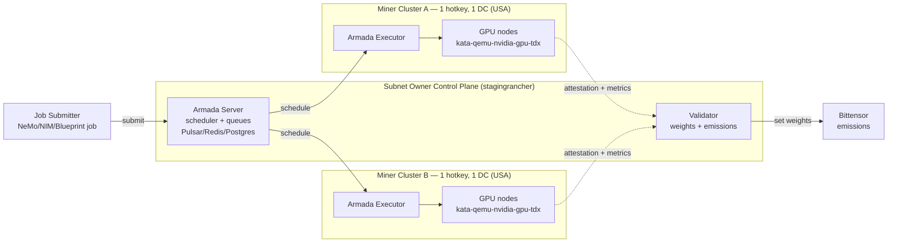
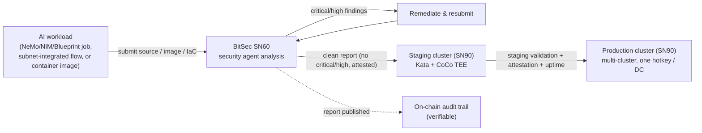
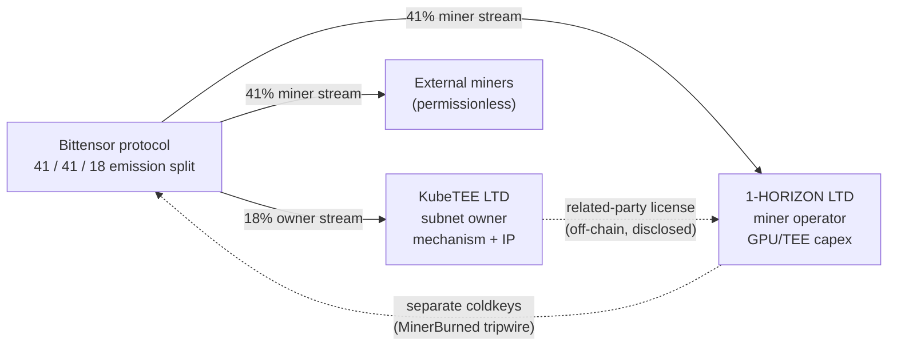
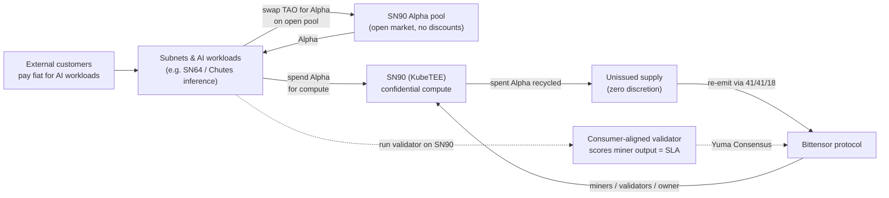
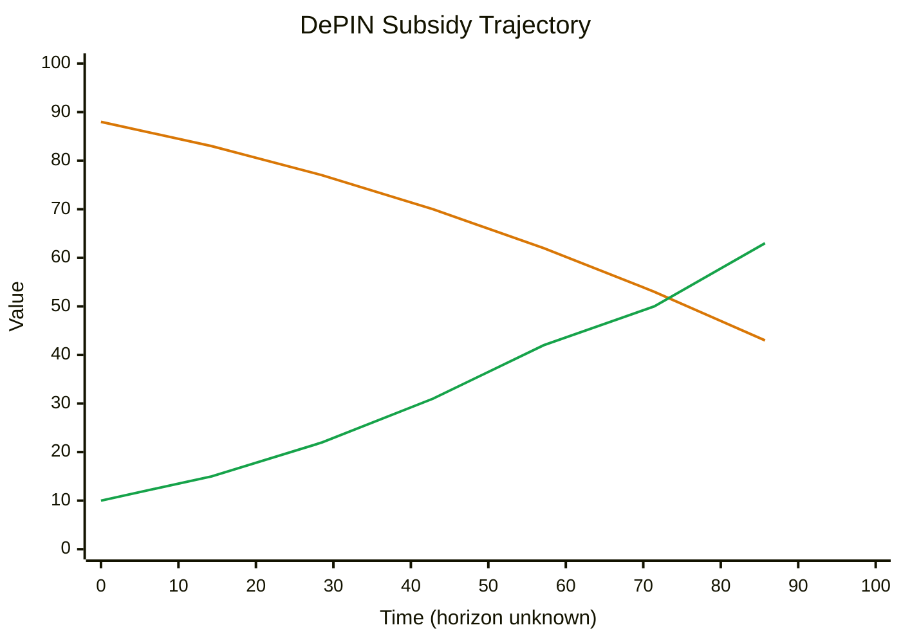

# KubeTEE AI Factory — Confidential Compute for Decentralized AI Jobs

> Enterprise-Grade Confidential Computing AI Factory on Decentralized Kubernetes Infrastructure, scheduled by Armada across Bittensor miner clusters

---

## About

**KubeTEE AI** is the **AI Factory** of the Bittensor network: it turns decentralized GPU clusters into a confidential AI factory. AI workloads run inside hardware-secured Trusted Execution Environments (TEE) using [Kata Containers](https://katacontainers.io/) and [Confidential Containers (CoCo)](https://github.com/confidential-containers/confidential-containers), and are scheduled across miner clusters by [Armada](https://armadaproject.io/) — a CNCF Sandbox multi-cluster Kubernetes batch scheduler.

KubeTEE AI is registered with the [**NVIDIA Inception Program**](https://www.nvidia.com/startups/) and is an active contributor to both the [**Kata Containers**](https://katacontainers.io/) and [**Confidential Containers (CoCo)**](https://github.com/confidential-containers/confidential-containers) ecosystems. It also leverages [**CNCF**](https://www.cncf.io/) projects for cloud-native infrastructure.

### Bittensor Miner

As part of Bittensor ecosystem as a miner since Febuary 2024, Pierre known as the french miner from Cyprus by Targon was the first to provide Confidential Computing nodes on Targon Subnet 4. We helped Chutes Subnet 64 to onboard B200/B300 nodes and helped Lium Subnet 51 to deploy recently Confidential Computing working with their stack.

I was also the first to provide Confidential Computing to Telegram Cocoon and Phala Network.

### Background

With 40 years of expertise, Started in 1986 to install Linux and Novell servers and in 1992 one of the first internet provider in Canada, as an Infrastructure architect deploying internet in Moroco and managing tech stack at scale in cloud providers. My specialty is security and I did security audits for Fortune 500 companies.

### Motivation

My expertise for Confidential Computing, Kubernetes, networking and security at Kernel and hardware level can benefit Bittensor ecosystem and I want to help every subnets in the ecosystem by providing the most secure and efficient AI Factory stack to elevate Bittensor offering of decentrilized Artifical Inteligence.

Providing High Quality infrastructure to the 2 Computing and Inference subnets on Bittensor for more than 2.5 years (Chutes #64, Targon #3 and Lium #51) with monitoring, upgrades and my help to improve each stack. I wanted to offer different tech stack that I belive Bittensor ecosystem can use and extend from.

**Direct Engineering Collaboration**: KubeTEE AI works directly with **INTEL** and **NVIDIA** engineers throughout the development and testing process of the NVIDIA technology especialy Kata/CoCo Containers. This close collaboration ensures optimal integration of confidential computing features, early access to emerging technologies, and validation of our implementation against the most stringent security and performance standards.

KubeTEE AI actively contributes to OpenInfra and CNCF projects — [Kata Containers](https://katacontainers.io/) and [Confidential Containers (CoCo)](https://github.com/confidential-containers/confidential-containers) provide the TEE foundation, and [Armada](https://armadaproject.io/) schedules workloads across miner clusters (detailed in [Architecture](#architecture)).

### Confidential Computing Consortium Resources

As a member of the [Confidential Computing Consortium (CCC)](https://confidentialcomputing.io/), we recommend the following resources from the consortium:

- **[Protecting Agentic AI Workloads with Confidential Computing](https://confidentialcomputing.io/2026/01/20/protecting-agentic-ai-workloads-with-confidential-computing/)** (January 2026)  
  This article by Mike Bursell, Executive Director of the CCC, explains how Confidential Computing addresses critical security challenges for Agentic AI workloads. Key takeaways:
  - **The Security Problem**: Agents operating in environments not owned by the Agent's owner are at risk from people and applications with sufficient permissions who can read or change data or the application itself
  - **Isolation Requirements**: Agents need identity integrity protection and capability confidentiality protection, breaking the standard model where infrastructure controllers control workloads
  - **Confidential Computing Solution**: Hardware-based isolation rooted in silicon provides protection of data and applications in-use, with remote attestation capabilities for verification
  - **Perfect Fit for Agentic AI**: Allows owners to trust their Agents and enables interaction verification that data has not been compromised or exfiltrated

  This directly aligns with KubeTEE AI's architecture, which uses Intel TDX/SGX and NVIDIA Confidential Computing to protect AI workloads in decentralized Kubernetes infrastructure.

- **[Gartner Top 10 Strategic Technology Trends for 2026](https://www.gartner.com/en/articles/top-technology-trends-2026)** (Gartner IT Symposium/Xpo 2026)  
  Gartner ranks **Confidential Computing as #3** on their Top 10 Strategic Technology Trends for 2026, alongside other trends directly relevant to KubeTEE AI:
  1. AI-Native Development Platforms
  2. AI Supercomputing Platforms
  3. **Confidential Computing** — protects sensitive data while in use, enabling secure AI and analytics across untrusted infrastructure
  4. **Multiagent Systems** — modular AI agents collaborate on complex tasks, improving automation and scalability
  5. Domain-Specific Language Models
  6. Physical AI
  7. **Preemptive Cybersecurity**
  8. **Digital Provenance**
  9. **AI Security Platforms**
  10. Geopatriation

  Gartner organizes these trends into three themes: **The Architect** (AI platforms and infrastructure), **The Synthesist** (AI application and orchestration), and **The Vanguard** (security, trust and governance). KubeTEE AI operates across all three themes with TEE-enabled infrastructure, multi-agent AI workloads, and enterprise-grade security compliance.

### Mission & Vision

**Mission**: To turn decentralized GPU clusters into a confidential AI factory — running AI training, inference, and data-processing jobs in Trusted Execution Environments, scheduled fairly across Bittensor miner clusters by Armada, with the highest standards of security, compliance, and performance.

**Key Differentiators**:
- **Security-First**: TEE-enabled infrastructure on a FIPS-140-2 validated RKE2 baseline in Early Access (FIPS-140-3 as a Phase 3 target) and Kata Containers isolation
- **Armada-Scheduled**: multi-cluster batch scheduling with fair-use queuing, gang scheduling, and preemption across decentralized clusters
- **NVIDIA-Powered**: NeMo Microservices, NIM models, and AI Blueprints as first-class confidential job types — with the subnet goal of **surpassing NVIDIA NeMo's limitations** (experimental Kata sandbox, no CoCo + NIMCache, ephemeral data only, no multi-node NIM, vendor lock-in) and providing a **SOTA stack** via Bittensor subnet integrations run inside Kata + CoCo TEE (see [Bittensor Subnet Integrations (SOTA, Confidential-Ready)](#bittensor-subnet-integrations-sota-confidential-ready))
- **Decentralized**: one hotkey per cluster, nodes co-located in a single data center, expanding across global regions
- **Open Source**: Built on OpenInfra Foundation and CNCF projects with community-driven innovation

---

## Table of Contents

- [KubeTEE AI Factory — Confidential Compute for Decentralized AI Jobs](#kubetee-ai-factory--confidential-compute-for-decentralized-ai-jobs)
  - [About](#about)
    - [Bittensor Miner](#bittensor-miner)
    - [Background](#background)
    - [Motivation](#motivation)
    - [Confidential Computing Consortium Resources](#confidential-computing-consortium-resources)
    - [Mission \& Vision](#mission--vision)
  - [Table of Contents](#table-of-contents)
  - [Overview](#overview)
    - [Early Access](#early-access)
  - [The Confidential Compute Challenge: Problems We Solve](#the-confidential-compute-challenge-problems-we-solve)
  - [Architecture](#architecture)
    - [Confidential Computing (Kata + CoCo)](#confidential-computing-kata--coco)
    - [Infrastructure](#infrastructure)
      - [Kubernetes High Availability](#kubernetes-high-availability)
      - [Armada Multi-Cluster Batch Scheduling](#armada-multi-cluster-batch-scheduling)
    - [Security \& Compliance](#security--compliance)
      - [Network Security](#network-security)
      - [Data Protection](#data-protection)
      - [Monitoring \& Audit](#monitoring--audit)
    - [Multi-Cluster Topology](#multi-cluster-topology)
      - [Subnet Owner Infrastructure](#subnet-owner-infrastructure)
      - [Miner Infrastructure](#miner-infrastructure)
    - [Early Access Topology](#early-access-topology)
  - [Supported AI Workloads (Job Types)](#supported-ai-workloads-job-types)
    - [NVIDIA NeMo Microservices](#nvidia-nemo-microservices)
  - [Subnet Economics](#subnet-economics)
    - [Incentive Mechanism: Infrastructure (Early Access)](#incentive-mechanism-infrastructure-early-access)
      - [Staging vs Production](#staging-vs-production)
    - [Payments \& Revenue (Roadmap)](#payments--revenue-roadmap)
  - [Tokenomics — Utility Token \& DePIN Model](#tokenomics--utility-token--depin-model)
    - [Recycle vs Burn](#recycle-vs-burn)
    - [Corporate Structure (vertically split)](#corporate-structure-vertically-split)
    - [Cross-Subnet Consumption Loop (utility-token flywheel)](#cross-subnet-consumption-loop-utility-token-flywheel)
    - [DePIN Subsidy Trajectory](#depin-subsidy-trajectory)
  - [Validator Scoring \& Attestation](#validator-scoring--attestation)
    - [Validator Runtime (TEE)](#validator-runtime-tee)
    - [Rancher v3 Access (Hotkey-signed Auth)](#rancher-v3-access-hotkey-signed-auth)
    - [TEE Attestation](#tee-attestation)
    - [Armada Job Metrics](#armada-job-metrics)
    - [Infrastructure Health](#infrastructure-health)
    - [Competitive Pricing](#competitive-pricing)
    - [Weight Setting](#weight-setting)
  - [Submitting a Confidential Job](#submitting-a-confidential-job)
    - [Miner Registration](#miner-registration)
  - [Workflow Orchestration (Airflow \& Metaflow)](#workflow-orchestration-airflow--metaflow)
  - [For Miners (Infrastructure)](#for-miners-infrastructure)
  - [Roadmap](#roadmap)
    - [Phase 0 — Early Access (Current)](#phase-0--early-access-current)
    - [Phase 1 — Expansion](#phase-1--expansion)
    - [Phase 2 — Paid Jobs](#phase-2--paid-jobs)
    - [Phase 3 — Job-Type Growth](#phase-3--job-type-growth)
  - [Research \& Documentation](#research--documentation)
    - [Documentation](#documentation)
    - [External Resources](#external-resources)
    - [Community \& Support](#community--support)

---

## Overview

KubeTEE AI Factory provides Enterprise-Grade Confidential Computing for AI batch jobs on a Decentralized Multi-Cluster Kubernetes RKE2 infrastructure. Jobs are submitted to Armada queues and scheduled across miner clusters, executing inside Trusted Execution Environments (TEE) so that data and models are protected **at rest, in transit, and in use** — and never leave the confidential computing boundary.

Each miner cluster is identified by a permanent Bittensor **hotkey/coldkey** pair. Armada dispatches batch jobs to these clusters as Kubernetes pods; the pods run under a confidential `runtimeClassName` (`kata-qemu-nvidia-gpu-tdx` for GPU TEE, `kata-qemu-tdx` for CPU TEE) so the workload is hardware-isolated and attested. CoCo provides transparent confidential image decryption and remote attestation — unmodified containers run inside the TEE without changes.

### Early Access

KubeTEE is in **Early Access**. The first deployment targets **two clusters in the USA**, one hotkey each, with all nodes of a cluster co-located in a single data center. Early Access focuses on:

- Standing up the Armada multi-cluster batch scheduler across miner clusters
- Running confidential AI jobs (NeMo / NIM / Blueprints) in Kata + CoCo TEE pods
- The **validator incentive mechanism**: scoring miners on TEE attestation, Armada job success, uptime, and **competitive pricing** against the other compute subnets (Targon, Lium, Chutes) with a 75% utilization target
- **Emissions + Alpha/TAO paid jobs** — emissions reward miners for capacity (supply-side); consumers pay Alpha/TAO in **compute units** for compute consumed (demand-side). USDC-on-BASE fiat billing is Phase 2 (see [Roadmap](#roadmap))
- **Security**: Confidential Computing TEE on a FIPS-140-2 validated RKE2 baseline (FIPS-140-3 as a Phase 3 target)

---

## The Confidential Compute Challenge: Problems We Solve

Organizations running sensitive AI workloads — training, fine-tuning, inference, data processing — face an impossible choice between security, cost, and trust. KubeTEE resolves all three:

1. **Private data & models must stay private** — Public cloud AI and traditional deployments expose data in memory and give providers/insiders access. KubeTEE enforces hardware TEE isolation (Intel TDX/SGX, NVIDIA CC) via Kata + CoCo, with remote attestation so you can verify the exact code running on your data; data is protected at rest, in transit, and in use.
2. **Regulated workloads need verifiable compute** — Healthcare (HIPAA), Finance (SOC2/PCI-DSS), Government (FedRAMP) need proof of isolation. KubeTEE provides a FIPS-140-2 validated RKE2 baseline (FIPS-140-3 as a Phase 3 target), cryptographic attestation, audit trails (Prometheus, Kubernetes events), and isolated namespaces for tenant separation.
3. **Trust in decentralized infrastructure** — Centralized clouds are single points of failure with vendor lock-in. KubeTEE's decentralized multi-cluster architecture, Bittensor incentives, validator attestation, and open standards (Kubernetes, Armada, Kata, CoCo) remove the single point of failure and the lock-in.

---

## Architecture

### Confidential Computing (Kata + CoCo)

**Trusted Execution Environment (TEE)**
- Kata Containers for workload isolation
- Confidential Containers with Workload Identity Validation
- Intel TDX/SGX
- NVIDIA Hopper/Blackwell/Vera Ruben

CoCo provides transparent confidential image decryption and remote attestation via the KBS, so unmodified containers run inside the TEE. Confidential job execution uses the `kata-qemu-nvidia-gpu-tdx` (GPU) and `kata-qemu-tdx` (CPU) runtime classes — see [Armada Multi-Cluster Batch Scheduling](#armada-multi-cluster-batch-scheduling).

### Infrastructure

#### Kubernetes High Availability

**RKE2 Rancher Kubernetes**
- [FIPS-140-2 validated](https://docs.rke2.io/security/fips_support) U.S. Federal Government Grade Security (Early Access baseline), with FIPS-140-3 as a Phase 3 target
- Fully conformant distribution focused on security and compliance

**Multi-Cluster Management**
- [Rancher Fleet](https://fleet.rancher.io/) GitOps-based Multi-Cluster Management
- Regional deployment: Americas, EU, Middle East, Africa, Asia
- Native integration with Rancher for unified management

**Rancher UI RBAC Management**
- Users/Miners access to isolated Kubernetes Namespaces
- Project-based resource isolation
- Fleet workspaces for multi-tenancy

#### Armada Multi-Cluster Batch Scheduling

[Armada](https://armadaproject.io/) ([GitHub](https://github.com/armadaproject/armada)) is a CNCF Sandbox multi-cluster Kubernetes batch scheduler. It transforms Kubernetes into a high-throughput batch platform while remaining compatible with service workloads, and is used in production to run millions of jobs per day across tens of thousands of nodes.

**Component placement**:
- **Armada Server** (controller, scheduler, lookout + Pulsar/Redis/Postgres) runs on the **subnet-owner control plane** alongside the validator
- **Armada Executor + Installer** run on **each miner cluster**, turning the cluster into a scheduling target (pool)
- Jobs are submitted to **Armada queues** and scheduled across miner clusters with **fair-use queuing**, **gang scheduling**, and **preemption**

**Confidential execution**:
- Jobs land on nodes with a confidential `runtimeClassName`:
  - `kata-qemu-nvidia-gpu-tdx` — Confidential GPU (Intel TDX + NVIDIA GPU passthrough)
  - `kata-qemu-tdx` — Confidential CPU-only (Intel TDX, no GPU)
  - `nvidia` — Non-confidential GPU (staging/dev only)
- **CoCo** handles transparent confidential image decryption and remote attestation via the KBS, so unmodified containers run inside the TEE

Armada addresses Kubernetes batch limitations that matter for the Factory: single-cluster scaling limits, etcd throughput ceilings, and the lack of fair-use / gang scheduling in the default kube-scheduler.

### Security & Compliance

#### Network Security
- Linkerd mTLS communication within the cluster
- Network Policies enforcement
- RBAC (Role-Based Access Control)

#### Data Protection
- **Rancher Longhorn**: Encrypted Storage with 3 Replicas
- Encrypted Container Repository
- External Secrets Manager (Vault & CoCo KBS Trustee)

#### Monitoring & Audit
- Prometheus Metrics
- Kubernetes Events tracking
- UpTime, QoS, and Performance monitoring
- ElasticSearch Audit logs

### Multi-Cluster Topology

#### Subnet Owner Infrastructure
- Global Multi-Cluster Control Plane with Rancher on Confidential Computing TEE
- Rancher Multi-Cluster Management with Fleet for GitOps
  - RKE2 Rancher Kubernetes (FIPS-140-2 validated baseline in Early Access; FIPS-140-3 as a Phase 3 target)
  - Kata Containers (TEE)
  - [Confidential Containers](https://confidentialcontainers.org/docs/overview/) Operator
  - Armada Server (controller, scheduler, lookout + Pulsar/Redis/Postgres)
- Validator runs in a TEE on the control plane; KubeTEE can also host the validator code (see [Validator Runtime (TEE)](#validator-runtime-tee))

#### Miner Infrastructure
- RKE2 Rancher Kubernetes
- One Cluster per Miner (identified by hotkey/coldkey, not UID)
  - One data center per cluster — all nodes co-located in a single DC
  - Regional deployment (One Region/Zone Control Plane with same region workers)
  - Cluster labeled with `kubetee.ai/` prefixed labels for permanent identification
  - Required labels: `kubetee.ai/continent`, `kubetee.ai/country`, `kubetee.ai/city`, `kubetee.ai/miner-hotkey`, `kubetee.ai/miner-coldkey`, `kubetee.ai/miner-uid`
- Kata Containers and CoCo Containers (TEE)
- Armada Executor + Installer (scheduled by the subnet-owner Armada Server)
- Fleet Agent for automated deployments

**Important**: Clusters are labeled with `kubetee.ai/miner-hotkey` and `kubetee.ai/miner-coldkey` for permanent identification. These labels never change, while `kubetee.ai/miner-uid` can be updated if a miner deregisters and re-registers on the subnet.

### Early Access Topology

> The **Validator** and **Armada Server** run on the control plane inside confidential Kata + CoCo TEE pods (see [Validator Runtime (TEE)](#validator-runtime-tee)).

---

## Supported AI Workloads (Job Types)

KubeTEE AI Factory schedules AI workloads as Armada batch jobs that execute inside Kata + CoCo TEE pods. The Factory ships with first-class job templates built on the NVIDIA AI stack — NeMo Microservices, NIM models, and AI Blueprints — and any containerized batch job can be submitted to an Armada queue.

### NVIDIA NeMo Microservices

[NVIDIA NeMo Microservices](https://docs.nvidia.com/nemo/microservices/latest/about/index.html) are API-first, modular tools for customizing, evaluating, and securing LLMs and embedding models on Kubernetes. A goal of the KubeTEE AI Factory is to run the full NVIDIA AI stack — NeMo Microservices, NIM models, and AI Blueprints — inside Confidential Computing (Kata + CoCo TEE), scheduled as Armada batch jobs. Each cluster exposes a shared mTLS-secured, high-availability NeMo Microservices infrastructure.

#### NIM Operator — Experimental Kata & Dynamo Support

The [NVIDIA NIM Operator](https://docs.nvidia.com/nim-operator/latest/) now ships **experimental** support for running NIM/NeMo workloads inside Kata sandboxes and for Dynamo-orchestrated inference graphs:

- **[Kata Sandbox Workloads (Experimental)](https://docs.nvidia.com/nim-operator/latest/kata-sandbox.html)** — deploys a `NIMService` with `runtimeClassName: kata-qemu-nvidia-gpu` so the NIM runs inside a Kata VM sandbox with hardware-isolated kernel and OS. NVIDIA notes this is a preview for testing only (not production), and that **Confidential Containers** support is planned for a future release.
- **[Dynamo (Experimental)](https://docs.nvidia.com/nim-operator/latest/dynamo.html)** — deploys Dynamo `DynamoGraphDeployment` CRDs (OpenAI-compatible frontend, multi-backend LLM serving, disaggregated prefill/decode) via the NIM Operator with `dynamo.enabled=true`.

> ⚠️ **Status — Experimental, not production-ready.** Both features carry NVIDIA's *"experimental, not fully supported, not recommended for production"* warning. **KubeTEE is working directly with the NVIDIA NIM Operator team and the Kata Containers team** to harden Kata sandbox + CoCo integration and Dynamo's disaggregated serving graphs for production confidential deployments. Until that work lands, NeMo Microservices on KubeTEE run on the **stable** Kata + CoCo TEE runtime classes (`kata-qemu-nvidia-gpu-tdx` / `kata-qemu-tdx`) documented in [Confidential Computing (Kata + CoCo)](#confidential-computing-kata--coco); the NIM Operator's experimental Kata/Dynamo paths are tracked as a Phase 2+ roadmap item.

#### Kata / CoCo Limitations (NVIDIA)

The NeMo Microservices docs index does not itself list Kata/CoCo limits — the constraints come from the **NIM Operator** (which deploys NeMo Microservices as CRDs) and the **NVIDIA CoCo Reference Architecture**. They are the reason KubeTEE's current confidential path is the stable CoCo runtime classes rather than the NIM Operator's experimental Kata sandbox:

**NIM Operator Kata Sandbox (experimental)** — [Kata Sandbox docs](https://docs.nvidia.com/nim-operator/latest/kata-sandbox.html)
- **Not confidential computing.** The Kata sandbox runtime class is `kata-qemu-nvidia-gpu` and *"does not enable encryption"* — VM isolation only, no TEE encryption/attestation. The GPU Operator must run in **non-CC mode** (`nvidia.com/cc.mode=off`).
- **CoCo + NIMCache unsupported.** *"Confidential Containers and NIM Cache deployments have not been tested and are not supported in this release."* Only `NIMService` with the Kata sandbox has been tested; CoCo support is planned for a future NIM Operator release.
- **Preview only** — NVIDIA marks it *"experimental, not fully supported, not recommended for production."*

**NVIDIA CoCo Reference Architecture** (the stable `kata-qemu-nvidia-gpu-tdx` path KubeTEE uses) — [Limitations & Restrictions](https://docs.nvidia.com/datacenter/cloud-native/confidential-containers/latest/overview.html)
- **containerd only** — no CRI-O / dockerd for confidential workloads.
- **All GPUs on a host must be in CC mode** — configuring a subset is unsupported; for multi-GPU passthrough, all GPUs must be assigned to a single confidential VM.
- **No nested virtualization** — CoCo must be installed directly on the host, not inside a guest VM.
- **No PCI peer-to-peer (P2P) DMA** — IOMMUFD cannot map PCI BAR regions (QEMU logs warnings; GPU function is unaffected).
- **No host-side NVIDIA driver** — CoCo uses VFIO passthrough; host drivers interfere with VFIO binding (the GPU Operator manages the in-guest driver instead).

**NIM Operator (general)** — [Release Notes](https://docs.nvidia.com/nim-operator/latest/release-notes.html)
- **No multi-node NIM microservice config** — *"The Operator does not support configuring NIM microservices in a multi-node deployment"* (multi-node NIM v2.0 via Ray is a separate, newer path).
- **CC added incrementally** — Kata sandbox is the *"first foundational step"*; full CoCo encryption/attestation through the Operator is future work.

#### Bittensor Subnet Integrations (SOTA, Confidential-Ready)

The NeMo stack and NVIDIA's Kata/CoCo paths carry the limitations documented above — an experimental Kata sandbox (isolation only, not CC), no CoCo + NIMCache, **ephemeral container data only**, no multi-node NIM microservice config, and a closed NVIDIA-only stack. KubeTEE's thesis is that **the Bittensor ecosystem already contains SOTA, verifiable substitutes** for several NeMo stack layers, and that running them inside Kata + CoCo TEE pods — instead of, or alongside, the NVIDIA stack — both sidesteps those limitations and keeps the workloads confidential. Each subnet below exposes a **verifiable feed** (public API + on-chain metagraph) and is a candidate to replace or augment the corresponding NeMo component on KubeTEE:

| Subnet | Name | SOTA role | Replaces / augments (NeMo stack) | Confidential-computing fit |
|--------|------|-----------|----------------------------------|----------------------------|
| SN56 | [Gradients](https://www.gradients.io/) (G.O.D) | AutoML tournaments — miners submit open-source SFT / DPO / GRPO training scripts; validators execute on standardized GPU infra and open-source the winners | NeMo Customizer (fine-tuning) | Training scripts execute inside KubeTEE TEE pods → confidential fine-tuning tournaments with open-source winning methods |
| SN120 | [Affine](https://www.affine.io/) | Incentivized RL ("reason mining") — miners submit on-chain model revisions; validators host inference and run challenger-vs-champion duels; winner-takes-all; sybil/decoy/copy/overfitting-proof | NeMo Customizer (RL / reasoning) | Validator inference + duels run in TEE; winning models bridge to Chutes (SN64) for confidential serving |
| SN97 | [Albedo](https://github.com/unarbos/albedo) | King-of-the-hill coding-LLM competition (Qwen3-4B class, SWE-ZERO, LLM-judge ensemble); publishes open distilled checkpoints + duel traces | NeMo Customizer (coding agents) + eval data | Duels run in TEE; open distilled checkpoints are reusable as confidential job templates |
| SN27 | [Orion](https://github.com/SILX-LABS/Orion) | Decentralized data subnet — campaign-driven discovery / generation / curation of model-ready training data with on-chain quality validation | NeMo Data Designer / data pipeline | Data provenance is on-chain; generation miners run in TEE for confidential data pipelines |
| SN22 | [Desearch](https://desearch.ai/) | Decentralized real-time web + X/Twitter search for AI agents; cited, context-rich results via API | NeMo Retriever / RAG grounding | Live retrieval runs as a confidential grounding step inside the TEE before generation |
| SN64 | [Chutes](https://chutes.ai/) — Parallax (Jon Durbin) | Decentralized serverless inference + **Parallax** decentralized MoE training (surrogate experts, no all-to-all; ternary weights; Gated DeltaNet) across heterogeneous, non-colocated GPUs — within 0.6% of centralized baseline | NeMo inference + distributed training | Chutes is migrating to a **fully TEE-only infrastructure stack**; Parallax trains frontier models on distributed confidential compute — a native fit for KubeTEE's decentralized TEE clusters |
| SN75 | [Hippius](https://hippius.com/) | Decentralized cloud storage — S3-compatible + IPFS pinning; Arion engine (Reed-Solomon k=10/m=20, CRUSH placement, self-healing) | Persistent storage (solves CoCo's **ephemeral-data-only** limitation) | **Already ships Confidential Compute** (AMD SEV-SNP encrypted VMs); drop-in S3 endpoint replacing/augmenting encrypted Longhorn + object store |
| SN118 | [Ditto](https://heyditto.ai/) | Open-source persistent memory / context layer for AI agents (Claude / Cursor / MCP); miners train the memory-retrieval "harness" | Agent memory / context management | Memory graph backed by confidential storage (e.g. Hippius) so agent context persists across confidential sessions |
| SN60 | [Bitsec.ai](https://bitsec.ai/) | Decentralized AI security — miners submit autonomous security agents that find high/critical-severity exploits in codebases & smart contracts; validators run them in isolated Docker sandboxes and score against benchmark ground truths | **Security gate** (new layer — no NeMo equivalent) | Planned pre-promotion analysis for AI workloads before they reach staging/production on SN90 — design concept, to be detailed during integration (see [BitSec SN60 — Security Gate](#bitsec-sn60--security-gate-for-ai-workload-promotion)) |

KubeTEE treats this as an **open set**: any Bittensor subnet with a SOTA, verifiable solution for a NeMo stack layer — data, training, retrieval, inference, storage, agent memory, or evaluation — is a candidate integration, with the workload adapted to run inside `kata-qemu-nvidia-gpu-tdx` / `kata-qemu-tdx` and its outputs attested and persisted on confidential storage. This is the Bittensor-native path to a confidential AI Factory that is **not locked to a single vendor's experimental stack**, and it is the concrete way KubeTEE "works with the ecosystem" rather than waiting on the NIM Operator's CoCo roadmap.

#### BitSec SN60 — Security Gate for AI Workload Promotion

> 🧪 **Design concept — not yet implemented.** This section describes the intended SN60 integration at the design level. It will be detailed and hardened as the integration proceeds; the gate rules, thresholds, and tooling below are provisional and subject to change. See the [Phase 1 — Expansion](#phase-1--expansion) roadmap item.

[Bitsec.ai (SN60)](https://bitsec.ai/) is a decentralized security subnet: miners submit autonomous AI security agents that scan codebases and smart contracts for **high- and critical-severity** vulnerabilities, and validators run those agents in isolated, resource-limited Docker sandboxes, scoring them against benchmark ground truths (SCA-Bench / Smart Contract Audit Benchmark). BitSec already audits other Bittensor subnets' incentive mechanisms and smart-contract code (findings published as critical / high / medium), so it is a natural, verifiable security layer for SN90.

In this design, KubeTEE would use BitSec SN60 as a **mandatory security gate** that an AI workload must pass **before it is promoted to staging or production** clusters on SN90. The gate sits in front of the staging→production pipeline, not inside it:

**Proposed gate rules (design, subject to change during integration):**
- **Scope** — BitSec analyzes the workload's code (job template, model-serving code, subnet-integration glue, any on-chain/smart-contract code) and the container image it runs, plus the IaC/Helm values that deploy it.
- **Pass condition** — a workload is promoted to staging only with a **clean BitSec report** (no unresolved critical or high-severity findings). Findings are either remediated and resubmitted, or accepted as a documented risk with owner sign-off (production requires the clean report — no sign-off bypass for critical/high).
- **Verifiable** — the BitSec report is published and referenceable (BitSec posts summaries on X and detailed findings on its site), so the security posture of every workload running on SN90 is auditable, not claimed.
- **Re-run on change** — any material change to the workload (new image tag, new job template, new subnet integration) re-triggers the gate; promotion is per-revision, not once-and-done.
- **Confidentiality** — the gate runs on the workload's *code/image*, not on the confidential *data* it will process in production, so running BitSec does not require exposing production data or TEE contents. The analysis itself can run inside a KubeTEE TEE pod when the code under review is itself sensitive.

**Why a gate, not a scanner inside the cluster:** production SN90 clusters run confidential workloads under Kata + CoCo with attested, encrypted memory. A security agent *inside* the TEE would either see confidential data (breaking the trust boundary) or see nothing useful. Putting BitSec **before** promotion keeps the security analysis where it belongs — on the code/image, pre-deployment — and keeps the production TEE boundary intact. This is the Bittensor-native equivalent of a CI security stage, decentralized and incentivized via SN60.

---

## Subnet Economics

### Incentive Mechanism: Infrastructure (Early Access)

KubeTEE Early Access uses a **single Infrastructure incentive mechanism**. Miners earn Bittensor emissions by providing confidential compute capacity and reliably executing Armada-scheduled jobs. Early Access pairs **emissions** (supply-side: miners earn for providing capacity) with **Alpha / TAO paid jobs** priced in compute units (demand-side: consumers spend Alpha/TAO for the compute they consume). Fiat billing (USDC-on-BASE) remains a Phase 2 roadmap item (see [Payments & Revenue](#payments--revenue-roadmap)).

**Purpose**: Reward miners for providing Kubernetes infrastructure that runs confidential AI jobs scheduled by Armada.

**Key Feature**: Emissions are distributed per resources provided (GPU nodes), weighted by attested TEE health, job-execution quality, and uptime.

**Mandatory Requirement**:
- **TEE Attestation** (Intel TDX/SGX, NVIDIA CC) must be proven — **no attestation = no emissions**

**Resource Utilization Guidance**:
- **Below 75% capacity**: Penalized — underutilized, not contributing proportionally to subnet demand
- **Target ~80% capacity**: Optimal — ensures miners provide exactly what the subnet needs

**Benefits**:
- TEE compliance is enforced, not optional
- Clear incentive to provide higher-tier GPU nodes
- Job-execution quality rewards miners that reliably run confidential workloads
- Resource utilization ensures balanced subnet capacity — no over/under provisioning

#### Staging vs Production

**Staging Environment** (Permissionless):
- Test applications, infrastructure, upgrades, job validation
- Gateway to Production environment
- Community Staging jobs

**Production Environment** (After Staging testing Period):
- Multi-Clusters (one per data center per miner hotkey)
- Must pass Staging validation period
- Optional KYC for regulated workloads.

**Promotion Gate (both environments, design concept):** the intent is that every AI workload passes a **BitSec SN60 security analysis** (no unresolved critical/high-severity findings) before it is deployed to staging, and again before promotion to production — see [BitSec SN60 — Security Gate for AI Workload Promotion](#bitsec-sn60--security-gate-for-ai-workload-promotion) (design concept — to be detailed during integration). Staging would not exempt a workload from the gate; it would be the first environment a *clean* workload is allowed to run in.

### Payments & Revenue (Roadmap)

Early Access pairs **emissions** (supply-side) with **Alpha / TAO paid jobs** priced in compute units (demand-side). The remaining payment and revenue features are planned for Phase 2 (see [Roadmap](#roadmap)):

**Early Access (Phase 0):**
- **Alpha / TAO paid jobs** — compute priced in **compute units (CU)** that are **competitive** (benchmarked against Targon/Lium/Chutes) and **dynamic according to the job queues** (Armada queue depth + the 75% utilization target) — see [Competitive Pricing](./docs/COMPETITIVE-PRICING.md)
- **Subnet 90 Alpha, Other Subnets Alpha, TAO** discounted for the Bittensor community

**Phase 2:**
- **USDC-on-BASE job billing** — pull-based, per-epoch metering of Armada job resource usage (fiat billing layered on top of the Early Access compute-unit pricing)
- **Referrer / integrator / reseller program** — revenue share with on-chain attribution
- **Automated USDC→TAO→Alpha recycling** — unused emissions recycled

---

## Tokenomics — Utility Token & DePIN Model

SN90 (KubeTEE) Alpha is a **utility token consumed to access confidential compute**, not a security. The design follows a DePIN subsidy model: external inference demand buys Alpha on the open market and spends it to consume compute; spent Alpha is **recycled** to unissued supply and re-emitted through the protocol's fixed emission split — a self-sustaining security budget for the compute network (the Bitcoin-fee model applied to Alpha). Full analysis: [Tokenomics — Utility Token & DePIN Model](./docs/TOKENOMICS.md).

### Recycle vs Burn

When Alpha is spent for compute, the subnet mechanism chooses what happens to it:

- **Burn** — permanent supply reduction; does not reduce `SubnetAlphaOut`; maximum scarcity signal.
- **Recycle** (chosen) — returns to unissued supply, reduces `SubnetAlphaOut`, extends the Alpha emission runway, pushes halving thresholds out, and refills the miner incentive budget.

For a compute subnet whose product is ongoing work, **recycle** is the right economics: consumption funds future miner emissions. Neither method games emission share — the miner-withholding penalty is source-based, not method-based.

### Corporate Structure (vertically split)

- **KubeTEE LTD — subnet owner**: owns the mechanism, the €198k subnet registration, and the **18% owner emission stream**. No token sales against promises, no customer balances, no treasury — all unused emissions are recycled.
- **1-HORIZON LTD — miner operator**: competes for the **41% miner share** like any miner; funds GPU/TEE capex. Registers, competes, and is deregistered under identical rules as every other miner.
- **On-chain tripwire**: the `MinerBurned` penalty targets miner emission flowing to subnet-owner-controlled coldkeys. 1-HORIZON's miner hotkeys must trace to genuinely separate coldkeys, not KubeTEE-controlled ones.
- **Target state**: the related-party (1-HORIZON) share shrinks as external miners grow — a declining related-party share is the on-chain evidence the network is real.

### Cross-Subnet Consumption Loop (utility-token flywheel)

External customers pay fiat for AI workloads → a consuming subnet or AI workload (e.g. SN64 / Chutes) swaps TAO for SN90 Alpha on the **open pool** (no discounts, no allocations, no side-letters) → spends Alpha to consume SN90 confidential compute → spent Alpha is **recycled** to unissued supply → re-emitted via the **41/41/18** split (miners / validators / owner). A **consumer-aligned validator** on SN90 scores miner output — the protocol-native SLA (no contract needed). This is external demand one hop removed, not circular emissions-farming.

### DePIN Subsidy Trajectory

The amber **emission subsidy** line decays as emissions taper over an unknown horizon; the green **consumption revenue** line rises as consumer spend (from subnets and AI workloads) grows. They cross at the **crossover** — the point where net Alpha issuance ≈ 0 and consumers (not emissions) fund the miner budget through the pool. The exact date is unknown (recycle shifts halving thresholds), so the x-axis is an undated horizon, not a halving schedule.

Miner compensation = emissions + consumption spend. While emissions cover most of the cost base, miners price compute below cash cost and the consumer pockets the gap (funded by Alpha dilution). The **subsidy ratio** (emission value ÷ total miner compensation) is the single on-chain KPI, monotonically declining:

- **Pre-crossover** (amber): net inflationary; emissions fund the subsidy.
- **Crossover**: consumption spend = emissions → net Alpha issuance ≈ 0; consumers fund the miner budget through the pool.
- **Post-crossover**: net-deflationary while still paying miners fully.

Defenses: subsidy tapers by a **published glide path** (not surprise); **stack efficiency** is the moat (Kubernetes bin-packing, TEE-attestation confidential-compute premium, higher utilization) — target 70% subsidy / 30% efficiency at launch → 30/70 by crossover. Score verifiable properties (delivered capacity, attested TEE execution, validator-issued challenges) and make self-consumption economically neutral to defeat **wash consumption**.

---

## Validator Scoring & Attestation

The validator is the subnet's referee. In Early Access it scores each miner (one hotkey per cluster) on a single Infrastructure mechanism and sets Bittensor weights each epoch.

> **Current Early Access stand-in:** the shipping validator scores node liveness only today; the full TEE-attestation + Armada + health scoring below is the design target (see [Roadmap](#roadmap) and [SUBNET.md](SUBNET.md)).

### Validator Runtime (TEE)

The validator is the subnet's referee — so the referee itself must be trustworthy. The validator process runs **inside a confidential TEE pod** (`kata-qemu-nvidia-gpu-tdx` or `kata-qemu-tdx`) on the subnet-owner control plane, with CoCo remote attestation proving the validator code and configuration are unmodified. Scoring, weight-setting, and credentials (Rancher token, Bittensor wallet) stay confidential and tamper-resistant — the validator cannot be silently altered by the host or hypervisor.

**KubeTEE-hosted validator**: KubeTEE offers to run the validator code in KubeTEE clusters, so a validator operator does not need to provision and operate their own TEE infrastructure. KubeTEE schedules the validator as a confidential workload in a KubeTEE confidential cluster, with attestation evidence available to the subnet. This lowers the barrier to running a validator and ensures every validator runs in a genuine, attested TEE.

### Rancher v3 Access (Hotkey-signed Auth)

To read cluster and node metrics for scoring, the validator calls the **Rancher v3 REST API**. Access is granted by **hotkey-signed authentication**: the validator signs a challenge with its Bittensor **hotkey** (SR25519), and an auth mechanism connected to Rancher verifies the signature on-chain, maps the hotkey to a Rancher principal, and issues a **short-lived, read-only** Rancher v3 bearer token bound to `cluster-readonly`. The hotkey is the only credential — no long-lived admin token is held by the validator — and it stays inside the validator's TEE pod.

Miners use the same hotkey-signed flow, scoped read-only to their own cluster (the one labeled with their `kubetee.ai/miner-hotkey`), provisioned automatically when their cluster is created.

### TEE Attestation
- The validator runs attestation cronjobs inside Kata Containers to verify each miner cluster's TEE (Intel TDX/SGX, NVIDIA CC)
- CoCo remote attestation confirms the confidential container image and runtime are unmodified
- **No valid attestation → zero emissions** for that miner

### Armada Job Metrics
- The validator pulls Armada scheduler/executor metrics via Prometheus: job success rate, throughput, scheduling latency, preemption fairness, and gang-scheduling success
- Miners that reliably execute confidential jobs under `kata-*` runtime classes score higher

### Infrastructure Health
- Uptime, QoS, capacity, and latency from Prometheus and Kubernetes events
- FIPS-140-2/3 validated

### Competitive Pricing

SN90 sells compute, so its miners are scored against the **other Bittensor compute subnets** — **Targon (SN4)**, **Lium (SN51)**, and **Chutes (SN64)** — each of which exposes a **verifiable** feed (public API + on-chain metagraph for emission/attestation proof). Targon exposes a **supply-side** payout feed (per-miner emission payout by compute type and card count, via `stats.targon.com`); every Targon GPU miner runs an **8-card node** — the same form factor SN90 requires — so the live per-8-card-node payout (B300 ~64, B200 ~52, H200 ~28, H100 ~24 TAO/epoch) is the direct benchmark SN90 miner compensation must match or miners migrate to SN4. Lium and Chutes expose **demand-side** listing prices. The validator scrapes those feeds each epoch, cross-checks them against the metagraph, and computes a **target price** per SN90 job class (GPU-hour by GPU type, CPU-hour, per-token inference).

The target price is **discovered, not decreed** — a function of four inputs:

- **The compute needed** — the job class (GPU type / GPU-hours / CPU-hours / per-token); price is computed per class, not as a flat number.
- **Competitor signals for the same class** — Targon's per-miner payout by compute type (supply-side) and Lium's / Chutes's listing prices (demand-side), each cross-checked on-chain.
- **SN90 demand** — Armada queue depth and scheduling wait time for that class.
- **The 75% utilization target** — the equilibrium anchor. Below 75% average capacity, price is pushed down to attract demand and fill capacity; at 75%, price sits at the competitor average; above 75%, price is pushed up to ration demand and preserve headroom.

The target price is a **scoring input, not a bill**. Miners are scored on whether the compute they deliver is priced at or below the target (full credit), modestly above (reduced credit), or far above (zero credit for that class — SN90 would lose the demand to SN4/SN51/SN64). A miner with perfect attestation but a price 2× the competitor average scores low. This is what "competitive with the other subnets" means mechanically: the weight vector rewards miners that keep SN90 in the competitive band. The 75% target also doubles as the **wash-consumption defense** — a miner faking utilization pushes the subnet above 75%, which raises the target price and makes its own wash spend more expensive.

Every input is a public API or on-chain data; the validator publishes the scraped competitor prices and the computed target price each epoch as Prometheus metrics, so the weight vector is auditable end-to-end. Full design — competitor feeds, the target-price formula, scoring integration, and verifiability table: [Competitive Pricing & Miner Scoring](./docs/COMPETITIVE-PRICING.md).

> **Status:** competitive pricing is an **Early Access (Phase 0)** scoring dimension — it is required to price the Alpha/TAO compute units competitively and dynamically per the job queues (USDC-on-BASE fiat billing stays Phase 2). The shipping Early Access validator scores node liveness only until the price feeds are wired (see [SUBNET.md](SUBNET.md)).

### Weight Setting
- Scores are normalized per miner hotkey and set on-chain via Bittensor `set_weights` (single mechanism)
- Reference implementation: [`scripts/validator.py`](scripts/validator.py) (scoring: [`scripts/miner_scoring.py`](scripts/miner_scoring.py), reconciliation: [`scripts/reconciliation.py`](scripts/reconciliation.py), Rancher v3 client: [`scripts/rancher_client.py`](scripts/rancher_client.py))

---

## Submitting a Confidential Job

Jobs are submitted to Armada queues and scheduled onto miner clusters with a confidential `runtimeClassName`. In Early Access, job submission is available to the subnet owner and authorized integrators.

### Miner Registration

Miners register clusters (one hotkey per cluster) with the subnet owner for Rancher Fleet and Armada enrollment. See [For Miners (Infrastructure)](#for-miners-infrastructure).

---

## Workflow Orchestration (Airflow & Metaflow)

Single confidential jobs are submitted to Armada queues (see [Submitting a Confidential Job](#submitting-a-confidential-job)). For **multi-step AI pipelines** — ETL → fine-tune → evaluate → register → deploy — KubeTEE integrates with two open-source orchestrators so each pipeline step runs as a confidential Armada batch job inside Kata + CoCo TEE pods:

- **[Apache Airflow](https://airflow.apache.org/)** — DAG-based pipeline orchestration. Author DAGs on the control plane (or externally); each task submits an Armada job spec with a confidential `runtimeClassName`. Airflow schedules the *pipeline*; Armada schedules the *task pods* across miner clusters.
- **[Metaflow](https://metaflow.org/)** — a Python framework for data-science / ML workflows. Author flows with `@step`-style decorators; a KubeTEE Metaflow producer submits each step to an Armada queue as a confidential pod. Iterate locally, run production steps in TEE.

**Confidential pipelines**: every task pod runs under `kata-qemu-nvidia-gpu-tdx` (GPU) or `kata-qemu-tdx` (CPU) with CoCo remote attestation. Pipeline artifacts move through encrypted Longhorn volumes or an encrypted object store; secrets are injected via the CoCo KBS — no plaintext secrets in DAG/flow code. A pipeline can verify a step's attestation evidence before passing artifacts downstream.

See [Workflow Orchestration — Airflow & Metaflow](./docs/WORKFLOW-ORCHESTRATION.md) for architecture, connector design, and example DAG / Metaflow flow snippets.

> **Status:** integration is on the roadmap — Airflow and Metaflow Armada connectors land in Phase 1 / Phase 3 (see [Roadmap](#roadmap)).

---

## For Miners (Infrastructure)

**Early Access Cluster Rules**:
- One hotkey per cluster (one miner = one cluster)
- All nodes co-located in a single data center (low-latency, same-DC networking)
- First two clusters deployed in the USA
- Armada Executor + Installer deployed on the cluster (scheduled by the subnet-owner Armada Server)
- Confidential runtime classes available: `kata-qemu-nvidia-gpu-tdx` (GPU TEE), `kata-qemu-tdx` (CPU TEE)

**Minimum For Staging Permissionless Participation**:

- ✅ INTEL TDX Compatible node with NVIDIA H100/H200
- ✅ BIOS TDX/SGX Enabled
- ✅ Kernel TDX/SGX Enabled
- ✅ One Cluster per Miner (labeled with `kubetee.ai/` prefixed labels)
- ✅ Same Regional deployment (Workers in same Data Center)
- ✅ Cluster registered with Rancher for Fleet management
- ✅ Cluster must be labeled with required labels:
  - `kubetee.ai/continent`, `kubetee.ai/country`, `kubetee.ai/city` (geographic identification)
  - `kubetee.ai/miner-hotkey`, `kubetee.ai/miner-coldkey` (permanent miner identification)
  - `kubetee.ai/miner-uid` (current UID, updateable)

**For Production Participation**:

- ✅ Successfully passed Staging validation period

**Reference Documentation**:
- [Node Registration](./docs/NODE-REGISTRATION.md) — Miner RKE2 node registration and the `kubetee.ai/miner-hotkey` label requirement
- [GPU Node Requirements](./docs/GPU-NODE-REQUIREMENTS.md) — GPU/TEE hardware requirements (CPU TDX/SEV-SNP, BIOS, kernel)
- [Cluster Naming Convention](./docs/CLUSTER_NAMING_CONVENTION.md) — `kubetee.ai/*` labels and Fleet GitOps targeting
- [FIPS-140-3 Target](./docs/FIPS-140-3.md) — RKE2 + Kata + CoCo FIPS stack

---

## Roadmap

### Phase 0 — Early Access (Current)

- [ ] Deploy 2 US clusters (one hotkey each, nodes co-located in a single DC)
- [ ] Armada Server on the subnet-owner control plane; Armada Executor on each miner cluster
- [ ] Kata + CoCo TEE runtime classes (`kata-qemu-nvidia-gpu-tdx`, `kata-qemu-tdx`)
- [ ] Single Infrastructure validator mechanism (design: TEE attestation + Armada job metrics + uptime; Early Access stand-in: node liveness)
- [ ] Validator runs in a TEE (Kata + CoCo) on the control plane; CoCo attestation proves the validator code is unmodified
- [ ] KubeTEE-hosted validator offering: KubeTEE runs the validator code in a KubeTEE confidential cluster for operators without their own TEE infrastructure
- [ ] Validator Rancher v3 API access: a validator authenticates by **signing a challenge with its Bittensor hotkey**; an auth mechanism connected to Rancher verifies the signature and issues a **read-only** Rancher v3 bearer token (bound to `cluster-readonly`) — see [Rancher v3 Access (Hotkey-signed Auth)](#rancher-v3-access-hotkey-signed-auth) and CLAUDE.md "Validator Rancher API Access"
- [ ] Miner Rancher access on cluster creation: the miner authenticates with the same **hotkey-signed** flow, scoped **read-only** to their own cluster (the one labeled with their `kubetee.ai/miner-hotkey`, bound to `cluster-readonly`) so the miner can observe their cluster (subnet owner manages via Fleet)
- [ ] Emissions rewards for miners providing confidential compute capacity (supply-side)
- [ ] Alpha / TAO paid jobs (demand-side) — price compute in **compute units (CU)** that are **competitive** (benchmarked vs Targon/Lium/Chutes) and **dynamic according to the job queues** (Armada queue depth + the 75% utilization target set the CU price per job class) — see [Competitive Pricing](./docs/COMPETITIVE-PRICING.md)
- [ ] Competitive pricing dimension: scrape Targon (SN4) / Lium (SN51) / Chutes (SN64) price feeds, compute per-class target price, score miners on price competitiveness against a 75% utilization target (see [Competitive Pricing](./docs/COMPETITIVE-PRICING.md))
- [ ] Confidential NeMo / NIM / Blueprint job templates
- [ ] Confidential Subnets Owners and Approved Integrators templates.

### Phase 1 — Expansion

- [ ] More US + international clusters
- [ ] Armada fair-use + gang scheduling hardening
- [ ] Automated TEE attestation cronjobs
- [ ] Validator scoring expansion: TEE attestation + Armada job metrics + infrastructure health (replacing the Early Access liveness stand-in)
- [ ] Apache Airflow + Metaflow Armada connectors — multi-step confidential pipelines (see [Workflow Orchestration](./docs/WORKFLOW-ORCHESTRATION.md))
- [ ] BitSec SN60 security gate — mandatory AI-workload security analysis (code/image/IaC) before promotion to staging/production (see [BitSec SN60 — Security Gate](#bitsec-sn60--security-gate-for-ai-workload-promotion))
- [ ] Build documentation website

### Phase 2 — Paid Jobs

- [ ] USDC-on-BASE job billing (pull-based, per-epoch metering) — fiat billing layered on top of the Early Access Alpha / TAO compute-unit pricing
- [ ] Referrer / integrator / reseller program (on-chain attribution)
- [ ] Automated USDC→TAO→Alpha recycling (unused emissions recycled)

### Phase 3 — Job-Type Growth

- [ ] More job templates
- [ ] Multi-arch TEE (Intel TDX + AMD SEV-SNP)
- [ ] Additional confidential compute runtimes
- [ ] FIPS-140-3 target on FIPS-140-2 validated RKE2 baseline
- [ ] NIM Operator Kata Sandbox + Dynamo production-readiness — graduate NVIDIA's [experimental Kata Sandbox](https://docs.nvidia.com/nim-operator/latest/kata-sandbox.html) and [experimental Dynamo](https://docs.nvidia.com/nim-operator/latest/dynamo.html) support to production confidential deployments (KubeTEE working with the NVIDIA NIM Operator and Kata Containers teams)

---

## Research & Documentation

### Documentation
- [Node Registration](./docs/NODE-REGISTRATION.md) — Miner RKE2 node registration and `kubetee.ai/*` labels
- [GPU Node Requirements](./docs/GPU-NODE-REQUIREMENTS.md) — GPU/TEE hardware requirements
- [Cluster Naming Convention](./docs/CLUSTER_NAMING_CONVENTION.md) — `kubetee.ai/*` labels and Fleet GitOps targeting
- [FIPS-140-3 Target](./docs/FIPS-140-3.md) — RKE2 + Kata + CoCo FIPS stack research
- [Confidential Containers Certification](./docs/certification-confidential-containers.md) — CC standards and Kata runtime mapping
- [UAT-g004 Runbook](./docs/UAT-g004.md) — Self-contained single-node validator UAT procedures
- [Workflow Orchestration — Airflow & Metaflow](./docs/WORKFLOW-ORCHESTRATION.md) — orchestrating multi-step confidential pipelines on Armada
- [Tokenomics — Utility Token & DePIN Model](./docs/TOKENOMICS.md) — recycle vs burn, securities posture, cross-subnet consumption loop, DePIN subsidy trajectory
- [Competitive Pricing & Miner Scoring](./docs/COMPETITIVE-PRICING.md) — pricing SN90 against Targon/Lium/Chutes, the 75% utilization target, and how price becomes weights

### External Resources
- [Armada](https://armadaproject.io/) | [Armada GitHub](https://github.com/armadaproject/armada) — multi-cluster batch scheduler
- [Apache Airflow](https://airflow.apache.org/) | [Metaflow](https://metaflow.org/) — pipeline orchestration for confidential Armada jobs
- [Kata Containers](https://katacontainers.io/) | [Confidential Containers](https://github.com/confidential-containers/confidential-containers)
- [NVIDIA NIM Operator](https://docs.nvidia.com/nim-operator/latest/) — [Kata Sandbox (Experimental)](https://docs.nvidia.com/nim-operator/latest/kata-sandbox.html) | [Dynamo (Experimental)](https://docs.nvidia.com/nim-operator/latest/dynamo.html)
- [RKE2 FIPS Support](https://docs.rke2.io/security/fips_support)

### Community & Support

- **GitHub**: [KubeTEE-AI-Blueprints](https://github.com/KubeTEE-AI-Blueprints)
- **Documentation**: [docs/](./docs/)
- **Discord**: Coming soon
- **Twitter**: Coming soon

---

**Built by the KubeTEE Community**

*Confidential compute for decentralized AI jobs — secured by TEE, scheduled by Armada, incentivized by Bittensor.*

## Workers

<!-- gsd: workers -->
| Worker | Entrypoint | Component doc |
|---|---|---|
<!-- /gsd: workers -->
