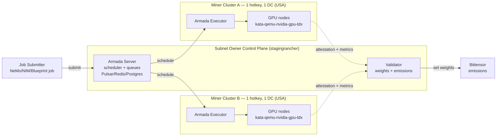

# KubeTEE AI Factory — Confidential Compute for Decentralized AI Jobs

> Enterprise-Grade Confidential Computing AI Factory on Decentralized Kubernetes Infrastructure, scheduled by Armada across Bittensor miner clusters

[](https://docs.rke2.io/security/fips_support)
[](https://docs.rke2.io/security/fips_support)
[](https://katacontainers.io/)
[](https://github.com/confidential-containers/confidential-containers)
[](https://docs.rke2.io/)
[](https://www.rancher.io/)
[](https://armadaproject.io/)
[](https://confidentialcomputing.io/)
[](https://www.intel.com/content/www/us/en/developer/tools/tdx/overview.html)
[](https://www.intel.com/content/www/us/en/architecture-and-technology/software-guard-extensions.html)
[](https://en.wikipedia.org/wiki/Trusted_execution_environment)
[](https://developer.nvidia.com/)
[](https://www.nvidia.com/startups/)
[](https://confidentialcomputing.io/)
[](https://openinfra.org/)

---

## About

**KubeTEE AI** is the **AI Factory** of the Bittensor network: it turns decentralized GPU clusters into a confidential batch-job factory. AI workloads are scheduled across miner clusters by [Armada](https://armadaproject.io/) — a CNCF Sandbox multi-cluster Kubernetes batch scheduler — and executed inside hardware-secured Trusted Execution Environments (TEE) using [Kata Containers](https://katacontainers.io/) and [Confidential Containers (CoCo)](https://github.com/confidential-containers/confidential-containers).

KubeTEE AI is registered with the [**NVIDIA Inception Program**](https://www.nvidia.com/startups/) and is an active contributor to both the [**Kata Containers**](https://katacontainers.io/) and [**Confidential Containers (CoCo)**](https://github.com/confidential-containers/confidential-containers) ecosystems. It also leverages [**CNCF**](https://www.cncf.io/) projects for cloud-native infrastructure.

### Bittensor Community Partnerships

As part of Bittensor ecosystem as a miner since Febuary 2024, Pierre known as the french miner from Cyprus by Targon was the first to provide Confidential Computing nodes on Subnet 3. We helped Chutes Subnet 64 to onboard B200/B300 nodes and helped Lium Subnet 51 to deploy recently Confidential Computing working with their stack.

I was also the first to provide Confidential Computing to Telegram Cocoon and Phala Network.

### Background

With 40 years of expertise, Started in 1986 to install Linux and Novell servers and in 1992 one of the first internet provider in Canada, as an Infrastructure architect deploying internet in Moroco and managing tech stack at scale in cloud providers. My specialty is security and I did security audits for Fortune 500 companies.

### Motivation

My expertise for Confidential Computing, Kubernetes, networking and security at Kernel and hardware level can benefit Bittensor ecosystem and I want to help every subnets in the ecosystem by providing the most secure and efficient AI Factory stack to elevate Bittensor offering of decentrilized Artifical Inteligence.

Providing High Quality infrastructure to the 3 Computing subnet on Bittensor for more than 2.5 years (Chutes #64, Targon #3 and Lium #51) with monitoring, upgrades and my help to improve each stack. I wanted to offer different tech stack that I belive Bittensor ecosystem can use and extend from.

**Direct Engineering Collaboration**: KubeTEE AI works directly with **INTEL** and **NVIDIA** engineers throughout the development and testing process of the NVIDIA technology especialy Kata/CoCo Containers. This close collaboration ensures optimal integration of confidential computing features, early access to emerging technologies, and validation of our implementation against the most stringent security and performance standards.

KubeTEE AI actively contributes to and builds upon the [OpenInfra Foundation's](https://openinfra.org/) open source infrastructure projects, particularly:
- **[Kata Containers](https://katacontainers.io/)**: Secure, lightweight CRI-compatible virtualized containers that provide the TEE foundation for our confidential computing infrastructure

We also leverage CNCF projects for cloud-native confidential computing:
- **[Confidential Containers (CoCo)](https://github.com/confidential-containers/confidential-containers)**: CNCF Sandbox project enabling transparent deployment of unmodified containers in Trusted Execution Environments (TEEs) with support for Intel TDX/SGX and other hardware platforms

We schedule workloads across miner clusters with **[Armada](https://armadaproject.io/)** ([GitHub](https://github.com/armadaproject/armada)), a CNCF Sandbox multi-cluster Kubernetes batch scheduler used in production to run millions of jobs per day across tens of thousands of nodes.

### Confidential Computing Consortium Resources

As a member of the [Confidential Computing Consortium (CCC)](https://confidentialcomputing.io/), we recommend the following resources from the consortium:

- **[Protecting Agentic AI Workloads with Confidential Computing](https://confidentialcomputing.io/2026/01/20/protecting-agentic-ai-workloads-with-confidential-computing/)** (January 2026)  
  This article by Mike Bursell, Executive Director of the CCC, explains how Confidential Computing addresses critical security challenges for Agentic AI workloads. Key takeaways:
  - **The Security Problem**: Agents operating in environments not owned by the Agent's owner are at risk from people and applications with sufficient permissions who can read or change data or the application itself
  - **Isolation Requirements**: Agents need identity integrity protection and capability confidentiality protection, breaking the standard model where infrastructure controllers control workloads
  - **Confidential Computing Solution**: Hardware-based isolation rooted in silicon provides protection of data and applications in-use, with remote attestation capabilities for verification
  - **Perfect Fit for Agentic AI**: Allows owners to trust their Agents and enables interaction verification that data has not been compromised or exfiltrated

  This directly aligns with KubeTEE AI's architecture, which uses Intel TDX/SGX and NVIDIA Confidential Computing to protect AI workloads in decentralized Kubernetes infrastructure.

- **[Gartner Top 10 Strategic Technology Trends for 2026](https://www.gartner.com/en/articles/top-technology-trends-2026)** (Gartner IT Symposium/Xpo 2026)  
  Gartner ranks **Confidential Computing as #3** on their Top 10 Strategic Technology Trends for 2026, alongside other trends directly relevant to KubeTEE AI:
  1. AI-Native Development Platforms
  2. AI Supercomputing Platforms
  3. **Confidential Computing** — protects sensitive data while in use, enabling secure AI and analytics across untrusted infrastructure
  4. **Multiagent Systems** — modular AI agents collaborate on complex tasks, improving automation and scalability
  5. Domain-Specific Language Models
  6. Physical AI
  7. **Preemptive Cybersecurity**
  8. **Digital Provenance**
  9. **AI Security Platforms**
  10. Geopatriation

  Gartner organizes these trends into three themes: **The Architect** (AI platforms and infrastructure), **The Synthesist** (AI application and orchestration), and **The Vanguard** (security, trust and governance). KubeTEE AI operates across all three themes with TEE-enabled infrastructure, multi-agent AI workloads, and enterprise-grade security compliance.

### Mission & Vision

**Mission**: To turn decentralized GPU clusters into a confidential batch-job factory — running AI training, inference, and data-processing jobs in Trusted Execution Environments, scheduled fairly across Bittensor miner clusters by Armada, with the highest standards of security, compliance, and performance.

**Key Differentiators**:
- **Security-First**: TEE-enabled infrastructure with FIPS-140-3 as the Early Access target (FIPS-140-2 validated RKE2 baseline) and Kata Containers isolation
- **Armada-Scheduled**: multi-cluster batch scheduling with fair-use queuing, gang scheduling, and preemption across decentralized clusters
- **NVIDIA-Powered**: NeMo Microservices, NIM models, and AI Blueprints as first-class confidential job types
- **Decentralized**: one hotkey per cluster, nodes co-located in a single data center, expanding across global regions
- **Open Source**: Built on OpenInfra Foundation and CNCF projects with community-driven innovation

---

## Table of Contents

- [KubeTEE AI Factory — Confidential Compute for Decentralized AI Jobs](#kubetee-ai-factory--confidential-compute-for-decentralized-ai-jobs)
  - [About](#about)
    - [Bittensor Community Partnerships](#bittensor-community-partnerships)
    - [Background](#background)
    - [Motivation](#motivation)
    - [Confidential Computing Consortium Resources](#confidential-computing-consortium-resources)
    - [Mission \& Vision](#mission--vision)
  - [Table of Contents](#table-of-contents)
  - [Overview](#overview)
    - [Early Access](#early-access)
  - [The Confidential Compute Challenge: Problems We Solve](#the-confidential-compute-challenge-problems-we-solve)
    - [1. Private Data and Models Must Stay Private](#1-private-data-and-models-must-stay-private)
    - [2. Regulated Workloads Need Verifiable Compute](#2-regulated-workloads-need-verifiable-compute)
    - [3. Trust in Decentralized Infrastructure](#3-trust-in-decentralized-infrastructure)
    - [The KubeTEE Value Proposition](#the-kubetee-value-proposition)
  - [Architecture](#architecture)
    - [Infrastructure](#infrastructure)
      - [Kubernetes High Availability](#kubernetes-high-availability)
      - [Armada Multi-Cluster Batch Scheduling](#armada-multi-cluster-batch-scheduling)
    - [Security \& Compliance](#security--compliance)
      - [Confidential Computing Features](#confidential-computing-features)
      - [Network Security](#network-security)
      - [Data Protection](#data-protection)
      - [Monitoring \& Audit](#monitoring--audit)
    - [Multi-Cluster Topology](#multi-cluster-topology)
      - [Subnet Owner Infrastructure](#subnet-owner-infrastructure)
      - [Miner Infrastructure](#miner-infrastructure)
    - [Early Access Topology](#early-access-topology)
  - [Supported AI Workloads (Job Types)](#supported-ai-workloads-job-types)
    - [NVIDIA NeMo Microservices](#nvidia-nemo-microservices)
  - [Subnet Economics](#subnet-economics)
    - [Incentive Mechanism: Infrastructure (Early Access)](#incentive-mechanism-infrastructure-early-access)
      - [Staging vs Production](#staging-vs-production)
    - [Payments \& Revenue (Roadmap)](#payments--revenue-roadmap)
  - [Validator Scoring \& Attestation](#validator-scoring--attestation)
    - [TEE Attestation](#tee-attestation)
    - [Armada Job Metrics](#armada-job-metrics)
    - [Infrastructure Health](#infrastructure-health)
    - [Weight Setting](#weight-setting)
  - [Submitting a Confidential Job](#submitting-a-confidential-job)
    - [Miner Registration](#miner-registration)
  - [For Miners (Infrastructure)](#for-miners-infrastructure)
  - [Roadmap](#roadmap)
    - [Phase 0 — Early Access (Current)](#phase-0--early-access-current)
    - [Phase 1 — Expansion](#phase-1--expansion)
    - [Phase 2 — Paid Jobs](#phase-2--paid-jobs)
    - [Phase 3 — Job-Type Growth](#phase-3--job-type-growth)
  - [Research \& Documentation](#research--documentation)
    - [Documentation](#documentation)
    - [External Resources](#external-resources)
    - [Community \& Support](#community--support)
  - [License](#license)

---

## Overview

KubeTEE AI Factory provides Enterprise-Grade Confidential Computing for AI batch jobs on a Decentralized Multi-Cluster Kubernetes RKE2 infrastructure. Jobs are submitted to Armada queues and scheduled across miner clusters, executing inside Trusted Execution Environments (TEE) so that data and models are protected **at rest, in transit, and in use** — and never leave the confidential computing boundary.

Each miner cluster is identified by a permanent Bittensor **hotkey/coldkey** pair. Armada dispatches batch jobs to these clusters as Kubernetes pods; the pods run under a confidential `runtimeClassName` (`kata-qemu-nvidia-gpu-tdx` for GPU TEE, `kata-qemu-tdx` for CPU TEE) so the workload is hardware-isolated and attested. CoCo provides transparent confidential image decryption and remote attestation — unmodified containers run inside the TEE without changes.

### Early Access

KubeTEE is in **Early Access**. The first deployment targets **two clusters in the USA**, each operated by 1-Horizon hotkeys with all nodes co-located in two data center. Early Access focuses on:

- Standing up the Armada multi-cluster batch scheduler across miner clusters
- Running confidential AI jobs (NeMo / NIM / Blueprints) in Kata + CoCo TEE pods
- The **validator incentive mechanism**: scoring miners on TEE attestation, Armada job success, and uptime
- **Emissions-only** rewards (no USDC job billing yet — see [Roadmap](#roadmap))
- **Security**: Confidential Computing TEE with FIPS-140-3 as the Early Access target on a FIPS-140-2 validated RKE2 baseline

---

## The Confidential Compute Challenge: Problems We Solve

Most organizations that need to run sensitive AI workloads — training, fine-tuning, inference, and data processing — face an impossible choice between security, cost, and trust.

### 1. Private Data and Models Must Stay Private

**The Problem**:
- Enterprises cannot send proprietary data or models to public cloud AI services
- Traditional deployments expose data in memory during processing
- Insider threats and cloud provider access to sensitive data
- No cryptographic guarantee that data remains private during compute

**KubeTEE's Solution**:
- **Hardware-enforced Trusted Execution Environment (TEE)** encrypts data in use, not just at rest and in transit
- **Intel TDX/SGX** creates isolated memory enclaves invisible to hypervisors and OS
- **NVIDIA Hopper/Blackwell Confidential Computing** protects GPU workloads during AI compute
- **Kata Containers** isolate workloads at the VM level with cryptographic validation
- **CoCo remote attestation** lets you verify the exact code running on your data
- **End-to-end encryption** from job submission through compute to results

### 2. Regulated Workloads Need Verifiable Compute

**The Problem**:
- Healthcare (HIPAA), Finance (SOC2, PCI-DSS), Government (FedRAMP) face strict compliance requirements
- Public cloud AI services cannot guarantee data isolation and compliance
- No verifiable proof that infrastructure ran the expected workload

**KubeTEE's Solution**:
- **FIPS-140-3** as the Early Access security target, on a **FIPS-140-2 validated RKE2** baseline
- **Trusted Execution Environment (TEE)** with hardware-enforced isolation (Intel TDX/SGX, NVIDIA CC)
- **Cryptographic attestation** — validators verify each cluster's TEE and the unmodified container image
- **Audit trails and monitoring** built-in for compliance reporting (Prometheus, Kubernetes events)
- **Isolated namespaces** ensure complete tenant separation

### 3. Trust in Decentralized Infrastructure

**The Problem**:
- Centralized cloud providers represent single points of failure and control
- Vendor lock-in limits flexibility and negotiating power
- No transparency into infrastructure operations and data handling

**KubeTEE's Solution**:
- **Decentralized multi-cluster architecture** eliminates single points of failure
- **Bittensor incentive mechanism** aligns infrastructure providers with reliable job execution
- **Validator attestation** provides objective, cryptographic proof of confidential compute
- **Open source transparency** — inspect code, audit security, verify operations
- **No vendor lock-in** — open standards (Kubernetes, Armada, Kata, CoCo)

### The KubeTEE Value Proposition

KubeTEE AI Factory uniquely combines **confidential security**, **decentralized trust**, and **accessible pricing** to democratize access to confidential AI compute.

```
        Confidential Security
               /\
              /  \
             /    \
            /      \
           /        \
          /          \
         /____________\
    Accessible      Trustworthy
     Pricing        Decentralized
```

Traditional solutions force you to choose two:
- **Public cloud AI**: Accessible + scalable ✗ Confidential security & decentralization
- **Build your own TEE cluster**: Security + control ✗ Accessible & decentralized
- **Single-vendor confidential platform**: Security + accessible ✗ Decentralized trust

**KubeTEE AI Factory delivers all three.**

---

## Architecture

### Infrastructure

#### Kubernetes High Availability

**RKE2 Rancher Kubernetes**
- [FIPS-140-2 validated](https://docs.rke2.io/security/fips_support) U.S. Federal Government Grade Security, with FIPS-140-3 as the Early Access target
- Fully conformant distribution focused on security and compliance

**Multi-Cluster Management**
- [Rancher Fleet](https://fleet.rancher.io/) GitOps-based Multi-Cluster Management
- Regional deployment: Americas, EU, Middle East, Africa, Asia
- Native integration with Rancher for unified management

**Rancher UI RBAC Management**
- Users/Miners access to isolated Kubernetes Namespaces
- Project-based resource isolation
- Fleet workspaces for multi-tenancy

#### Armada Multi-Cluster Batch Scheduling

[Armada](https://armadaproject.io/) ([GitHub](https://github.com/armadaproject/armada)) is a CNCF Sandbox multi-cluster Kubernetes batch scheduler. It transforms Kubernetes into a high-throughput batch platform while remaining compatible with service workloads, and is used in production to run millions of jobs per day across tens of thousands of nodes.

**Component placement**:
- **Armada Server** (controller, scheduler, lookout + Pulsar/Redis/Postgres) runs on the **subnet-owner control plane** alongside the validator
- **Armada Executor + Installer** run on **each miner cluster**, turning the cluster into a scheduling target (pool)
- Jobs are submitted to **Armada queues** and scheduled across miner clusters with **fair-use queuing**, **gang scheduling**, and **preemption**

**Confidential execution**:
- Jobs land on nodes with a confidential `runtimeClassName`:
  - `kata-qemu-nvidia-gpu-tdx` — Confidential GPU (Intel TDX + NVIDIA GPU passthrough)
  - `kata-qemu-tdx` — Confidential CPU-only (Intel TDX, no GPU)
  - `nvidia` — Non-confidential GPU (staging/dev only)
- **CoCo** handles transparent confidential image decryption and remote attestation via the KBS, so unmodified containers run inside the TEE

Armada addresses Kubernetes batch limitations that matter for the Factory: single-cluster scaling limits, etcd throughput ceilings, and the lack of fair-use / gang scheduling in the default kube-scheduler.

### Security & Compliance

#### Confidential Computing Features

**Trusted Execution Environment (TEE)**
- Intel TDX/SGX
- NVIDIA Hopper/Blackwell/Vera Ruben
- Kata Containers for workload isolation
- Confidential Containers with Workload Identity Validation

#### Network Security
- Linkerd mTLS communication within the cluster
- Network Policies enforcement
- RBAC (Role-Based Access Control)

#### Data Protection
- **Rancher Longhorn**: Encrypted Storage with 3 Replicas
- Encrypted Container Repository
- External Secrets Manager (Vault & CoCo KBS Trustee)

#### Monitoring & Audit
- Prometheus Metrics
- Kubernetes Events tracking
- UpTime, QoS, and Performance monitoring
- ElasticSearch Audit logs

### Multi-Cluster Topology

#### Subnet Owner Infrastructure
- Global Multi-Cluster Control Plane with Rancher on Confidential Computing TEE
- Rancher Multi-Cluster Management with Fleet for GitOps
  - RKE2 Rancher Kubernetes with FIPS-140-3 target (FIPS-140-2 validated baseline)
  - Kata Containers (TEE)
  - [Confidential Containers](https://confidentialcontainers.org/docs/overview/) Operator
  - Armada Server (controller, scheduler, lookout + Pulsar/Redis/Postgres)

#### Miner Infrastructure
- RKE2 Rancher Kubernetes
- One Cluster per Miner (identified by hotkey/coldkey, not UID)
  - One data center per cluster — all nodes co-located in a single DC
  - Regional deployment (One Region/Zone Control Plane with same region workers)
  - Cluster labeled with `kubetee.ai/` prefixed labels for permanent identification
  - Required labels: `kubetee.ai/continent`, `kubetee.ai/country`, `kubetee.ai/city`, `kubetee.ai/miner-hotkey`, `kubetee.ai/miner-coldkey`, `kubetee.ai/miner-uid`
- Kata Containers and CoCo Containers (TEE)
- Armada Executor + Installer (scheduled by the subnet-owner Armada Server)
- Fleet Agent for automated deployments

**Important**: Clusters are labeled with `kubetee.ai/miner-hotkey` and `kubetee.ai/miner-coldkey` for permanent identification. These labels never change, while `kubetee.ai/miner-uid` can be updated if a miner deregisters and re-registers on the subnet.

### Early Access Topology

The first deployment targets two clusters in the USA, one hotkey each, all nodes co-located in a single data center per cluster:



---

## Supported AI Workloads (Job Types)

KubeTEE AI Factory schedules AI workloads as Armada batch jobs that execute inside Kata + CoCo TEE pods. The Factory ships with first-class job templates built on the NVIDIA AI stack — NeMo Microservices, NIM models, and AI Blueprints — and any containerized batch job can be submitted to an Armada queue.


### NVIDIA NeMo Microservices

[NVIDIA NeMo Microservices](https://docs.nvidia.com/nemo/microservices/latest/about/index.html) are API-first, modular tools for customizing, evaluating, and securing LLMs and embedding models on Kubernetes. A goal of the KubeTEE AI Factory is to run the full NVIDIA AI stack — NeMo Microservices, NIM models, and AI Blueprints — inside Confidential Computing (Kata + CoCo TEE), scheduled as Armada batch jobs. Each cluster exposes a shared mTLS-secured, high-availability NeMo Microservices infrastructure.

---

## Subnet Economics

### Incentive Mechanism: Infrastructure (Early Access)

KubeTEE Early Access uses a **single Infrastructure incentive mechanism**. Miners earn Bittensor emissions by providing confidential compute capacity and reliably executing Armada-scheduled jobs. Emissions are **emissions-only** in Early Access — Alpha, Subnet Alpha, TAO, USDC job billing are a Roadmap item (Phase 2).

**Purpose**: Reward miners for providing Kubernetes infrastructure that runs confidential AI jobs scheduled by Armada.

**Key Feature**: Emissions are distributed per resources provided (GPU nodes), weighted by attested TEE health, job-execution quality, and uptime.

**Mandatory Requirement**:
- **TEE Attestation** (Intel TDX/SGX, NVIDIA CC) must be proven — **no attestation = no emissions**

**Resource Utilization Guidance**:
- **Below 75% capacity**: Penalized — underutilized, not contributing proportionally to subnet demand
- **Target ~80% capacity**: Optimal — ensures miners provide exactly what the subnet needs

**Benefits**:
- TEE compliance is enforced, not optional
- Clear incentive to provide higher-tier GPU nodes
- Job-execution quality rewards miners that reliably run confidential workloads
- Resource utilization ensures balanced subnet capacity — no over/under provisioning

#### Staging vs Production

**Staging Environment** (Permissionless):
- Test applications, infrastructure, upgrades, job validation
- Gateway to Production environment
- Community Staging jobs

**Production Environment** (After Staging testing Period):
- Multi-Clusters (one per data center per miner hotkey)
- Must pass Staging validation period
- Optional KYC for regulated workloads.

### Payments & Revenue (Roadmap)

Early Access is **emissions-only**. The following payment and revenue features are planned for Phase 2 (see [Roadmap](#roadmap)):

- **Subnet 90 Alpha, Other Subnets Alpha, TAO** Discounted for Bittensor community.
- **USDC-on-BASE job billing** — pull-based, per-epoch metering of Armada job resource usage
- **Referrer / integrator / reseller program** — revenue share with on-chain attribution
- **Automated USDC→TAO→Alpha buyback and treasury** — sustainable price support and operations funding

---

## Validator Scoring & Attestation

The validator is the subnet's referee. In Early Access it scores each miner (one hotkey per cluster) on a single Infrastructure mechanism and sets Bittensor weights each epoch.

### TEE Attestation
- The validator runs attestation cronjobs inside Kata Containers to verify each miner cluster's TEE (Intel TDX/SGX, NVIDIA CC)
- CoCo remote attestation confirms the confidential container image and runtime are unmodified
- **No valid attestation → zero emissions** for that miner

### Armada Job Metrics
- The validator pulls Armada scheduler/executor metrics via Prometheus: job success rate, throughput, scheduling latency, preemption fairness, and gang-scheduling success
- Miners that reliably execute confidential jobs under `kata-*` runtime classes score higher

### Infrastructure Health
- Uptime, QoS, capacity, and latency from Prometheus and Kubernetes events
- FIPS-140-2/3 validated

### Weight Setting
- Scores are normalized per miner hotkey and set on-chain via Bittensor `set_weights` (single mechanism)
- Reference implementation: [`template/mechanisms/infrastructure.py`](template/mechanisms/infrastructure.py) and [`template/validator/forward.py`](template/validator/forward.py)

---

## Submitting a Confidential Job

Jobs are submitted to Armada queues and scheduled onto miner clusters with a confidential `runtimeClassName`. In Early Access, job submission is available to the subnet owner and authorized integrators.


### Miner Registration

Miners register clusters (one hotkey per cluster) with the subnet owner for Rancher Fleet and Armada enrollment. See [For Miners (Infrastructure)](#for-miners-infrastructure).

---

## For Miners (Infrastructure)

**Early Access Cluster Rules**:
- One hotkey per cluster (one miner = one cluster)
- All nodes co-located in a single data center (low-latency, same-DC networking)
- First two clusters deployed in the USA
- Armada Executor + Installer deployed on the cluster (scheduled by the subnet-owner Armada Server)
- Confidential runtime classes available: `kata-qemu-nvidia-gpu-tdx` (GPU TEE), `kata-qemu-tdx` (CPU TEE)

**Minimum For Staging Permissionless Participation**:

- ✅ INTEL TDX Compatible node with NVIDIA H100/H200
- ✅ BIOS TDX/SGX Enabled
- ✅ Kernel TDX/SGX Enabled
- ✅ One Cluster per Miner (labeled with `kubetee.ai/` prefixed labels)
- ✅ Same Regional deployment (Workers in same Data Center)
- ✅ Cluster registered with Rancher for Fleet management
- ✅ Cluster must be labeled with required labels:
  - `kubetee.ai/continent`, `kubetee.ai/country`, `kubetee.ai/city` (geographic identification)
  - `kubetee.ai/miner-hotkey`, `kubetee.ai/miner-coldkey` (permanent miner identification)
  - `kubetee.ai/miner-uid` (current UID, updateable)

**For Production Participation**:

- ✅ Successfully passed Staging validation period

**Reference Documentation**:
- [Node Registration](./docs/NODE-REGISTRATION.md)
- [GPU Node Requirements](./docs/GPU-NODE-REQUIREMENTS.md)
- [Cluster Naming Convention](./docs/CLUSTER_NAMING_CONVENTION.md)
- [FIPS-140-3 Target](./docs/FIPS-140-3.md)

---

## Roadmap

### Phase 0 — Early Access (Current)

- [ ] Deploy 2 US clusters (one hotkey each, nodes co-located in a single DC)
- [ ] Armada Server on the subnet-owner control plane; Armada Executor on each miner cluster
- [ ] Kata + CoCo TEE runtime classes (`kata-qemu-nvidia-gpu-tdx`, `kata-qemu-tdx`)
- [ ] Single Infrastructure validator mechanism (TEE attestation + Armada job metrics + uptime)
- [ ] Validator Rancher v3 API access: map Bittensor validator hotkeys to Rancher principals (custom auth provider / SAML / OIDC) so validators obtain a read-only bearer token for the Rancher v3 API (bound to `cluster-readonly`) — see CLAUDE.md "Validator Rancher API Access"
- [ ] Miner Rancher access on cluster creation: map the new cluster's `kubetee.ai/miner-hotkey` to a Rancher principal (same external auth) and bind it **read-only** to the miner's own cluster (`cluster-readonly`) so the miner can observe their cluster (subnet owner manages via Fleet)
- [ ] Emissions-only rewards
- [ ] FIPS-140-3 target on FIPS-140-2 validated RKE2 baseline
- [ ] Confidential NeMo / NIM / Blueprint job templates
- [ ] Confidential Subnets Owners and Approved Integrators templates.

### Phase 1 — Expansion

- [ ] More US + international clusters
- [ ] Armada fair-use + gang scheduling hardening
- [ ] Automated TEE attestation cronjobs
- [ ] Build documentation website

### Phase 2 — Paid Jobs

- [ ] Alpha, TAO, USDC-on-BASE job billing (pull-based, per-epoch metering)
- [ ] Referrer / integrator / reseller program (on-chain attribution)
- [ ] Automated USDC→TAO→Alpha buyback and treasury

### Phase 3 — Job-Type Growth

- [ ] More job templates
- [ ] Multi-arch TEE (Intel TDX + AMD SEV-SNP)
- [ ] Additional confidential compute runtimes

---

## Research & Documentation

### Documentation
- [FIPS-140-3 Target](./docs/FIPS-140-3.md) — RKE2 + Kata + CoCo FIPS stack research
- [Confidential Containers Certification](./docs/certification-confidential-containers.md) — CC standards and Kata runtime mapping
- [Node Registration](./docs/NODE-REGISTRATION.md) — Miner RKE2 node registration
- [GPU Node Requirements](./docs/GPU-NODE-REQUIREMENTS.md) — GPU/TEE hardware requirements
- [Cluster Naming Convention](./docs/CLUSTER_NAMING_CONVENTION.md) — `kubetee.ai/*` labels and Fleet GitOps targeting

### External Resources
- [Armada](https://armadaproject.io/) | [Armada GitHub](https://github.com/armadaproject/armada) — multi-cluster batch scheduler
- [Kata Containers](https://katacontainers.io/) | [Confidential Containers](https://github.com/confidential-containers/confidential-containers)
- [RKE2 FIPS Support](https://docs.rke2.io/security/fips_support)

### Community & Support

- **GitHub**: [KubeTEE-AI-Blueprints](https://github.com/KubeTEE-AI-Blueprints)
- **Documentation**: [docs/](./docs/)
- **Discord**: Coming soon
- **Twitter**: Coming soon

---

## License

See [LICENSE](LICENSE) for details.

---

**Built by the KubeTEE Community**

*Confidential compute for decentralized AI jobs — secured by TEE, scheduled by Armada, incentivized by Bittensor.*
