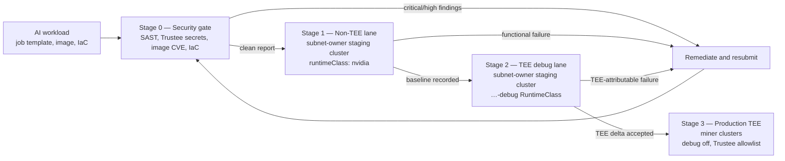
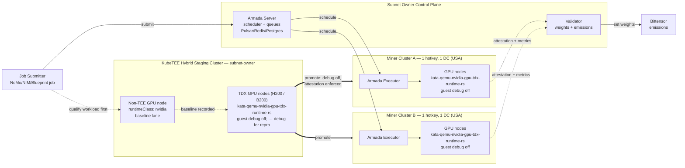
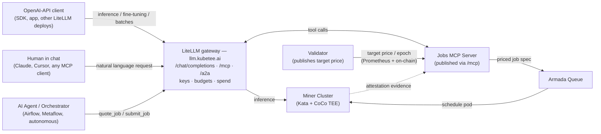

# KubeTEE AI Factory — Decentralized Clusters (Kube) for AI Workloads in Trusted Execution Environment (TEE)

> Enterprise-Grade Confidential Computing AI Factory on Decentralized Kubernetes Infrastructure, scheduled by Armada across Bittensor miner clusters

---

## About

**KubeTEE AI** is the **AI Factory** of the Bittensor network: it turns decentralized GPU clusters into a confidential AI factory. AI workloads run inside hardware-secured Trusted Execution Environments (TEE) using [Kata Containers](https://katacontainers.io/) and [Confidential Containers (CoCo)](https://github.com/confidential-containers/confidential-containers), and are scheduled across miner clusters by [Armada](https://armadaproject.io/) — a CNCF Sandbox multi-cluster Kubernetes batch scheduler.

KubeTEE AI is registered with the [**NVIDIA Inception Program**](https://www.nvidia.com/startups/) and is an active contributor to both the [**Kata Containers**](https://katacontainers.io/) and [**Confidential Containers (CoCo)**](https://github.com/confidential-containers/confidential-containers) ecosystems. It also leverages [**CNCF**](https://www.cncf.io/) projects for cloud-native infrastructure.

### About the Owner

Known as Pierre in the Bittensor community, I have mined since February 2024. I was the first to bring Confidential Computing nodes to Targon (Subnet 4), later helped Chutes (Subnet 64) onboard B200/B300 nodes, and most recently worked with the Lium (Subnet 51) team to deploy Confidential Computing on their stack. Beyond Bittensor, I was also the first to provide Confidential Computing to Telegram Cocoon and Phala Network.

Forty years in infrastructure architecture and deployment at scale. I started in 1986 installing Linux and Novell servers, and in 1992 built one of the first internet providers in Canada. I deployed internet distribution infrastructure in Morocco and have managed tech stacks at scale for cloud providers. One of my specialty is security, and I have done multiple security audits for Fortune 500 companies.

### Motivation

My expertise in Confidential Computing, Kubernetes, networking, and security at the kernel and hardware level can benefit the Bittensor ecosystem. Having run infrastructure for the compute subnets for more than two years — monitoring, upgrades, and improvements to each subnet tech stack including recently onboarding B200/B300 on Chutes and H200 on Lium — I want to offer a different tech stack that I believe the ecosystem can benefit from and build on: the most secure and efficient decentralized AI Factory stack available.

**Direct Engineering Collaboration**: I work directly with **Intel** and **NVIDIA** engineers throughout the development and testing of NVIDIA technology, especially Kata and CoCo Containers. This close collaboration ensures optimal integration of confidential computing features, early access to emerging technologies, and validation of the KubeTEE implementation against the most stringent security and performance standards.

I actively contribute to OpenInfra and CNCF projects — [Kata Containers](https://katacontainers.io/) and [Confidential Containers (CoCo)](https://github.com/confidential-containers/confidential-containers) provide the TEE foundation for Kubernetes orchestration.

### Confidential Computing Consortium Resources

As a member of the [Confidential Computing Consortium (CCC)](https://confidentialcomputing.io/), I recommend two references:

- **[Protecting Agentic AI Workloads with Confidential Computing](https://confidentialcomputing.io/2026/01/20/protecting-agentic-ai-workloads-with-confidential-computing/)** (January 2026) — Mike Bursell, CCC Executive Director, on why an agent running in infrastructure its owner does not control needs hardware-rooted isolation and remote attestation to get identity integrity and capability confidentiality. That is precisely the threat model KubeTEE's Intel TDX/SGX + NVIDIA CC architecture addresses.
- **[Gartner Top 10 Strategic Technology Trends for 2026](https://www.gartner.com/en/articles/top-technology-trends-2026)** — Gartner ranks **Confidential Computing #3**, alongside AI Supercomputing Platforms (#2), Multiagent Systems (#4), Preemptive Cybersecurity (#7), Digital Provenance (#8), and AI Security Platforms (#9). KubeTEE spans all three of Gartner's themes: The Architect (AI infrastructure), The Synthesist (orchestration), and The Vanguard (security and trust).

### Mission & Vision

**Mission**: To turn decentralized multi-cluster GPU nodes into a worldwide (and in-space) confidential AI factory — running AI training, inference, and data-processing jobs in Trusted Execution Environments, scheduled fairly across Bittensor miner clusters by Armada, with the highest standards of security, compliance, and performance.

**Key Differentiators**:
- **Security-First**: TEE-enabled infrastructure on a FIPS-validated RKE2 baseline with Kata Containers isolation
- **Multi Cluster Scheduler**: multi-cluster batch scheduling with fair-use queuing, gang scheduling, and preemption across decentralized clusters
- **NVIDIA-Powered**: NeMo Microservices, NIM models, and AI Blueprints as first-class confidential job types — and, where NVIDIA's own stack falls short (see [Kata / CoCo Limitations](./docs/NEMO-MICROSERVICES-AND-SUBNET-INTEGRATIONS.md#4-kata--coco-limitations-nvidia)), SOTA [Bittensor subnet integrations](./docs/NEMO-MICROSERVICES-AND-SUBNET-INTEGRATIONS.md#5-bittensor-subnet-integrations-sota-confidential-ready) running inside Kata + CoCo TEE instead
- **Decentralized**: one hotkey per cluster, nodes located in distinct data center, expanding across global regions
- **Open Source**: Built on OpenInfra Foundation and CNCF projects with community-driven innovation

---

## Table of Contents

- [About](#about) — owner, motivation, mission
  - [About the Owner](#about-the-owner)
  - [Motivation](#motivation)
  - [Confidential Computing Consortium Resources](#confidential-computing-consortium-resources)
  - [Mission & Vision](#mission--vision)
- [Overview](#overview)
  - [Early Access](#early-access)
  - [What Ships Today](#what-ships-today)
- [The Confidential Compute Challenge: Problems We Solve](#the-confidential-compute-challenge-problems-we-solve)
- [Deploying in a TEE: The Engineering Challenge](#deploying-in-a-tee-the-engineering-challenge)
- [CI/CD — Promotion Pipeline](#cicd--promotion-pipeline)
- [Architecture](#architecture)
  - [Confidential Computing (Kata + CoCo)](#confidential-computing-kata--coco)
  - [Infrastructure](#infrastructure) — RKE2 HA, Armada batch scheduling
  - [Security & Compliance](#security--compliance)
  - [Multi-Cluster Topology](#multi-cluster-topology)
  - [Early Access Topology](#early-access-topology)
- [Supported AI Workloads (Job Types)](#supported-ai-workloads-job-types)
  - [Serving Configurations](#serving-configurations--every-job-requires-fast-inference)
  - [NVIDIA NeMo Microservices & Bittensor Subnet Integrations](#nvidia-nemo-microservices--bittensor-subnet-integrations) — attestation-gated TLS, NIM Operator Kata/CoCo limits, SOTA Bittensor subnet substitutes, Stage 0 supply-chain CI
- [Subnet Economics](#subnet-economics)
  - [Incentive Mechanism: Infrastructure](#incentive-mechanism-infrastructure-early-access)
  - [Payment methods](#payment-methods)
  - [Staging vs Production](#staging-vs-production)
- [Tokenomics — Utility Token & DePIN Model](#tokenomics--utility-token--depin-model)
- [Validator Scoring & Attestation](#validator-scoring--attestation)
  - [Validator Runtime (TEE)](#validator-runtime-tee)
  - [Evidence Feeds](#evidence-feeds)
  - [Competitive Pricing](#competitive-pricing)
  - [Weight Setting](#weight-setting)
- [Submitting a Confidential Job](#submitting-a-confidential-job)
  - [LiteLLM Gateway — the multi-service front door](#litellm-gateway--the-multi-service-front-door)
  - [Workflow Orchestration (Airflow & Metaflow)](#workflow-orchestration-airflow--metaflow)
  - [Jobs MCP Server](#jobs-mcp-server) — agent and chat-driven job deployment
- [For Miners (Infrastructure)](#for-miners-infrastructure)
  - [Miner onboarding](#miner-onboarding)
  - [Miner deposit (registration collateral)](#miner-deposit-registration-collateral)
- [Roadmap](#roadmap) — [Phase 0](#phase-0--early-access-current) · [Phase 1](#phase-1--expansion) · [Phase 2](#phase-2--paid-jobs) · [Phase 3](#phase-3--job-type-growth)
- [Research & Documentation](#research--documentation)
- [Community & Support](#community--support)

---

## Overview

KubeTEE AI Factory provides Enterprise-Grade Confidential Computing for AI batch jobs on a Decentralized Multi-Cluster Kubernetes RKE2 infrastructure. Jobs are submitted to Armada queues and scheduled across miner clusters, executing inside Trusted Execution Environments (TEE) so that data and models are protected **at rest, in transit, and in use** — and never leave the confidential computing boundary.

Each miner cluster is identified by a permanent Bittensor **hotkey/coldkey** pair. Armada dispatches batch jobs to these clusters as Kubernetes pods; the pods run under a confidential `runtimeClassName` so the workload is hardware-isolated and attested. Production classes are **`kata-qemu-nvidia-gpu-tdx-runtime-rs`** (GPU TEE) and **`kata-qemu-tdx-runtime-rs`** (CPU-only TEE), guest debug off, with `nvidia` reserved for the non-confidential staging baseline lane and a `…-debug` class for staging qualification and incident repro. CoCo + Trustee/KBS provide remote attestation so unmodified containers run inside the TEE.

The RKE2 baseline is **[FIPS-140-2 validated](https://docs.rke2.io/security/fips_support)** today; FIPS-140-3 is a [Phase 3](#phase-3--job-type-growth) target. Both are referred to below simply as the FIPS-validated baseline.

> **Open-source by default.** Every technology in the KubeTEE stack is open source — RKE2, Rancher, Kata Containers, Confidential Containers, Armada, LiteLLM, Longhorn, cert-manager, NVIDIA GPU Operator, and the Bittensor subtensor SDK. KubeTEE does not vendor-lock or proprietary-fork any of them. Where KubeTEE adds patches, fixes, or features (e.g. the Kata runtime-rs NVSwitch passthrough fix, the CSI direct-volume data-loss fix, the LiteLLM provider integration), the modifications live in **forks under the [KubeTEE-AI](https://github.com/KubeTEE-AI) GitHub organization** and are contributed upstream wherever the upstream project accepts them. The forks are public so anyone can audit what changed, and the contribution path back to upstream is the long-term goal for every patch.

### Early Access

KubeTEE is in **Early Access**. The first deployment targets **two clusters in the USA**, one hotkey each, with all nodes of a cluster co-located in a single data center. Early Access focuses on:

- Standing up the Armada multi-cluster batch scheduler across miner clusters
- Running confidential AI jobs in Kata + CoCo TEE pods
- A **hybrid staging cluster** operated by Pierre as the subnet-owner staging miner — non-TEE GPU nodes (`runtimeClassName: nvidia`) alongside Intel TDX GPU nodes. The non-TEE lane is the functional and performance baseline; a `…-debug` RuntimeClass is the staging qualification and incident-repro path. Production classes on miner clusters (and the LiteLLM / NIM path on oakland) run with guest debug off — see [Deploying in a TEE: The Engineering Challenge](#deploying-in-a-tee-the-engineering-challenge)
- A **CI/CD promotion pipeline** every workload passes before it reaches a production miner cluster: supply-chain CI → non-TEE lane → TEE debug lane → production TEE with debug off and attestation enforced (see [CI/CD — Promotion Pipeline](#cicd--promotion-pipeline))
- The **validator incentive mechanism**: scoring miners on TEE attestation, Armada job success, uptime, and **competitive pricing** against the other compute subnets (Targon, Lium, Chutes)
- **Emissions + Alpha/TAO paid jobs** — the supply and demand sides of a single mechanism (see [Subnet Economics](#subnet-economics))

### What Ships Today

This README documents both what runs in the KubeTEE infrastructure and what is designed. Sections describing unimplemented work carry a status note pointing back here; this table is the single source of truth for the distinction. **The Bittensor validator v1 is built, tested, and live on Finney** — it scores the subnet-owner staging miner on a single Infrastructure mechanism and sets weights once per epoch. The "Designed / to be built" column lists future-scoring dimensions on top of that base.

| Area | Exists today (infrastructure / design) | Designed / to be built |
|------|--------------------|--------------------|
| **Confidential&nbsp;runtime** | Kata + CoCo TEE runtime classes on TDX H200/B200 nodes | AMD SEV-SNP multi-arch + RTX 5000 Pro Server Edition testing ([Phase 1](#phase-1--expansion)) |
| **Service&nbsp;transport** | Grey-cloud DNS + Traefik TLS passthrough into the LiteLLM TDX guest. [Attestation-gated TLS](./docs/NEMO-MICROSERVICES-AND-SUBNET-INTEGRATIONS.md#2-attestation-gated-tls-between-services) (RA-TLS: TLS public key in TDX `report_data`, Trustee + Intel Trust Authority) is the client-attested hop on top of that path | Native TLS from the LiteLLM guest to NIM guests on miner clusters |
| **Staging&nbsp;lanes** | Hybrid subnet-owner staging cluster — non-TEE baseline lane (`nvidia`) + production TEE classes (guest debug off) + `…-debug` class for qualification and incident repro | — |
| **CI/CD&nbsp;promotion** | Both staging lanes exist | Gate automation, per-revision enforcement, published gate results |
| **Security&nbsp;gate** | — | Stage 0 supply-chain CI (SAST, Trustee/KBS secrets, image CVE, IaC/Helm policy, image provenance) — design, not yet automated |
| **Validator&nbsp;scoring** | **v1 live on Finney:** binary infrastructure-readiness gate (hotkey binding, Rancher readiness, HA topology, capacity, 8-GPU passthrough, confidential runtime handler) + USD-denominated compensation pricing via Taostats + Targon SN4 supply-side clamp + [KubeTEE Validator/Miners Dashboard](https://s3.hippius.com/kubetee-validator/index.html) (hosted on Hippius) | `PROBATION`→`EARNING` state machine; fresh TEE attestation, Armada job metrics, serving probes, workload identity |
| **Validator&nbsp;pricing** | **v1 live:** Taostats compensation feed (`api/dtao/pool/latest/v1`) + Targon SN4 payout feed (`stats.targon.com/api/miners`) + per-GPU price card (H100 $3 / H200 $3.50 / B200 $6.50 / B300 $8 /GPU/hr); one `set_weights` per epoch with rate-limit cooldown | Lium / Chutes demand-side scrape, per-job-class target price, price-competitiveness weighting |
| **Validator&nbsp;runtime** | **v1 live:** flat self-contained Python unit (12 modules, 35 tests) running as a container on the operator's machine; sets weights once per epoch | Run inside a Kata + CoCo TEE pod on the control plane with CoCo remote attestation (the referee itself attested) |
| **Armada** | — | **In development** — Server on the control plane, Executor on each miner cluster ([Phase 0](#phase-0--early-access-current)); move into Kata + CoCo TEE pods with attestation-gated TLS ([Phase 1](#phase-1--expansion)) |
| **Miner&nbsp;onboarding** | KubeTEE applies the hotkey binding | Permissionless self-service ([Phase 1](#phase-1--expansion)) |
| **Miner&nbsp;deposit** | 100 TAO gate **measured, not enforced** | On-chain collateral bonding ([Phase 1](#phase-1--expansion)) |
| **Payments** | Alpha / TAO at a resources price per hour | USDC-on-BASE billing ([Phase 2](#phase-2--paid-jobs)) |
| **LiteLLM&nbsp;gateway** | `llm.kubetee.ai` — OpenAI-compatible inference plus virtual keys, budgets, rate limits, and spend tracking. Cloudflare DNS-only (grey cloud) to oakland node IPs. LiteLLM runs in `kata-qemu-tdx-runtime-rs`; Traefik TLS passthrough terminates in the guest. Trustee allowlists production RuntimeClass measurements. Inference backends are in-cluster NIM on the staging cluster; miner clusters are extra `api_base` rows under the same `model_name`. | Wire `/mcp` and `/a2a` surfaces and the fine-tuning / batch endpoints through to Armada; KubeTEE as an upstream LiteLLM **provider**; RA-TLS so clients attest the terminator |
| **Inference&nbsp;models** | **Live on the staging cluster:** Kimi-K3, GLM-5.2, DeepSeek-V4-Flash-0731 — available through `llm.kubetee.ai`. **SN28 (SayGM) integration in progress** (KubeTEE onboarded as a provider before Aug 15) — a demand channel, **not** an exclusive public-inference path | Expand the confidential model catalogue (more GPU classes, embedding/judge/retrieval models); additional demand channels as needed |
| **Jobs&nbsp;MCP&nbsp;server** | — | **Not developed yet** — agent- and chat-driven job deployment at `llm.kubetee.ai/mcp` ([Phase 1](#phase-1--expansion)) |
| **Albedo&nbsp;SN97&nbsp;eval&nbsp;PoC** | **Live on staging:** competitive-distillation king-of-the-hill evals (always-on king `/v1/*` + challenger Job + shared judge → LiteLLM) on `na-us-oakland-56`; successful 100-sample run 2026-08-09 — [SN97-ALBEDO-POC.md](./docs/SN97-ALBEDO-POC.md) | Register king in LiteLLM for inference; Armada submit; confidential eval path; split gen vs score Jobs |

---

## The Confidential Compute Challenge: Problems We Solve

Organizations running sensitive AI workloads — training, fine-tuning, inference, data processing — face an impossible choice between security, cost, and trust. KubeTEE resolves all three:

1. **Private data & models must stay private** — Public cloud AI and traditional deployments expose data in memory and give providers/insiders access. KubeTEE enforces hardware TEE isolation (Intel TDX/SGX, NVIDIA CC) via Kata + CoCo, with remote attestation so you can verify the exact code running on your data; data is protected at rest, in transit, and in use.
2. **Regulated workloads need verifiable compute** — Healthcare (HIPAA), Finance (SOC2/PCI-DSS), Government (FedRAMP) need proof of isolation. KubeTEE provides a FIPS-validated RKE2 baseline, cryptographic attestation, audit trails (Prometheus, Kubernetes events), and isolated namespaces for tenant separation.
3. **Trust in decentralized infrastructure** — Centralized clouds are single points of failure with vendor lock-in. KubeTEE's decentralized multi-cluster architecture, Bittensor incentives, validator attestation, and open standards (Kubernetes, Armada, Kata, CoCo) remove the single point of failure and the lock-in.

---

## Deploying in a TEE: The Engineering Challenge

The section above is why customers need confidential compute. This one is why it is hard to build — and why Early Access runs a hybrid staging cluster and a promotion pipeline instead of deploying straight to production.

**A confidential pod is a virtual machine with an encrypted, attested memory boundary, not a namespaced process on the host.** Every assumption a Kubernetes workload makes about devices, storage, resources, startup time, and debuggability is renegotiated at that boundary — multi-GPU/NVSwitch passthrough, guest-vs-pod sizing, cold start, storage semantics, observability, destructive failures, and version-coupled stacks. Each has been hit bringing up this stack, and most have an upstream issue attached.

Two consequences follow directly, and they shape Early Access:

1. **A reference lane is required to diagnose anything.** Without an identical non-TEE run to compare against, an operator cannot tell "the workload is broken" from "the TEE path is broken" — different owners, different fixes. Hence the hybrid staging cluster.
2. **Debuggability must be bought explicitly, and cannot be bought in production.** Kata debug mode restores guest visibility, but upstream CoCo documentation is explicit that it *changes the attestation evidence and the launch measurement*. A debug-enabled guest cannot serve as an attestation reference — so debug is a staging tool, and "debug off, attestation verified" is itself a promotion gate.

Full detail — every failure class, the hybrid-cluster rationale, and the debug-mode trade-off: [Deploying in a TEE — The Engineering Challenge and the CI/CD Promotion Pipeline](./docs/TEE-DEPLOYMENT-AND-CICD.md).

### Example: Upstream Participation — kata-containers #13535

KubeTEE does not just consume upstream projects; it hardens them and reports what it finds. A concrete example from Early Access:

While bringing up a 2.5 TB Kimi-K3 inference pod (8× B300 GPU passthrough) under `kata-qemu-nvidia-gpu-tdx-runtime-rs`, the sandbox hung at boot and hit the 1200s `create_container` timeout before the guest kernel even started. Root cause: the `OVMF.inteltdx.fd` shipped in **kata-deploy v4.0.0** performs **eager memory acceptance** for Intel TDX guests — spending all its time in `TDCALL [TDG.MEM.PAGE.ACCEPT]` for large-memory VMs. The distro `ovmf-inteltdx` (Ubuntu, with lazy-accept enabled by `PcdLazyAcceptPartialMemorySize=512`) booted the same 512 GB TDX VM in under 15 seconds. KubeTEE filed the issue with full evidence (serial logs, kata config, kernel `CONFIG_UNACCEPTED_MEMORY=y`), root-cause analysis (Config-A vs Config-B build, PCD defaults), and three proposed solutions — [kata-containers#13535](https://github.com/kata-containers/kata-containers/issues/13535).

This is the model: hit the failure in production, isolate it against a reference lane (the non-TEE baseline + the distro OVMF comparison), file it upstream with a reproducible root cause and a fix proposal, and carry a local workaround until the upstream fix lands. KubeTEE maintains a fork branch (`ovmf-tdx-bump-202605`) with a pre-built Config-B OVMF from `edk2-stable202605` and a reproducible build script for pipeline testing.

---

## CI/CD — Promotion Pipeline

Because a workload can pass on a container runtime and fail in a TEE for any of the reasons above, workloads are promoted through **three lanes**, each closer to production than the last, in front of a [Stage 0 supply-chain security gate](./docs/TEE-DEPLOYMENT-AND-CICD.md#stage-0--security-gate):

```mermaid
flowchart LR
    WL["AI workload<br/>job template, image, IaC"]
    S0["Stage 0 — Security gate<br/>SAST, Trustee secrets, image CVE, IaC"]
    S1["Stage 1 — Non-TEE lane<br/>subnet-owner staging cluster<br/>runtimeClass: nvidia"]
    S2["Stage 2 — TEE debug lane<br/>subnet-owner staging cluster<br/>…-debug RuntimeClass"]
    S3["Stage 3 — Production TEE<br/>miner clusters<br/>debug off, Trustee allowlist"]
    Fix["Remediate and resubmit"]

    WL --> S0
    S0 -->|"critical/high findings"| Fix
    S1 -->|"functional failure"| Fix
    S2 -->|"TEE-attributable failure"| Fix
    Fix --> S0
    S0 -->|"clean report"| S1
    S1 -->|"baseline recorded"| S2
    S2 -->|"TEE delta accepted"| S3
```

The four stages — supply-chain CI → non-TEE baseline lane → TEE debug lane (`…-debug` RuntimeClass) → production TEE (guest debug off, Trustee allowlist) — each with its exit criteria, are specified in [the full pipeline spec](./docs/TEE-DEPLOYMENT-AND-CICD.md#4-the-cicd-promotion-pipeline). Promotion is **per-revision, not once-and-done**: a new image tag, job template, guest image, or driver version re-triggers the pipeline from Stage 0, because the stack underneath a workload can change without the workload changing at all.

> **Status:** both staging lanes exist; gate automation and Stage 0 do not — see [What Ships Today](#what-ships-today) and [the full pipeline spec](./docs/TEE-DEPLOYMENT-AND-CICD.md#4-the-cicd-promotion-pipeline).

---

## Architecture

### Confidential Computing (Kata + CoCo)

**Trusted Execution Environment (TEE)**
- Kata Containers for workload isolation
- Confidential Containers with Workload Identity Validation
- Intel TDX/SGX
- NVIDIA Hopper/Blackwell/Vera Rubin

Confidential jobs execute under the production TEE runtime classes introduced in the [Overview](#overview) — see [Armada Multi-Cluster Batch Scheduling](#armada-multi-cluster-batch-scheduling) for how they are scheduled.

### Infrastructure

#### Kubernetes High Availability

**RKE2 Rancher Kubernetes**
- FIPS-validated, U.S. Federal Government Grade Security
- Fully conformant distribution focused on security and compliance

**Multi-Cluster Management**
- [Rancher Fleet](https://fleet.rancher.io/) GitOps-based Multi-Cluster Management
- Regional deployment: Americas, EU, Middle East, Africa, Asia
- Native integration with Rancher for unified management

**Rancher UI RBAC Management**
- Users/Miners access to isolated Kubernetes Namespaces
- Project-based resource isolation
- Fleet workspaces for multi-tenancy

#### Armada Multi-Cluster Batch Scheduling

[Armada](https://armadaproject.io/) ([GitHub](https://github.com/armadaproject/armada)) is a CNCF Sandbox multi-cluster Kubernetes batch scheduler. It transforms Kubernetes into a high-throughput batch platform while remaining compatible with service workloads, and is used in production to run millions of jobs per day across tens of thousands of nodes.

**Component placement**:
- **Armada Server** (controller, scheduler, lookout + Pulsar/Redis/Postgres) runs on the **subnet-owner control plane** alongside the validator
- **Armada Executor + Installer** run on **each miner cluster**, turning the cluster into a scheduling target (pool)
- Jobs are submitted to **Armada queues** and scheduled across miner clusters with **fair-use queuing**, **gang scheduling**, and **preemption**

**Confidentiality of the scheduler itself** is a second step, not part of the initial install. Phase 0 stands Armada up; [Phase 1](#phase-1--expansion) moves the Server and Executors into Kata + CoCo TEE pods and puts [attestation-gated TLS](./docs/NEMO-MICROSERVICES-AND-SUBNET-INTEGRATIONS.md#2-attestation-gated-tls-between-services) on the Server-to-Executor control channel, so a scheduler will not dispatch to an executor that cannot attest and an executor will not accept work from an unattested scheduler. Until then the scheduler is trusted infrastructure while the *jobs* it dispatches are already confidential.

**Confidential execution**:
- Jobs land on nodes with a confidential `runtimeClassName` — `kata-qemu-nvidia-gpu-tdx-runtime-rs` for Intel TDX + NVIDIA GPU passthrough, `kata-qemu-tdx-runtime-rs` for CPU-only TDX, `nvidia` for the non-confidential staging lane
- **CoCo + Trustee/KBS** handle remote attestation, so the job image needs no modification to run confidentially

Armada addresses Kubernetes batch limitations that matter for the Factory: single-cluster scaling limits, etcd throughput ceilings, and the lack of fair-use / gang scheduling in the default kube-scheduler.

> **Status:** Armada is not deployed yet. Standing up the Server and Executors is a [Phase 0](#phase-0--early-access-current) item; moving them into TEE is [Phase 1](#phase-1--expansion) ([What Ships Today](#what-ships-today)).

### Security & Compliance

#### Network Security
- Network Policies enforcement (Calico)
- RBAC (Role-Based Access Control)

#### Data Protection
- **Rancher Longhorn**: Encrypted Storage with 3 Replicas
- Encrypted Container Repository
- **CoCo Trustee / KBS** — secrets and image-decryption keys are released only to an attested guest (not Kubernetes Secrets, not Git)

#### Monitoring & Audit
- Prometheus Metrics
- Kubernetes Events tracking
- UpTime, QoS, and Performance monitoring
- Loki + Grafana Alloy log aggregation

### Multi-Cluster Topology

#### Subnet Owner Infrastructure
- Global Multi-Cluster Control Plane with Rancher on Confidential Computing TEE
- Rancher Multi-Cluster Management with Fleet for GitOps
  - RKE2 Rancher Kubernetes (FIPS-validated baseline)
  - Kata Containers (TEE)
  - [Confidential Containers](https://confidentialcontainers.org/docs/overview/) Operator
  - Armada Server (controller, scheduler, lookout + Pulsar/Redis/Postgres)
- Validator runs in a TEE on the control plane; KubeTEE can also host the validator code (see [Validator Runtime (TEE)](#validator-runtime-tee))

#### Miner Infrastructure
- RKE2 Rancher Kubernetes
- One Cluster per Miner (identified by hotkey, not UID)
  - One data center per cluster — all nodes co-located in a single DC
  - Regional deployment (One Region/Zone Control Plane with same region workers)
  - Cluster carries the `kubetee.ai/hotkey` binding label, **applied by the
    KubeTEE platform** during enrollment — not something the miner creates
- Kata Containers and CoCo Containers (TEE)
- Armada Executor + Installer (scheduled by the subnet-owner Armada Server)
- Fleet Agent for automated deployments

### Early Access Topology

```mermaid
flowchart LR
    subgraph owner["Subnet Owner Control Plane"]
        Validator["Validator\nweights + emissions"]
        ArmadaServer["Armada Server\nscheduler + queues\nPulsar/Redis/Postgres"]
    end
    subgraph staging["KubeTEE Hybrid Staging Cluster — subnet-owner"]
        NodeNonTEE["Non-TEE GPU node\nruntimeClass: nvidia\nbaseline lane"]
        NodeTEE["TDX GPU nodes (H200 / B200)<br/>kata-qemu-nvidia-gpu-tdx-runtime-rs<br/>guest debug off; …-debug for repro"]
    end
    subgraph clusterA["Miner Cluster A — 1 hotkey, 1 DC (USA)"]
        ExecA["Armada Executor"]
        NodeA["GPU nodes\nkata-qemu-nvidia-gpu-tdx-runtime-rs\nguest debug off"]
    end
    subgraph clusterB["Miner Cluster B — 1 hotkey, 1 DC (USA)"]
        ExecB["Armada Executor"]
        NodeB["GPU nodes\nkata-qemu-nvidia-gpu-tdx-runtime-rs\nguest debug off"]
    end
    Client["Job Submitter\nNeMo/NIM/Blueprint job"] -->|submit| ArmadaServer
    Client -.->|"qualify workload first"| NodeNonTEE
    NodeNonTEE -.->|"baseline recorded"| NodeTEE
    NodeTEE == "promote: debug off,\nattestation enforced" ==> clusterA
    NodeTEE == "promote" ==> clusterB
    ArmadaServer -->|schedule| ExecA
    ArmadaServer -->|schedule| ExecB
    ExecA --> NodeA
    ExecB --> NodeB
    NodeA -.->|attestation + metrics| Validator
    NodeB -.->|attestation + metrics| Validator
    Validator -->|set weights| Chain["Bittensor\nemissions"]
```

> The **Validator** runs on the control plane inside a confidential Kata + CoCo TEE pod (see [Validator Runtime (TEE)](#validator-runtime-tee)). The **Armada Server** and **Executors** are drawn here as designed: they are stood up in [Phase 0](#phase-0--early-access-current) and move into TEE pods in [Phase 1](#phase-1--expansion) ([What Ships Today](#what-ships-today)).
>
> The **hybrid staging cluster** is KubeTEE's own — it is the only cluster with a non-TEE lane and the only one running Kata debug mode. Workloads are qualified there and promoted to production miner clusters, which are TEE-only with debug disabled. Miner clusters are **not** hybrid: see [For Miners (Infrastructure)](#for-miners-infrastructure) and [CI/CD — Promotion Pipeline](#cicd--promotion-pipeline).

---

## Supported AI Workloads (Job Types)

KubeTEE AI Factory schedules AI workloads as Armada batch jobs that execute inside Kata + CoCo TEE pods. The Factory ships with first-class job templates built on the NVIDIA AI stack — NeMo Microservices, NIM models, and AI Blueprints — and any containerized batch job can be submitted to an Armada queue.

### Serving Configurations — Every Job Requires Fast Inference

Confidential execution is not an excuse for slow inference. **Every job type on KubeTEE requires fast inference**, whether it is an agent loop, a consumer chat session, or an overnight batch. The Kata + CoCo boundary is a security property, not a performance tax, and each workload is held to a latency and throughput target inside the TEE.

No single operating point serves an agentic tool-calling loop and a heavy-context batch equally well, so **every model is published in three serving configurations**. All three run the same attested weights on the same confidential runtime — what differs is how the serve is tuned: concurrency ceiling, batching and chunked-prefill sizing, KV-cache budget, and speculative decoding.

| Configuration | Target workload | Optimized for |
|---------------|-----------------|---------------|
| **Low-latency** | Agentic, low concurrency | Time-to-first-token and per-token latency for tool-calling loops, where every hop blocks the caller. Concurrency is deliberately capped to keep the tail predictable. |
| **Balanced** | General, consumer-aligned | The default consumer-facing operating point — interactive chat responsiveness at a sane occupancy per GPU. |
| **High-throughput** | Batches and heavy-context jobs, no human in the loop | Aggregate tokens per second per GPU — long-context ingestion, evaluation sweeps, and bulk generation, where queueing is acceptable and hardware efficiency dominates. |

A consumer picks the configuration alongside the model at submission. Because the choice determines how much hardware the job occupies and for how long, it is the main lever a consumer has over the resources price per hour (see [Subnet Economics](#subnet-economics) and [Jobs MCP Server](#jobs-mcp-server)).

### NVIDIA NeMo Microservices & Bittensor Subnet Integrations

[NVIDIA NeMo Microservices](https://docs.nvidia.com/nemo/microservices/latest/about/index.html) (Customizer, Evaluator, Guardrails, Retriever, model endpoints) run as **cluster-resident services** that scheduled Armada jobs call inside the confidential boundary — shared HA per cluster, amortized across jobs. Service-to-service traffic uses **attestation-gated TLS** (in-guest keypairs, certificates issued only against a valid TDX quote, verified through Intel Trust Authority, terminated inside the guest) — not cert-manager, not a service mesh, not host-level encryption, because the host is the adversary. The NVIDIA NIM Operator has **experimental** Kata sandbox + Dynamo support, but KubeTEE runs the **stable** `kata-qemu-nvidia-gpu-tdx` runtime classes instead and is working with NVIDIA to graduate the experimental paths (Phase 3).

Given the NIM Operator's current Kata/CoCo limitations, KubeTEE's thesis is that **the Bittensor ecosystem already contains SOTA, verifiable substitutes** for several NeMo stack layers. Each subnet below exposes a verifiable feed (public API + on-chain metagraph) and is a **potential partnership** — a candidate integration, not a shipping integration — that could run inside `kata-qemu-nvidia-gpu-tdx` / `kata-qemu-tdx` with its outputs attested and persisted on confidential storage. This is the Bittensor-native path to a confidential AI Factory not locked to a single vendor's experimental stack.

| NeMo layer | Bittensor subnet (potential partner) | What it could replace/augment |
|---|---|---|
| Data Designer | [Orion SN27](https://github.com/SILX-LABS/Orion) | Decentralized data discovery / generation / curation with on-chain quality validation |
| Customizer (fine-tuning) | [Gradients SN56](https://www.gradients.io/) | AutoML tournaments — open-source SFT/DPO/GRPO training scripts |
| Customizer (RL/reasoning) | [Affine SN120](https://www.affine.io/) | Incentivized RL "reason mining" — challenger-vs-champion duels |
| Customizer (distillation) + Evaluator + Inference | [Albedo SN97](https://github.com/unarbos/distil) ([albedo](https://github.com/unarbos/albedo)) | Competitive **model distillation** (not coding agents): miners compress a large teacher into ≤33B students; validators run king-of-the-hill duels on a multi-axis composite; the reigning king is a reusable open checkpoint ([chat.arbos.life](https://chat.arbos.life) upstream). **Active KubeTEE SN90 PoC**: always-on king Deployment already exposes OpenAI-compatible `/v1/*` on-cluster — wire it into LiteLLM as an inference backend alongside GLM/Kimi/DeepSeek; eval Jobs + public Hippius artifacts — [SN97-ALBEDO-POC.md](./docs/SN97-ALBEDO-POC.md) · [upstream PR](https://github.com/unarbos/albedo/pull/4) |
| Retriever / RAG | [Desearch SN22](https://desearch.ai/) | Decentralized real-time web + X/Twitter search for AI agents |
| Video Search & Summarization | [Score SN44](https://github.com/score-technologies/turbovision) | Decentralized computer vision — object detection, tracking, structured annotations |
| Inference + distributed training | [Chutes SN64](https://chutes.ai/) / Parallax | Serverless inference + decentralized MoE training (already fully TEE-only) |
| Persistent storage | [Hippius SN75](https://hippius.com/) | S3-compatible + IPFS pinning (already ships AMD SEV-SNP CC) |
| Agent memory / context | [Ditto SN118](https://heyditto.ai/) | Open-source persistent memory layer for AI agents (Claude / Cursor / MCP) |

This is an **open set**: any Bittensor subnet with a SOTA, verifiable solution for a NeMo stack layer is a candidate. The full table with SOTA roles, confidential-computing fit, and the "could replace/augment" mapping: [NeMo Microservices & Bittensor Subnet Integrations](./docs/NEMO-MICROSERVICES-AND-SUBNET-INTEGRATIONS.md#5-bittensor-subnet-integrations-sota-confidential-ready).

**Stage 0 is ordinary supply-chain CI**, not a Bittensor subnet. Workloads are gated on SAST, image CVE/SCA, IaC/Helm policy, and image provenance before they reach the non-TEE lane. **Secrets live in CoCo Trustee / KBS** and are released only to an attested guest — they are not Kubernetes Secrets and must not appear in Git, Helm, or image layers ([Stage 0](./docs/TEE-DEPLOYMENT-AND-CICD.md#stage-0--security-gate), [secrets and images](./docs/TEE-DEPLOYMENT-AND-CICD.md#16-secrets-and-images)). [BitSec SN60](https://bitsec.ai/) is a Solidity-agent contest scored on SCA-Bench; it does **not** fit that gate. An optional later partnership is a one-time audit of SN90 validator/incentive code, kept out of the promotion pipeline — [why SN60 is not the gate](./docs/NEMO-MICROSERVICES-AND-SUBNET-INTEGRATIONS.md#6-stage-0--supply-chain-security-gate).

Full detail — the attestation-gated TLS protocol, the NIM Operator experimental paths and Kata/CoCo limitations, the subnet integrations table, and the Stage 0 gate: [NeMo Microservices & Bittensor Subnet Integrations](./docs/NEMO-MICROSERVICES-AND-SUBNET-INTEGRATIONS.md).

---

## Subnet Economics

### Incentive Mechanism: Infrastructure (Early Access)

KubeTEE Early Access uses a **single Infrastructure incentive mechanism** with two sides. On the **supply side**, miners earn Bittensor emissions for providing confidential compute capacity and reliably executing Armada-scheduled jobs; emissions are distributed per resources provided (GPU nodes), weighted by attested TEE health, job-execution quality, and uptime. On the **demand side**, consumers pay Alpha or TAO at a published **resources price per hour** for the compute they consume.

**TEE attestation is mandatory** — Intel TDX/SGX and NVIDIA CC must be proven, and **no attestation means no emissions**. Compliance is enforced rather than requested, higher-tier GPU nodes earn more, and a miner is paid on capacity it makes available *and can prove*.

#### Payment methods

**Subnet 90 Alpha, other subnets' Alpha, and TAO** are all accepted at the published resources-per-hour price. There are **no discounts and no referrer or reseller program**: SN90 compute is already priced competitively because it is subsidized by subnet emissions, so a discount layer would simply be gamed (see the [Tokenomics](#tokenomics--utility-token--depin-model) boundary conditions).

The price itself is **competitive** (benchmarked against Targon/Lium/Chutes) and **dynamic with queue depth** — see [Competitive Pricing](#competitive-pricing). **USDC-on-BASE billing** and **automated USDC→TAO→Alpha recycling** layer on top in [Phase 2](#phase-2--paid-jobs).

#### Staging vs Production

**Staging Environment** (Subnet Owner):
- Operated by the subnet-owner — hybrid staging cluster with a non-TEE baseline lane (`nvidia`), production TEE classes (guest debug off), and a `…-debug` RuntimeClass for qualification and incident repro (full rationale: [Deploying in a TEE](./docs/TEE-DEPLOYMENT-AND-CICD.md))
- Test applications, infrastructure, upgrades, job validation; gateway to Production; community Staging jobs

**Production Environment** (Permissionless with minimum qualification and collaterals):
- Multi-cluster — one per data center per miner hotkey
- Must pass minimum requirements (hardware, HA topology, 8-GPU workers, passthrough wiring), TEE attestation, and infrastructure-readiness validation
- **TEE-only, debug disabled**, attestation verified against production measurements
- Verified accreditation — IP addresses and data center certifications/accreditations for regulated workloads

---

## Tokenomics — Utility Token & DePIN Model

SN90 (KubeTEE) Alpha is a **utility token consumed to access confidential compute**, not a security. The design follows a DePIN subsidy model: external inference demand buys Alpha on the open market and spends it to consume compute; spent Alpha is **recycled** to unissued supply and re-emitted through the protocol's fixed emission split — a self-sustaining security budget for the compute network (the Bitcoin-fee model applied to Alpha).

- **Owner conviction auto-locked to perpetuity** — KubeTEE AI LTD owns the 18% owner emission stream and the $198k (≈1,003 TAO) subnet registration; 100% of its dTAO conviction is programmatically re-locked on-chain so it never decays and is never withdrawn. The owner holds no discretionary liquid position to sell — removes the large-discretionary-insider-position fact pattern from the securities analysis.
- **Recycle vs burn** — spent Alpha is **recycled** (returned to unissued supply, extends the emission runway, refills the miner budget), not burned. For a compute subnet whose product is ongoing work, recycle funds future miner emissions.
- **Corporate structure (vertically split)** — KubeTEE AI LTD (subnet owner, mechanism + IP, 18% stream) and 1-HORIZON LTD (miner operator, competes for the 41% miner share under identical rules as every external miner). The target state is a declining related-party share — the on-chain evidence the network is real.
- **Cross-subnet consumption loop** — external customers → consuming subnet swaps TAO for SN90 Alpha on the open pool (no discounts) → spends Alpha on SN90 confidential compute → spent Alpha recycled → re-emitted via 41/41/18. A consumer-aligned validator on SN90 scores miner output as the protocol-native SLA. External demand one hop removed, not circular emissions-farming.
- **DePIN subsidy trajectory** — the emission subsidy line decays as consumption revenue rises; they cross at the **crossover** (net Alpha issuance ≈ 0, consumers fund the miner budget). The subsidy ratio (emission value ÷ total miner compensation) is the single on-chain KPI, monotonically declining. Defenses: published glide path, stack-efficiency moat (bin-packing, TEE premium, utilization), and self-consumption made economically neutral to defeat wash consumption.

Full analysis (securities posture, recycle mechanics, flywheel, trajectory charts): [Tokenomics — Utility Token & DePIN Model](./docs/TOKENOMICS.md).

---

## Validator Scoring & Attestation

The validator is the subnet's referee. In Early Access it scores each miner (one hotkey per cluster) on a single Infrastructure mechanism and sets Bittensor weights each epoch.

> **Status:** validator v1 is **built, tested (35 tests), and live on Finney** —
> it scores the subnet-owner staging miner on a single Infrastructure mechanism and sets Bittensor
> weights once per epoch (boundary-aligned, with `weights_rate_limit` cooldown).
> The KubeTEE Validator/Miners Dashboard is published to Hippius S3 every cycle at
> [https://s3.hippius.com/kubetee-validator/index.html](https://s3.hippius.com/kubetee-validator/index.html).
> The sections below
> describe both the running v1 and the future-scoring dimensions on top of it.
> The build-level details are in the `validator/` directory; the pricing design
> is in [Competitive Pricing & Miner Scoring](./docs/COMPETITIVE-PRICING.md).
> See [What Ships Today](#what-ships-today).

The validator shape: on each epoch the validator reads the metagraph,
enumerates clusters/nodes via a GET-only Rancher v3 client, reconciles
(guarded deregistration on sustained absence), recomputes a **binary
infrastructure-readiness verdict** per miner (hotkey binding, Rancher
readiness, HA topology, capacity, GPU passthrough, runtime handler), converts
a USD compensation target into a weight per miner, and sets weights on-chain
via Bittensor `set_weights`. Attestation, Armada, and serving gates are future
scoring dimensions on top of that base.

### Validator Runtime (TEE)

The referee itself must be trustworthy, so the validator process runs **inside a confidential TEE pod** on the subnet-owner control plane, with CoCo remote attestation proving the validator code and configuration are unmodified. Scoring, weight-setting, and credentials (Rancher token, Bittensor wallet) stay confidential and tamper-resistant — the validator cannot be silently altered by the host or hypervisor.

**KubeTEE-hosted validator**: KubeTEE offers to run the validator code in KubeTEE clusters, so a validator operator does not need to provision and operate their own TEE infrastructure. KubeTEE schedules the validator as a confidential workload in a KubeTEE confidential cluster, with attestation evidence available to the subnet. This lowers the barrier to running a validator and ensures every validator runs in a genuine, attested TEE.

### Evidence Feeds

Scoring today reads one feed: Rancher-reported readiness, topology, capacity, GPU passthrough, and runtime-handler inventory. Three more are designed and **not yet in the weight path**:

- **TEE attestation** — an attestation verifier checking each miner cluster's TEE (Intel TDX/SGX, NVIDIA CC), with CoCo remote attestation proving the confidential image and runtime are unmodified.
- **Armada job metrics** — job success, throughput, latency, fairness, and gang-scheduling evidence from the scheduler and executors.
- **Infrastructure health** — uptime history, QoS, latency, and FIPS validation.

Until they land, the weights make no claim about attested TEE health or job quality.

### Competitive Pricing

SN90 sells compute, so its miners are scored against the **other Bittensor compute subnets** — **Targon (SN4)**, **Lium (SN51)**, and **Chutes (SN64)** — each of which exposes a **verifiable** feed (public API + on-chain metagraph). The validator discovers a **target price** per SN90 job class (GPU-hour by GPU type, CPU-hour, per-token) from competitor signals and SN90 demand, then scores miners on whether their delivered compute is priced at or below that target. A miner with perfect attestation but a price 2× the competitor average scores low — "competitive with the other subnets" means the weight vector rewards miners that keep SN90 in the competitive band.

**Two price feeds — only one is in the weight path (both are implemented and live in v1):**

- **Compensation pricing (weight-bearing, live).** Each cycle a Taostats feed fetches TAO/USD (the chain doesn't know USD) and the on-chain metagraph supplies alpha→TAO (zero delay, `mg.price`); the miner share of emissions is USD-denominated: an `EARNING` miner's score is `usd_target_per_hour × tenure × window_hours ÷ usd_per_alpha`, where `usd_target_per_hour` applies the GPU $/GPU/hour card to that miner's capacity. Whatever miners do not earn recycles to the owner UID. The feed is a **hard dependency**: if it fails, the cycle is skipped, the previous on-chain weights persist, and reliability counters freeze — the validator never guesses a price.
- **Competitive pricing (Targon supply-side clamp, live).** Reads what SN4 actually pays per card for each GPU class from `https://stats.targon.com/api/miners` and clamps the GPU card **downward only** (floored at 75% of the card). One publisher (subnet-owner validator) writes a snapshot to [Hippius (SN75)](https://docs.hippius.com/storage/s3/integration) S3; many readers. Fails **soft**: live → last-known → card, never skips a cycle.

The **Lium/Chutes demand-side scrape**, per-job-class target price, and price-competitiveness weighting remain **design-only**. Full design (formula, feeds, failure contracts, verifiability): [Competitive Pricing & Miner Scoring](./docs/COMPETITIVE-PRICING.md).

### Weight Setting

These are the validator behaviors:
- Scores are normalized per miner hotkey and set on-chain via Bittensor `set_weights` (single mechanism)
- The miner/owner split is **dynamic, not a fixed share**: each cycle the validator converts a USD compensation target into Alpha at the live token price, and everything miners do not earn recycles to the owner UID
- A cycle that cannot get a trustworthy price, Rancher inventory, or metagraph read is **skipped** rather than guessed — the previous on-chain weights persist and the reliability counters freeze, so an outage never blames miners

---

## Submitting a Confidential Job

Confidential compute reaches consumers through three front doors, in decreasing order of maturity: the **[LiteLLM gateway](#litellm-gateway--the-multi-service-front-door)** at `llm.kubetee.ai`, which ships today; **[Airflow and Metaflow connectors](#workflow-orchestration-airflow--metaflow)** for multi-step pipelines (designed, not built); and the **[Jobs MCP server](#jobs-mcp-server)** for agents and humans submitting conversationally (not developed yet). Underneath all three, batch work will land on Armada queues (Armada is in development) and be scheduled onto miner clusters with a confidential `runtimeClassName`. In Early Access, direct Armada submission will be open to the subnet owner and authorized integrators.

(Miners join the other side of this: they register one cluster per hotkey with the subnet owner for Rancher Fleet and Armada enrollment — see [For Miners (Infrastructure)](#for-miners-infrastructure).)

### LiteLLM Gateway — the multi-service front door

[LiteLLM](https://github.com/BerriAI/litellm) is an open-source **LLM gateway**, and calling it an "inference proxy" undersells it: a single deployment terminates **three protocol surfaces** — `/v1/chat/completions` for models, `/mcp` for tool servers, and `/a2a` for agent-to-agent invocation — behind one auth, budget, and audit layer ([deployment architecture](https://docs.litellm.ai/docs/mcp_deployment)). KubeTEE runs it at **`llm.kubetee.ai`** as the gateway for the Factory — the surfaces map onto confidential services as follows:

| LiteLLM surface | What it does | KubeTEE mapping |
|-----------------|--------------|-----------------|
| `/chat/completions`, `/completions`, [`/responses`](https://docs.litellm.ai/docs/proxy/user_keys) | OpenAI-compatible inference | Confidential SGLang / NIM model services in TEE pods, in all three [serving configurations](#serving-configurations--every-job-requires-fast-inference) |
| `/embeddings`, `/rerank` | Vectorization and reranking | Confidential retrieval services (the NeMo Retriever layer, or a [subnet substitute](./docs/NEMO-MICROSERVICES-AND-SUBNET-INTEGRATIONS.md#5-bittensor-subnet-integrations-sota-confidential-ready)) |
| `/images`, `/images/edits`, `/audio/speech`, `/audio/transcriptions` | Multimodal generation and ASR | Multimodal job types on the same attested runtime |
| [`/fine_tuning/jobs`](https://docs.litellm.ai/docs/fine_tuning), `/batches`, `/files` | Long-running asynchronous work | **The OpenAI-shaped door onto Armada confidential jobs** — the same batch path the MCP server deploys to, reachable by anything that already speaks the OpenAI fine-tuning API |
| [`/mcp`](https://docs.litellm.ai/docs/mcp_deployment) | MCP gateway — publishes tool servers to any MCP client, with per-user credential passthrough (`x-mcp-{server}-authorization`) | Where the [Jobs MCP server](#jobs-mcp-server) is published, so job deployment inherits the gateway's auth and budgets rather than reinventing them |
| [`/a2a`](https://docs.litellm.ai/docs/a2a) | Agent-to-agent — routes JSON-RPC `message/send` to registered downstream agents | Agents executing **inside** TEE pods, callable without exposing the cluster |
| [Guardrails](https://docs.litellm.ai/docs/adding_provider/generic_guardrail_api) | Policy enforcement across every endpoint above | Pre- and post-call policy on confidential traffic |
| [Virtual keys, teams, orgs](https://docs.litellm.ai/docs/proxy/virtual_keys), hierarchical budgets, RPM limits, spend tracking | Multi-tenant governance — budgets inherit down the hierarchy and requests are blocked in real time when any level is exhausted | **The metering surface for Alpha/TAO billing** at the published resources price per hour (see [Subnet Economics](#subnet-economics)) |

**The gateway itself runs inside a TEE.** LiteLLM runs under `kata-qemu-tdx-runtime-rs`. Cloudflare hosts DNS for `llm.kubetee.ai` as **grey cloud** (DNS-only) to the oakland node ExternalIPs. Cluster ingress is **TLS passthrough**: Traefik holds no private key and forwards TLS records into the guest, where an in-sandbox terminator decrypts onto LiteLLM loopback. From there the gateway speaks [attestation-gated TLS](./docs/NEMO-MICROSERVICES-AND-SUBNET-INTEGRATIONS.md#2-attestation-gated-tls-between-services) to model services. A caller who verifies the gateway certificate against its TDX quote (RA-TLS: TLS public key in `report_data`) covers the terminator; Trustee allowlists production RuntimeClass measurements only.

When a miner cluster has a model, LiteLLM gets another row with the same `model_name` and that cluster's private `api_base`. `simple-shuffle` / `least-busy` uses capacity on every healthy backend.

Two things follow. First, an internal workload or pipeline deployed in the KubeTEE multi-cluster adopts KubeTEE by changing a base URL — no KubeTEE-specific SDK, and the tools, agents, and fine-tuning jobs they already run keep working, only now inside a TEE. Second, KubeTEE contributes to LiteLLM upstream and is integrating as a **provider inside the open-source project**, so a LiteLLM deployment *someone else* operates (including SN28/SayGM) can route to KubeTEE confidential compute as a first-class backend rather than a hand-configured custom endpoint. Meeting consumers in the open-source platforms they already run is the distribution strategy; the gateway is not a KubeTEE-only walled garden.

> **Status:** `llm.kubetee.ai` serves inference and multi-tenant governance (virtual keys, budgets, rate limits, spend tracking). Cloudflare is DNS-only (grey cloud). LiteLLM runs in `kata-qemu-tdx-runtime-rs` with Traefik TLS passthrough and in-guest termination. Trustee allowlists production RuntimeClass measurements. Remaining: RA-TLS so clients attest the terminator; native TLS from the LiteLLM guest to NIM guests; wiring `/mcp`, `/a2a`, and the fine-tuning and batch endpoints through to Armada; upstream provider integration. See [What Ships Today](#what-ships-today).

### Workflow Orchestration (Airflow & Metaflow)

For **multi-step AI pipelines** — ETL → fine-tune → evaluate → register → deploy — KubeTEE integrates with [Apache Airflow](https://airflow.apache.org/) (DAG-based) and [Metaflow](https://metaflow.org/) (Python `@step` flows) so each pipeline step runs as a confidential Armada batch job inside Kata + CoCo TEE pods. Airflow schedules the *pipeline*; Armada schedules the *task pods* across miner clusters. Every task pod runs under a TEE runtime class with CoCo remote attestation, and a pipeline can verify a step's attestation evidence before passing artifacts downstream.

See [Workflow Orchestration — Airflow & Metaflow](./docs/WORKFLOW-ORCHESTRATION.md) for architecture, connector design, and example DAG / Metaflow flow snippets.

> **Status:** designed, not built — the Armada connectors are a [Phase 1](#phase-1--expansion) item ([What Ships Today](#what-ships-today)). Armada itself is in development.

### Jobs MCP Server

The **Jobs MCP server** is the [Model Context Protocol](https://modelcontextprotocol.io/) front door to the Factory: it is how a job gets **deployed**, and pricing is one step in that path rather than the point of it. Three kinds of caller use the same interface — an **autonomous AI agent** deciding it needs compute, a **human in a chat client** (Claude, Cursor, or any MCP-capable assistant) asking for a job in natural language, and a **pipeline orchestrator** such as Airflow or Metaflow submitting a step. Whoever is calling, the server is the single validator-aligned interface between "I want to run this" and "the job is queued on a miner cluster."

**This complements the REST surface — it does not replace it, and it is not a separate deployment.** The [LiteLLM gateway](#litellm-gateway--the-multi-service-front-door) is itself an [MCP gateway](https://docs.litellm.ai/docs/mcp_deployment): the Jobs MCP server is published *through* `/mcp`, so it inherits the gateway's virtual keys, budgets, rate limits, and spend tracking instead of reinventing them, and a client that already points at `llm.kubetee.ai` for inference discovers job deployment at the same endpoint with the same credential.

**What it adds** is intent-level submission. REST is the right shape when the caller already knows what it wants — a fine-tuning job with a file id and a model name. It is the wrong shape for *"fine-tune this model on eight H200s overnight, high-throughput config"*, where the caller needs the catalogue browsed, the cost quoted, the trade-off explained, and the job tracked to completion in one conversation. That is what MCP is for, and why the same capability is exposed twice: **the OpenAI fine-tuning and batch APIs for programmatic callers, MCP for agents and humans reasoning about the job before committing to it.**

**Pricing is a step, not the product.** Quoting exists so a caller knows the cost before committing, and so every consumer is quoted against the same numbers the validator enforces on miners. The validator discovers a per-job-class **target price** each epoch from Targon / Lium / Chutes signals and SN90 demand (see [Competitive Pricing](#competitive-pricing) — the Taostats compensation feed and the Targon supply-side clamp are implemented and live in v1; the Lium/Chutes demand-side scrape is design-only). The server is a **read client** of that published price, never a price-setter, which is why the deployment path depends on the competitive-pricing work landing first.

**Tools (design concept):**
- `list_job_templates()` — the catalogue a caller can deploy: NeMo / NIM / Blueprint templates, the [serving configurations](#serving-configurations--every-job-requires-fast-inference), and the GPU classes each is available on.
- `get_target_price(job_class, gpu_type)` — the current validator-established target resources price per hour for a job class.
- `quote_job(resources, duration, job_class)` — resource-hours (GPU type × count × hours, CPU-hours, or per-token) × target price per hour → the Alpha/TAO cost the caller pays.
- `submit_job(job_spec, priced)` — deploys the priced job to the Armada queue with a confidential `runtimeClassName`; returns the Armada job id.
- `get_job_status(job_id)` — queue position, execution state, and the attestation evidence for the pod that ran it, so a chat client or agent can follow a job to completion.

**Flow:**

```mermaid
flowchart LR
    App["OpenAI-API client<br/>(SDK, app, other LiteLLM deploys)"]
    Human["Human in chat<br/>(Claude, Cursor, any MCP client)"]
    Agent["AI Agent / Orchestrator<br/>(Airflow, Metaflow, autonomous)"]
    Lite["LiteLLM gateway — llm.kubetee.ai<br/>/chat/completions · /mcp · /a2a<br/>keys · budgets · spend"]
    MCP["Jobs MCP Server<br/>(published via /mcp)"]
    Val["Validator<br/>(publishes target price)"]
    Arm["Armada Queue"]
    TEE["Miner Cluster<br/>(Kata + CoCo TEE)"]

    App -->|"inference / fine-tuning / batches"| Lite
    Human -->|"natural language request"| Lite
    Agent -->|"quote_job / submit_job"| Lite
    Lite -->|"inference"| TEE
    Lite <-->|"tool calls"| MCP
    Val -->|"target price / epoch<br/>(Prometheus + on-chain)"| MCP
    MCP -->|"priced job spec"| Arm
    Arm -->|"schedule pod"| TEE
    TEE -.->|"attestation evidence"| MCP
```

**Confidentiality:** the server is control-plane only — it quotes, queues, and reports status; it never sees job data. The pods it deploys run inside TEEs with CoCo remote attestation and KBS-injected secrets, so even the operator of the MCP server cannot read what the job processes. Payment for the quoted resource-hour cost is settled on-chain or via the Phase 2 escrow — the server records the quote, it does not custody funds.

> **Status:** not developed yet — a [Phase 1](#phase-1--expansion) item that depends on the competitive-pricing work being implemented first ([What Ships Today](#what-ships-today)).

---

## For Miners (Infrastructure)

### Miner onboarding

**KubeTEE onboards each miner today.** The miner supplies the cluster and the
hardware it runs on (requirements below); KubeTEE binds it by applying the
`kubetee.ai/hotkey` label that links the cluster to the miner's registered
hotkey. Rancher Fleet GitOps then deploys the infrastructure onto RKE2 and
verifies attestations and metrics.

**Self-service permissionless onboarding ships in Phase 1** — see
[Roadmap](#phase-1--expansion). Until then the platform endpoints, credentials,
and binding procedures behind onboarding are intentionally not published in this
public repository.

> **Onboarding rate is demand-driven.** The rate at which KubeTEE onboards new miners is governed by demand-side consumption — production deployments that have been staged, measured, and incentivized. New miner capacity is added to match proven demand, not ahead of it, so emissions are not diluted by idle capacity.

> **The hybrid staging cluster is not a template for miners.** KubeTEE operates one hybrid staging cluster with a non-TEE lane and Kata debug mode so that *workloads* can be qualified before they reach miner infrastructure — see [CI/CD — Promotion Pipeline](#cicd--promotion-pipeline). Miners do **not** run a non-TEE lane and do **not** run debug mode: non-TEE capacity is not confidential capacity and is not what the subnet scores, and debug mode changes the attestation measurement (see [Deploying in a TEE](#deploying-in-a-tee-the-engineering-challenge)). The promotion burden sits with the workload, not the miner — miners provide attested confidential capacity and execute jobs that have already passed the gates.

**Minimum For Staging Participation** — what the **miner** provides:

> KubeTEE is a decentralized multi-cluster architecture. Miners must provide the minimum requirements below to allow high availability, deploy the full tech stack, and have enough nodes to run AI workloads. These minimum requirements are written and enforced in Phase 0.

- **8 nodes minimum per cluster** (5 control-plane + etcd + worker combined, 3+ dedicated 8-GPU workers **per GPU type**) — all co-located in a single data center. The 5 combined nodes run the tech stack (GPU Operator, Kata/CoCo, Longhorn, NeMo, Armada Executor, monitoring) and serve inference; **3 dedicated GPU workers per GPU type** ensure HA for each workload class (a mixed-GPU cluster needs 3 per type, e.g. 3 H200 + 3 B200). Fewer nodes cannot simultaneously host the tech stack and serve inference with HA. Full topology + scaling table: [GPU Node Requirements — Cluster Architecture & HA](./docs/GPU-NODE-REQUIREMENTS.md#cluster-architecture--high-availability)
- Intel TDX (AMD SEV-SNP, Phase 1) compatible nodes with NVIDIA H100/H200/B200/B300; BIOS + kernel TDX/SGX enabled; one cluster per miner; cluster registered with Rancher for Fleet management
- Production Rancher inventory passes the infrastructure-readiness policy (readiness, HA topology, CPU/memory, eight-GPU workers, passthrough wiring, confidential runtime handler)
- A **100 TAO deposit** held as on-chain registration collateral on the mining hotkey — see [Miner deposit (registration collateral)](#miner-deposit-registration-collateral)

What **KubeTEE** applies (platform enrollment — not a miner task): the `kubetee.ai/hotkey` binding label (one cluster per hotkey) and any further `kubetee.ai/*` platform labels; the validator reads only the hotkey label and the `kubetee.ai/ban` safety switch.

**For Production Participation**: must pass minimum requirements (hardware, HA topology, 8-GPU workers, passthrough wiring), TEE attestation, and infrastructure-readiness validation.

Full hardware/firmware requirements, the registration command, and the label contract: [Node Registration](./docs/NODE-REGISTRATION.md), [GPU Node Requirements](./docs/GPU-NODE-REQUIREMENTS.md), [Cluster Naming Convention](./docs/CLUSTER_NAMING_CONVENTION.md).

### Miner deposit (registration collateral)

Every miner posts a **100 TAO deposit** as on-chain **registration collateral** on its own mining hotkey — the same amount for every miner. It is **not a fee, not custodial, and not slashable**: it stays on the miner's hotkey (KubeTEE never holds it), and a miner that breaches its SLA stops being scored → emission stops → deposit draining stops → the capital **freezes on the miner's own hotkey** rather than being taken. That freeze reverses as soon as the miner is back in compliance.

> **Status:** the gate **measures but does not enforce**, so every miner's coverage is visible before anyone's score depends on it ([What Ships Today](#what-ships-today)). Bonding a share of the registration price on chain is a separate [Phase 1](#phase-1--expansion) change this deposit does not depend on.

Full detail — the chain primitive, Alpha conversion, grace/recovery, `btcli` commands, owner/miner/validator runbooks: [Miner Deposit (Registration Collateral)](./docs/MINER-DEPOSIT.md). Hardware and label requirements: [GPU Node Requirements](./docs/GPU-NODE-REQUIREMENTS.md), [Node Registration](./docs/NODE-REGISTRATION.md), [Cluster Naming Convention](./docs/CLUSTER_NAMING_CONVENTION.md).

---

## Roadmap

### Phase 0 — Early Access (Current)

- [x] Kata + CoCo TEE runtime classes (`kata-qemu-nvidia-gpu-tdx`, `kata-qemu-tdx`)
- [x] Hybrid staging cluster — non-TEE GPU node alongside TDX H200/B200 nodes, so every workload gets a functional and performance baseline before it is run confidentially (see [Deploying in a TEE](#deploying-in-a-tee-the-engineering-challenge))
- [x] Kata debug mode on the staging TEE lane — guest boot logs, agent debug, and debug console for diagnosing confidential failures; staging-only because it changes the attestation measurement
- [ ] Validator runs in a TEE (Kata + CoCo) on the control plane; CoCo attestation proves the validator code is unmodified
- [x] [Attestation-gated TLS](./docs/NEMO-MICROSERVICES-AND-SUBNET-INTEGRATIONS.md#2-attestation-gated-tls-between-services) on the served backend (Kata runtime deployed) — in-guest keypairs, certificates issued only against a valid TDX quote verified through Intel Trust Authority, ingress on TLS passthrough, termination inside the guest
- [ ] **Confidential model catalogue + SN28 (SayGM) integration** — stand up a TEE-served model line-up on `llm.kubetee.ai` and behind the SN28 router (SN28 added KubeTEE as a provider, onboarding before Aug 15). SN28 is a first-class demand channel, **not** the exclusive path to public inference — KubeTEE may also serve the public (and other partners) directly. Every model published in all three [serving configurations](#serving-configurations--every-job-requires-fast-inference) and billed at the below market of Openrouter prices per token (a demand channel, **not** a discounted reseller tier — see [Payment methods](#payment-methods)):
  - [ ] **Kimi-K3** — B300 nodes
  - [x] **GLM-5.2** — B200 nodes
  - [x] **DeepSeek-V4-Flash-0731** — B200/H200 nodes
  - [ ] **SOTA embedding model**
  - [ ] **Specialised models for vectorization, LLM-as-judge, and document retrieval** — served through [NeMo Microservices](#nvidia-nemo-microservices--bittensor-subnet-integrations) (NeMo Retriever + Evaluator)
- [ ] Deploy 2 US clusters (one hotkey each, each cluster's nodes co-located in a single DC — one West Coast, one East Coast)
- [ ] Armada Server Multi-cluster Scheduler on the subnet-owner control plane; Armada Executor on each miner cluster
- [ ] Automate the CI/CD promotion pipeline — enforce the four stages (supply-chain CI → non-TEE baseline → TEE debug → production TEE with debug off and attestation verified), re-run per revision, and publish gate results (see [CI/CD — Promotion Pipeline](#cicd--promotion-pipeline))
- [ ] Binary Infrastructure validator gate (hotkey binding identity, Rancher readiness, HA, capacity, GPU/runtime wiring)
- [ ] Extend scoring with fresh TEE attestation, Armada job metrics, serving probes, workload identity, and KeyLease freshness
- [ ] KubeTEE-hosted validator offering: KubeTEE runs the validator code in a KubeTEE confidential cluster for operators without their own TEE infrastructure
- [ ] Validator Rancher v3 API access: a validator authenticates by **signing a challenge with its Bittensor hotkey**; an auth mechanism connected to Rancher verifies the signature and issues the narrow cluster/node-read plus guarded-cluster-delete role. Split reconciliation behind an operator-owned mutation credential/controller before describing validator scoring tokens as read-only
- [ ] Miner Rancher access on cluster creation: the miner authenticates with the same **hotkey-signed** flow, scoped **read-only** to their own cluster (the one carrying their `kubetee.ai/hotkey` label, bound to `cluster-readonly`) so the miner can observe their cluster (subnet owner manages via Fleet)
- [ ] Emissions rewards for miners providing confidential compute capacity (supply-side)
- [ ] Alpha / TAO paid jobs (demand-side) — compute priced at a resources price per hour, dynamic with Armada queue depth and wait time per job class
- [ ] Competitive pricing, supply side: implement the live Targon (SN4) payout feed to clamp the GPU price card (one publisher, all validators read), and the per-GPU price paid to miners
- [ ] Competitive pricing, demand side: scrape Lium (SN51) / Chutes (SN64) price feeds, compute per-class target price, score miners on price competitiveness
- [ ] Confidential job templates — NeMo / NIM / Blueprint, for subnet owners and approved integrators
- [x] **[Albedo SN97 competitive-distillation eval PoC](./docs/SN97-ALBEDO-POC.md)** (KubeTEE SN90 hosting SN97 king-of-the-hill duels — not coding agents) — split topology on staging: `dataset-prep` + always-on king (4× H200, OpenAI `/v1/*`) + challenger `batch/v1` Job + shared judge → LiteLLM; first successful 100-sample duel 2026-08-09 ([artifacts](./docs/SN97-ALBEDO-POC.md#latest-successful-run-2026-08-09), [upstream PR](https://github.com/unarbos/albedo/pull/4))
  - [ ] **Serve the reigning king via LiteLLM** — register `albedo-king.albedo-poc.svc.cluster.local:8000/v1` (same pattern as GLM/Kimi/DeepSeek) so internal workloads and `llm.kubetee.ai` can call the distilled champion; respect `king_changing` 503s and shared capacity with eval Jobs
  - [ ] Armada `JobSubmitRequest` path for Denrite’s dispatcher (today: direct `kubectl apply`)
  - [ ] Confidential eval + confidential king serve (`kata-qemu-nvidia-gpu-tdx-runtime-rs` + `kata-direct`)
  - [ ] Split generation vs scoring Jobs — free challenger GPUs before HTTP judge scoring / S3 upload
  - [ ] Production Albedo eval image (baked code + deps; staging still git-clones into `vllm/vllm-openai`)
  - [ ] Denrite real dispatcher integration (king change protocol already returns `king_changing` / `king_changed`)

### Phase 1 — Expansion

- [ ] **Permissionless miner onboarding** — a self-service flow where a registered miner proves control of its own cluster and the `kubetee.ai/hotkey` binding is applied without operator involvement (today KubeTEE performs onboarding — see [Miner onboarding](#miner-onboarding)). Onboarding rate is **demand-driven**: new miner capacity is added to match proven demand-side consumption (production deployments that have been staged, measured, and incentivized), not ahead of it, so emissions are not diluted by idle capacity.
- [ ] **Bond the registration price on chain** — set the subnet's `collateral_lock_share` and `collateral_drain_ratio` so a share of each registration is locked as collateral rather than burned. The drain ratio governs how long a miner stays accountable and can only be sized against observed per-miner emission, so both values are set in Phase 1 once that data exists; Phase 0 runs the [100 TAO deposit](#miner-deposit-registration-collateral) through the validator gate alone (see [Miner Deposit](./docs/MINER-DEPOSIT.md))
- [ ] More US + international clusters
- [ ] **Armada in TEE** — move the Phase 0 Server and Executors onto Kata + CoCo TEE pods, with [attestation-gated TLS](./docs/NEMO-MICROSERVICES-AND-SUBNET-INTEGRATIONS.md#2-attestation-gated-tls-between-services) on the Server-to-Executor control channel (see [Armada Multi-Cluster Batch Scheduling](#armada-multi-cluster-batch-scheduling))
- [ ] Armada fair-use + gang scheduling hardening
- [ ] Automated TEE attestation cronjobs
- [ ] Validator scoring expansion: TEE attestation + Armada job metrics + infrastructure health (replacing the Early Access liveness stand-in)
- [ ] Apache Airflow + Metaflow Armada connectors — multi-step confidential pipelines (see [Workflow Orchestration](./docs/WORKFLOW-ORCHESTRATION.md))
- [ ] Jobs MCP server — deploy confidential jobs from an autonomous agent, a human chat client, or a pipeline orchestrator: browse templates, quote, submit to Armada, and track status and attestation; quoting grounded in the Phase 0 [Competitive Pricing](./docs/COMPETITIVE-PRICING.md) target price (see [Jobs MCP Server](#jobs-mcp-server))
- [ ] Optional [BitSec SN60](https://bitsec.ai/) one-time audit of SN90 validator/incentive code — a partnership, **not** the promotion-pipeline Stage 0 gate (see [why SN60 is not the gate](./docs/NEMO-MICROSERVICES-AND-SUBNET-INTEGRATIONS.md#why-bitsec-sn60-is-not-the-gate))
- [ ] Build documentation website

### Phase 2 — Paid Jobs

- [ ] USDC-on-BASE job billing (pull-based, per-epoch metering) — fiat billing layered on top of the Early Access Alpha / TAO resources-per-hour pricing
- [ ] Automated USDC→TAO→Alpha recycling (unused emissions recycled)

### Phase 3 — Job-Type Growth

- [ ] More job templates
- [ ] Multi-arch TEE expansion (additional confidential compute runtimes beyond Intel TDX)
- [ ] Additional confidential compute runtimes
- [ ] FIPS-140-3 on the FIPS-140-2 validated RKE2 baseline
- [ ] NIM Operator Kata Sandbox + Dynamo production-readiness — graduate NVIDIA's [experimental Kata Sandbox](https://docs.nvidia.com/nim-operator/latest/kata-sandbox.html) and [experimental Dynamo](https://docs.nvidia.com/nim-operator/latest/dynamo.html) support to production confidential deployments (KubeTEE working with the NVIDIA NIM Operator and Kata Containers teams)

---

## Research & Documentation

### Documentation
- [Miner Deposit — registration collateral](./docs/MINER-DEPOSIT.md) — the 100 TAO on-chain registration deposit, chain primitive, and runbooks
- [Node Registration](./docs/NODE-REGISTRATION.md) — Miner RKE2 node registration and `kubetee.ai/*` labels
- [GPU Node Requirements](./docs/GPU-NODE-REQUIREMENTS.md) — GPU/TEE hardware requirements
- [Cluster Naming Convention](./docs/CLUSTER_NAMING_CONVENTION.md) — `kubetee.ai/*` labels and Fleet GitOps targeting
- [FIPS-140-3 Target](./docs/FIPS-140-3.md) — RKE2 + Kata + CoCo FIPS stack research
- [Confidential Containers Certification](./docs/certification-confidential-containers.md) — CC standards and Kata runtime mapping
- [Deploying in a TEE — Challenge & CI/CD](./docs/TEE-DEPLOYMENT-AND-CICD.md) — why TEE deployment is hard, the hybrid staging cluster, Kata debug mode, and the promotion pipeline
- [Workflow Orchestration — Airflow & Metaflow](./docs/WORKFLOW-ORCHESTRATION.md) — orchestrating multi-step confidential pipelines on Armada
- [Tokenomics — Utility Token & DePIN Model](./docs/TOKENOMICS.md) — recycle vs burn, securities posture, cross-subnet consumption loop, DePIN subsidy trajectory
- [Competitive Pricing & Miner Scoring](./docs/COMPETITIVE-PRICING.md) — pricing SN90 against Targon/Lium/Chutes and how price becomes weights
- [NeMo Microservices & Bittensor Subnet Integrations](./docs/NEMO-MICROSERVICES-AND-SUBNET-INTEGRATIONS.md) — attestation-gated TLS, NIM Operator Kata/CoCo limits, SOTA Bittensor subnet substitutes per NeMo layer, and the Stage 0 supply-chain security gate
- [Albedo SN97 Eval PoC (KubeTEE SN90)](./docs/SN97-ALBEDO-POC.md) — competitive distillation king-of-the-hill evals + LiteLLM king-serve opportunity: architecture, latest run metrics/artifacts, follow-ups
- [Release & Versioning](./RELEASE-AND-VERSIONING.md) — semantic versioning scheme, image tag mapping, release procedure

### External Resources
- [Armada](https://armadaproject.io/) | [Armada GitHub](https://github.com/armadaproject/armada) — multi-cluster batch scheduler
- [Apache Airflow](https://airflow.apache.org/) | [Metaflow](https://metaflow.org/) — pipeline orchestration for confidential Armada jobs
- [LiteLLM](https://github.com/BerriAI/litellm) ([docs](https://docs.litellm.ai/)) — the gateway: models, [MCP tool servers](https://docs.litellm.ai/docs/mcp_deployment), [A2A agents](https://docs.litellm.ai/docs/a2a), [fine-tuning](https://docs.litellm.ai/docs/fine_tuning), and multi-tenant governance behind one endpoint
- [Model Context Protocol](https://modelcontextprotocol.io/) — the agent- and chat-facing job interface
- [Kata Containers](https://katacontainers.io/) | [Confidential Containers](https://github.com/confidential-containers/confidential-containers)
- [NVIDIA NIM Operator](https://docs.nvidia.com/nim-operator/latest/) — [Kata Sandbox (Experimental)](https://docs.nvidia.com/nim-operator/latest/kata-sandbox.html) | [Dynamo (Experimental)](https://docs.nvidia.com/nim-operator/latest/dynamo.html)
- [RKE2 FIPS Support](https://docs.rke2.io/security/fips_support)

### Community & Support

- **GitHub**: [KubeTEE-AI/kubetee-subnet](https://github.com/KubeTEE-AI/kubetee-subnet)
- **Documentation**: [docs/](./docs/)
- **Discord**: Coming soon
- **Twitter**: Coming soon

---

**Built by the KubeTEE Community**

*Confidential compute for decentralized AI jobs — secured by TEE, scheduled by Armada, incentivized by Bittensor.*
