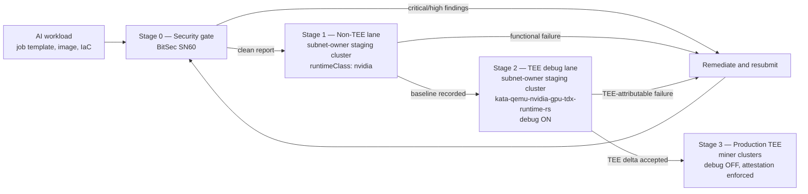
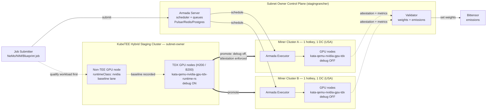
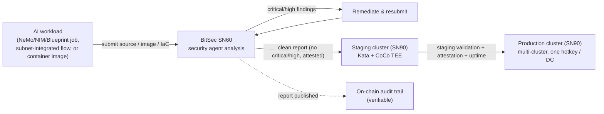
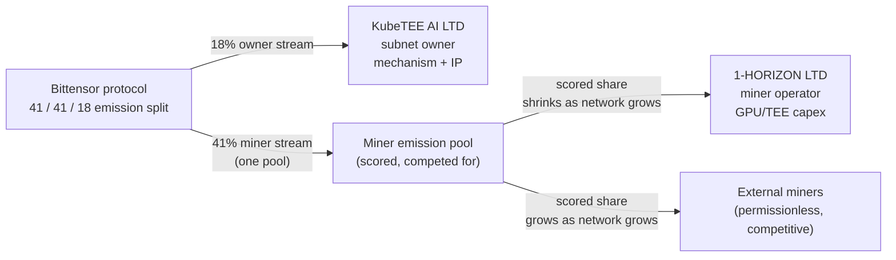
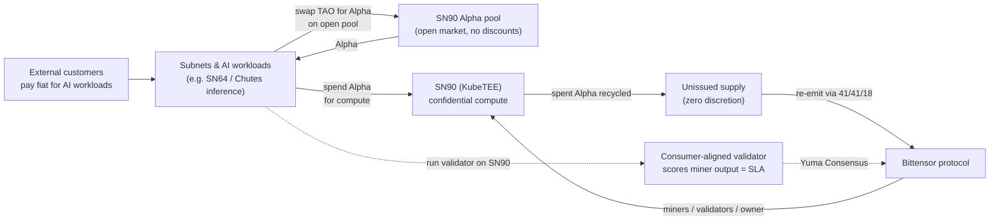
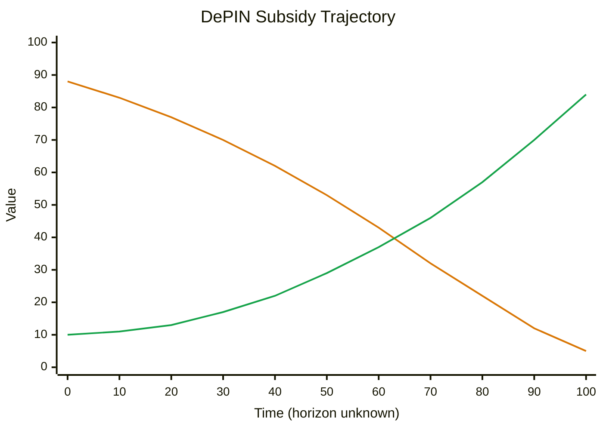
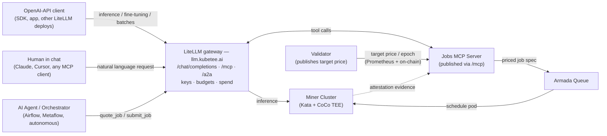

# KubeTEE AI Factory — Confidential Compute for Decentralized AI Jobs

> Enterprise-Grade Confidential Computing AI Factory on Decentralized Kubernetes Infrastructure, scheduled by Armada across Bittensor miner clusters

---

## About

**KubeTEE AI** is the **AI Factory** of the Bittensor network: it turns decentralized GPU clusters into a confidential AI factory. AI workloads run inside hardware-secured Trusted Execution Environments (TEE) using [Kata Containers](https://katacontainers.io/) and [Confidential Containers (CoCo)](https://github.com/confidential-containers/confidential-containers), and are scheduled across miner clusters by [Armada](https://armadaproject.io/) — a CNCF Sandbox multi-cluster Kubernetes batch scheduler.

KubeTEE AI is registered with the [**NVIDIA Inception Program**](https://www.nvidia.com/startups/) and is an active contributor to both the [**Kata Containers**](https://katacontainers.io/) and [**Confidential Containers (CoCo)**](https://github.com/confidential-containers/confidential-containers) ecosystems. It also leverages [**CNCF**](https://www.cncf.io/) projects for cloud-native infrastructure.

### About the Owner

Known as Pierre in the Bittensor community, I have mined since February 2024. I was the first to bring Confidential Computing nodes to Targon (Subnet 4), later helped Chutes (Subnet 64) onboard B200/B300 nodes, and most recently worked with the Lium (Subnet 51) team to deploy Confidential Computing on their stack. Beyond Bittensor, I was also the first to provide Confidential Computing to Telegram Cocoon and Phala Network.

Forty years in infrastructure architecture and deployment at scale. I started in 1986 installing Linux and Novell servers, and in 1992 built one of the first internet providers in Canada. I deployed internet distribution infrastructure in Morocco and have managed tech stacks at scale for cloud providers. My specialty is security, and I have done multiple security audits for Fortune 500 companies.

### Motivation

My expertise in Confidential Computing, Kubernetes, networking, and security at the kernel and hardware level can benefit the Bittensor ecosystem. Having run infrastructure for the compute subnets for more than two years — monitoring, upgrades, and improvements to each subnet tech stack including recently onboarding B200/B300 on Chutes and H200 on Lium — I want to offer a different tech stack that I believe the ecosystem can benefit from and build on: the most secure and efficient decentralized AI Factory stack available.

**Direct Engineering Collaboration**: I work directly with **Intel** and **NVIDIA** engineers throughout the development and testing of NVIDIA technology, especially Kata and CoCo Containers. This close collaboration ensures optimal integration of confidential computing features, early access to emerging technologies, and validation of the KubeTEE implementation against the most stringent security and performance standards.

I actively contribute to OpenInfra and CNCF projects — [Kata Containers](https://katacontainers.io/) and [Confidential Containers (CoCo)](https://github.com/confidential-containers/confidential-containers) provide the TEE foundation for Kubernetes orchestration.

### Confidential Computing Consortium Resources

As a member of the [Confidential Computing Consortium (CCC)](https://confidentialcomputing.io/), I recommend two references:

- **[Protecting Agentic AI Workloads with Confidential Computing](https://confidentialcomputing.io/2026/01/20/protecting-agentic-ai-workloads-with-confidential-computing/)** (January 2026) — Mike Bursell, CCC Executive Director, on why an agent running in infrastructure its owner does not control needs hardware-rooted isolation and remote attestation to get identity integrity and capability confidentiality. That is precisely the threat model KubeTEE's Intel TDX/SGX + NVIDIA CC architecture addresses.
- **[Gartner Top 10 Strategic Technology Trends for 2026](https://www.gartner.com/en/articles/top-technology-trends-2026)** — Gartner ranks **Confidential Computing #3**, alongside AI Supercomputing Platforms (#2), Multiagent Systems (#4), Preemptive Cybersecurity (#7), Digital Provenance (#8), and AI Security Platforms (#9). KubeTEE spans all three of Gartner's themes: The Architect (AI infrastructure), The Synthesist (orchestration), and The Vanguard (security and trust).

### Mission & Vision

**Mission**: To turn decentralized multi-cluster GPU nodes into a worldwide (and in-space) confidential AI factory — running AI training, inference, and data-processing jobs in Trusted Execution Environments, scheduled fairly across Bittensor miner clusters by Armada, with the highest standards of security, compliance, and performance.

**Key Differentiators**:
- **Security-First**: TEE-enabled infrastructure on a FIPS-validated RKE2 baseline with Kata Containers isolation
- **Multi Cluster Scheduler**: multi-cluster batch scheduling with fair-use queuing, gang scheduling, and preemption across decentralized clusters
- **NVIDIA-Powered**: NeMo Microservices, NIM models, and AI Blueprints as first-class confidential job types — and, where NVIDIA's own stack falls short (see [Kata / CoCo Limitations](#kata--coco-limitations-nvidia)), SOTA [Bittensor subnet integrations](#bittensor-subnet-integrations-sota-confidential-ready) running inside Kata + CoCo TEE instead
- **Decentralized**: one hotkey per cluster, nodes co-located in a single data center, expanding across global regions
- **Open Source**: Built on OpenInfra Foundation and CNCF projects with community-driven innovation

---

## Table of Contents

- [About](#about) — owner, motivation, mission
  - [About the Owner](#about-the-owner)
  - [Motivation](#motivation)
  - [Confidential Computing Consortium Resources](#confidential-computing-consortium-resources)
  - [Mission & Vision](#mission--vision)
- [Overview](#overview)
  - [Early Access](#early-access)
  - [What Ships Today](#what-ships-today)
- [The Confidential Compute Challenge: Problems We Solve](#the-confidential-compute-challenge-problems-we-solve)
- [Deploying in a TEE: The Engineering Challenge](#deploying-in-a-tee-the-engineering-challenge)
- [CI/CD — Promotion Pipeline](#cicd--promotion-pipeline)
- [Architecture](#architecture)
  - [Confidential Computing (Kata + CoCo)](#confidential-computing-kata--coco)
  - [Infrastructure](#infrastructure) — RKE2 HA, Armada batch scheduling
  - [Security & Compliance](#security--compliance)
  - [Multi-Cluster Topology](#multi-cluster-topology)
  - [Early Access Topology](#early-access-topology)
- [Supported AI Workloads (Job Types)](#supported-ai-workloads-job-types)
  - [Serving Configurations](#serving-configurations--every-job-requires-fast-inference)
  - [NVIDIA NeMo Microservices](#nvidia-nemo-microservices) — NIM Operator, Kata/CoCo limitations
  - [Bittensor Subnet Integrations](#bittensor-subnet-integrations-sota-confidential-ready)
  - [BitSec SN60 — Security Gate](#bitsec-sn60--security-gate-for-ai-workload-promotion)
- [Subnet Economics](#subnet-economics)
  - [Incentive Mechanism: Infrastructure](#incentive-mechanism-infrastructure-early-access)
  - [Payment methods](#payment-methods)
  - [Staging vs Production](#staging-vs-production)
- [Tokenomics — Utility Token & DePIN Model](#tokenomics--utility-token--depin-model)
  - [Owner Conviction Auto-Locked to Perpetuity](#owner-conviction-auto-locked-to-perpetuity)
  - [Recycle vs Burn](#recycle-vs-burn)
  - [Corporate Structure](#corporate-structure-vertically-split)
  - [Cross-Subnet Consumption Loop](#cross-subnet-consumption-loop-utility-token-flywheel)
  - [DePIN Subsidy Trajectory](#depin-subsidy-trajectory)
- [Validator Scoring & Attestation](#validator-scoring--attestation)
  - [Validator Runtime (TEE)](#validator-runtime-tee)
  - [Rancher v3 Access (Hotkey-signed Auth)](#rancher-v3-access-hotkey-signed-auth)
  - [Evidence Feeds](#evidence-feeds)
  - [Competitive Pricing](#competitive-pricing)
  - [Weight Setting](#weight-setting)
- [Submitting a Confidential Job](#submitting-a-confidential-job)
  - [LiteLLM Gateway — the multi-service front door](#litellm-gateway--the-multi-service-front-door)
  - [Workflow Orchestration (Airflow & Metaflow)](#workflow-orchestration-airflow--metaflow)
  - [Jobs MCP Server](#jobs-mcp-server) — agent and chat-driven job deployment
- [For Miners (Infrastructure)](#for-miners-infrastructure)
  - [Miner onboarding](#miner-onboarding)
  - [Miner deposit (registration collateral)](#miner-deposit-registration-collateral)
- [Roadmap](#roadmap) — [Phase 0](#phase-0--early-access-current) · [Phase 1](#phase-1--expansion) · [Phase 2](#phase-2--paid-jobs) · [Phase 3](#phase-3--job-type-growth)
- [Research & Documentation](#research--documentation)
- [Community & Support](#community--support)

---

## Overview

KubeTEE AI Factory provides Enterprise-Grade Confidential Computing for AI batch jobs on a Decentralized Multi-Cluster Kubernetes RKE2 infrastructure. Jobs are submitted to Armada queues and scheduled across miner clusters, executing inside Trusted Execution Environments (TEE) so that data and models are protected **at rest, in transit, and in use** — and never leave the confidential computing boundary.

Each miner cluster is identified by a permanent Bittensor **hotkey/coldkey** pair. Armada dispatches batch jobs to these clusters as Kubernetes pods; the pods run under a confidential `runtimeClassName` so the workload is hardware-isolated and attested. Two runtime classes carry every confidential workload in this document — **`kata-qemu-nvidia-gpu-tdx`** for GPU TEE and **`kata-qemu-tdx`** for CPU-only TEE — with `nvidia` reserved for the non-confidential staging lane. CoCo provides transparent confidential image decryption and remote attestation via the KBS, so unmodified containers run inside the TEE without changes.

The RKE2 baseline is **[FIPS-140-2 validated](https://docs.rke2.io/security/fips_support)** today; FIPS-140-3 is a [Phase 3](#phase-3--job-type-growth) target. Both are referred to below simply as the FIPS-validated baseline.

### Early Access

KubeTEE is in **Early Access**. The first deployment targets **two clusters in the USA**, one hotkey each, with all nodes of a cluster co-located in a single data center. Early Access focuses on:

- Standing up the Armada multi-cluster batch scheduler across miner clusters
- Running confidential AI jobs in Kata + CoCo TEE pods
- A **hybrid staging cluster** operated by Pierre as the subnet-owner staging miner — non-TEE GPU nodes alongside Intel TDX GPU nodes in the same cluster, with **Kata Containers in debug mode** on the TEE lane. The non-TEE lane gives every workload a functional and performance baseline; debug mode makes confidential failures diagnosable at all. Both are **staging-only** — see [Deploying in a TEE: The Engineering Challenge](#deploying-in-a-tee-the-engineering-challenge)
- A **CI/CD promotion pipeline** every workload passes before it reaches a production miner cluster: security gate → non-TEE lane → TEE debug lane → production TEE with debug off and attestation enforced (see [CI/CD — Promotion Pipeline](#cicd--promotion-pipeline))
- The **validator incentive mechanism**: scoring miners on TEE attestation, Armada job success, uptime, and **competitive pricing** against the other compute subnets (Targon, Lium, Chutes)
- **Emissions + Alpha/TAO paid jobs** — the supply and demand sides of a single mechanism (see [Subnet Economics](#subnet-economics))

### What Ships Today

This README documents both what runs in the KubeTEE infrastructure and what is designed. Sections describing unimplemented work carry a status note pointing back here; this table is the single source of truth for the distinction. **The Bittensor validator v1 is built, tested, and live on Finney** — it scores the subnet-owner staging miner on a single Infrastructure mechanism and sets weights once per epoch. The "Designed / to be built" column lists future-scoring dimensions on top of that base.

| Area | Exists today (infrastructure / design) | Designed / to be built |
|------|--------------------|--------------------|
| **Confidential&nbsp;runtime** | Kata + CoCo TEE runtime classes on TDX H200/B200 nodes | AMD SEV-SNP multi-arch ([Phase 3](#phase-3--job-type-growth)) |
| **Service&nbsp;transport** | [Attestation-gated TLS](#attestation-gated-tls-between-services) — in-guest keypairs, certificates issued only against a valid TDX quote, verified through Intel Trust Authority, terminated inside the guest; the ingress does TLS **passthrough** and holds no key | — |
| **Staging&nbsp;lanes** | Hybrid subnet-owner staging cluster — non-TEE baseline lane + TEE lane with Kata debug mode | — |
| **CI/CD&nbsp;promotion** | Both staging lanes exist | Gate automation, per-revision enforcement, published gate results |
| **Security&nbsp;gate** | — | BitSec SN60 analysis — design concept only |
| **Validator&nbsp;scoring** | **v1 live on Finney:** binary infrastructure-readiness gate (hotkey binding, Rancher readiness, HA topology, capacity, 8-GPU passthrough, confidential runtime handler) + USD-denominated compensation pricing via Taostats + Targon SN4 supply-side clamp + Hippius dashboard | `PROBATION`→`EARNING` state machine; fresh TEE attestation, Armada job metrics, serving probes, workload identity |
| **Validator&nbsp;pricing** | **v1 live:** Taostats compensation feed (`api/dtao/pool/latest/v1`) + Targon SN4 payout feed (`stats.targon.com/api/miners`) + per-GPU price card (H100 $3 / H200 $3.50 / B200 $6.50 / B300 $8 /GPU/hr); one `set_weights` per epoch with rate-limit cooldown | Lium / Chutes demand-side scrape, per-job-class target price, price-competitiveness weighting |
| **Validator&nbsp;runtime** | **v1 live:** flat self-contained Python unit (12 modules, 35 tests) running as a container on the operator's machine; sets weights once per epoch | Run inside a Kata + CoCo TEE pod on the control plane with CoCo remote attestation (the referee itself attested) |
| **Armada** | — | **In development** — Server on the control plane, Executor on each miner cluster ([Phase 0](#phase-0--early-access-current)); move into Kata + CoCo TEE pods with attestation-gated TLS ([Phase 1](#phase-1--expansion)) |
| **Miner&nbsp;onboarding** | KubeTEE applies the hotkey binding | Permissionless self-service ([Phase 1](#phase-1--expansion)) |
| **Miner&nbsp;deposit** | 100 TAO gate **measured, not enforced** | On-chain collateral bonding ([Phase 1](#phase-1--expansion)) |
| **Payments** | Alpha / TAO at a resources price per hour | USDC-on-BASE billing ([Phase 2](#phase-2--paid-jobs)) |
| **LiteLLM&nbsp;gateway** | `llm.kubetee.ai` — OpenAI-compatible inference plus virtual keys, budgets, rate limits, and spend tracking | Run inside a Kata + CoCo TEE pod with TLS terminated in-guest; wire `/mcp` and `/a2a` surfaces and the fine-tuning / batch endpoints through to Armada; KubeTEE as an upstream LiteLLM **provider** |
| **Jobs&nbsp;MCP&nbsp;server** | — | **Not developed yet** — agent- and chat-driven job deployment at `llm.kubetee.ai/mcp` ([Phase 1](#phase-1--expansion)) |

---

## The Confidential Compute Challenge: Problems We Solve

Organizations running sensitive AI workloads — training, fine-tuning, inference, data processing — face an impossible choice between security, cost, and trust. KubeTEE resolves all three:

1. **Private data & models must stay private** — Public cloud AI and traditional deployments expose data in memory and give providers/insiders access. KubeTEE enforces hardware TEE isolation (Intel TDX/SGX, NVIDIA CC) via Kata + CoCo, with remote attestation so you can verify the exact code running on your data; data is protected at rest, in transit, and in use.
2. **Regulated workloads need verifiable compute** — Healthcare (HIPAA), Finance (SOC2/PCI-DSS), Government (FedRAMP) need proof of isolation. KubeTEE provides a FIPS-validated RKE2 baseline, cryptographic attestation, audit trails (Prometheus, Kubernetes events), and isolated namespaces for tenant separation.
3. **Trust in decentralized infrastructure** — Centralized clouds are single points of failure with vendor lock-in. KubeTEE's decentralized multi-cluster architecture, Bittensor incentives, validator attestation, and open standards (Kubernetes, Armada, Kata, CoCo) remove the single point of failure and the lock-in.

---

## Deploying in a TEE: The Engineering Challenge

The section above is why customers need confidential compute. This one is why it is hard to build — and why Early Access runs a hybrid staging cluster and a promotion pipeline instead of deploying straight to production.

**A confidential pod is a virtual machine with an encrypted, attested memory boundary, not a namespaced process on the host.** Every assumption a Kubernetes workload makes about devices, storage, resources, startup time, and debuggability is renegotiated at that boundary. A container image that runs correctly under the `nvidia` runtime class can fail — or run correctly but far slower — under `kata-qemu-nvidia-gpu-tdx-runtime-rs`, for reasons that have nothing to do with the model or the application code:

- **Multi-GPU passthrough is not one problem, it is several.** Getting eight GPUs *and their NVSwitch fabric* into a confidential guest took five stacked fixes on KubeTEE before in-guest NVLink appeared at all. Three of those failures were silent: the pod scheduled, the sandbox booted, the container started, and the workload simply ran on a degraded interconnect or died inside the guest where the host could not see why.
- **Guest resources are not pod resources.** `resources.limits` sizes the container; the guest VM is sized by hypervisor configuration. Upstream runtime-rs boots confidential guests with **one vCPU** and ignores the sizing annotation ([kata-containers#13439](https://github.com/kata-containers/kata-containers/issues/13439)) — fatal for the CPU-bound work AI jobs do at startup (weight load, JIT, CUDA-graph capture), and it presents as "mysteriously slow," not as an error.
- **Cold start breaks normal probe assumptions.** Sandbox creation, guest boot, dm-verity, attestation round trips, in-guest image pull, and weight loading over virtualized storage take minutes. Default probes and CRI timeouts will kill a confidential pod mid-boot.
- **Storage semantics change.** A Filesystem PVC reaches the guest over slow virtio-fs unless the CSI driver is Kata-aware. CoCo is effectively ephemeral-data-only, and data written today lands as plaintext on host-visible media — the guest is encrypted, its data at rest is not.
- **Observability collapses by design.** A TEE exists to stop the host inspecting the workload, so when the workload misbehaves the operator has lost exactly the tools they would normally use. The security property and the debuggability problem are the same property.
- **Failures are destructive and the stack is version-coupled.** Force-deleting a confidential GPU pod can wedge VFIO until a **node reboot** ([kata-containers#13179](https://github.com/kata-containers/kata-containers/issues/13179)). Driver version, guest image, dm-verity hash, and shim are one coupled set — "it worked last month" is not evidence it works now.

None of this is hypothetical; each item has been hit bringing up this stack, and most have an upstream issue attached. Two consequences follow directly, and they shape Early Access:

1. **A reference lane is required to diagnose anything.** Without an identical non-TEE run to compare against, an operator cannot tell "the workload is broken" from "the TEE path is broken" — different owners, different fixes. Hence the hybrid staging cluster.
2. **Debuggability must be bought explicitly, and cannot be bought in production.** Kata debug mode restores guest visibility, but upstream CoCo documentation is explicit that it *changes the attestation evidence and the launch measurement*. A debug-enabled guest cannot serve as an attestation reference — so debug is a staging tool, and "debug off, attestation verified" is itself a promotion gate.

Full detail — every failure class, the hybrid-cluster rationale, and the debug-mode trade-off: [Deploying in a TEE — The Engineering Challenge and the CI/CD Promotion Pipeline](./docs/TEE-DEPLOYMENT-AND-CICD.md).

---

## CI/CD — Promotion Pipeline

Because a workload can pass on a container runtime and fail in a TEE for any of the reasons above, workloads are promoted through **three lanes**, each closer to production than the last, in front of the existing [BitSec SN60 security gate](#bitsec-sn60--security-gate-for-ai-workload-promotion):

```mermaid
flowchart LR
    WL["AI workload<br/>job template, image, IaC"]
    S0["Stage 0 — Security gate<br/>BitSec SN60"]
    S1["Stage 1 — Non-TEE lane<br/>subnet-owner staging cluster<br/>runtimeClass: nvidia"]
    S2["Stage 2 — TEE debug lane<br/>subnet-owner staging cluster<br/>kata-qemu-nvidia-gpu-tdx-runtime-rs<br/>debug ON"]
    S3["Stage 3 — Production TEE<br/>miner clusters<br/>debug OFF, attestation enforced"]
    Fix["Remediate and resubmit"]

    WL --> S0
    S0 -->|"critical/high findings"| Fix
    S1 -->|"functional failure"| Fix
    S2 -->|"TEE-attributable failure"| Fix
    Fix --> S0
    S0 -->|"clean report"| S1
    S1 -->|"baseline recorded"| S2
    S2 -->|"TEE delta accepted"| S3
```

| Stage | Environment | Exit criteria |
|-------|-------------|---------------|
| **0&nbsp;—&nbsp;Security&nbsp;gate** | Pre-deployment | No unresolved critical/high BitSec SN60 findings on code, image, and IaC |
| **1&nbsp;—&nbsp;Non-TEE&nbsp;lane** | Subnet-owner staging cluster, `nvidia` | Job correct; **performance baseline recorded**; resource footprint measured (the input to guest sizing) |
| **2&nbsp;—&nbsp;TEE&nbsp;debug&nbsp;lane** | Subnet-owner staging cluster, confidential runtime, debug on | Sandbox boots; GPU/NVLink topology correct in-guest; guest vCPU/memory verified inside the guest; storage and secrets paths work; startup within re-derived timeouts; **TEE-vs-baseline delta measured and accepted** |
| **3&nbsp;—&nbsp;Production&nbsp;TEE** | Miner clusters, debug off | Debug and debug console **disabled**; attestation verified against **production** measurements (necessarily re-verified — Stage 2's debug config changes the measurement); job completes on a production cluster |

Only after Stage 3 may a workload be published as an Armada job template. Promotion is **per-revision, not once-and-done**: a new image tag, job template, guest image, or driver version re-triggers the pipeline from Stage 0, because the stack underneath a workload can change without the workload changing at all.

> **Status:** both staging lanes exist; gate automation and Stage 0 do not — see [What Ships Today](#what-ships-today) and [the full pipeline spec](./docs/TEE-DEPLOYMENT-AND-CICD.md#4-the-cicd-promotion-pipeline).

---

## Architecture

### Confidential Computing (Kata + CoCo)

**Trusted Execution Environment (TEE)**
- Kata Containers for workload isolation
- Confidential Containers with Workload Identity Validation
- Intel TDX/SGX
- NVIDIA Hopper/Blackwell/Vera Rubin

Confidential jobs execute under the two TEE runtime classes introduced in the [Overview](#overview) — see [Armada Multi-Cluster Batch Scheduling](#armada-multi-cluster-batch-scheduling) for how they are scheduled.

### Infrastructure

#### Kubernetes High Availability

**RKE2 Rancher Kubernetes**
- FIPS-validated, U.S. Federal Government Grade Security
- Fully conformant distribution focused on security and compliance

**Multi-Cluster Management**
- [Rancher Fleet](https://fleet.rancher.io/) GitOps-based Multi-Cluster Management
- Regional deployment: Americas, EU, Middle East, Africa, Asia
- Native integration with Rancher for unified management

**Rancher UI RBAC Management**
- Users/Miners access to isolated Kubernetes Namespaces
- Project-based resource isolation
- Fleet workspaces for multi-tenancy

#### Armada Multi-Cluster Batch Scheduling

[Armada](https://armadaproject.io/) ([GitHub](https://github.com/armadaproject/armada)) is a CNCF Sandbox multi-cluster Kubernetes batch scheduler. It transforms Kubernetes into a high-throughput batch platform while remaining compatible with service workloads, and is used in production to run millions of jobs per day across tens of thousands of nodes.

**Component placement**:
- **Armada Server** (controller, scheduler, lookout + Pulsar/Redis/Postgres) runs on the **subnet-owner control plane** alongside the validator
- **Armada Executor + Installer** run on **each miner cluster**, turning the cluster into a scheduling target (pool)
- Jobs are submitted to **Armada queues** and scheduled across miner clusters with **fair-use queuing**, **gang scheduling**, and **preemption**

**Confidentiality of the scheduler itself** is a second step, not part of the initial install. Phase 0 stands Armada up; [Phase 1](#phase-1--expansion) moves the Server and Executors into Kata + CoCo TEE pods and puts [attestation-gated TLS](#attestation-gated-tls-between-services) on the Server-to-Executor control channel, so a scheduler will not dispatch to an executor that cannot attest and an executor will not accept work from an unattested scheduler. Until then the scheduler is trusted infrastructure while the *jobs* it dispatches are already confidential.

**Confidential execution**:
- Jobs land on nodes with a confidential `runtimeClassName` — `kata-qemu-nvidia-gpu-tdx` for Intel TDX + NVIDIA GPU passthrough, `kata-qemu-tdx` for CPU-only TDX, `nvidia` for the non-confidential staging lane
- **CoCo** handles image decryption and remote attestation via the KBS, so the job image needs no modification to run confidentially

Armada addresses Kubernetes batch limitations that matter for the Factory: single-cluster scaling limits, etcd throughput ceilings, and the lack of fair-use / gang scheduling in the default kube-scheduler.

> **Status:** Armada is not deployed yet. Standing up the Server and Executors is a [Phase 0](#phase-0--early-access-current) item; moving them into TEE is [Phase 1](#phase-1--expansion) ([What Ships Today](#what-ships-today)).

### Security & Compliance

#### Network Security
- Network Policies enforcement (Calico)
- RBAC (Role-Based Access Control)

#### Data Protection
- **Rancher Longhorn**: Encrypted Storage with 3 Replicas
- Encrypted Container Repository
- External Secrets Manager (HashiCorp Vault + CoCo KBS/Trustee)

#### Monitoring & Audit
- Prometheus Metrics
- Kubernetes Events tracking
- UpTime, QoS, and Performance monitoring
- Loki + Grafana Alloy log aggregation

### Multi-Cluster Topology

#### Subnet Owner Infrastructure
- Global Multi-Cluster Control Plane with Rancher on Confidential Computing TEE
- Rancher Multi-Cluster Management with Fleet for GitOps
  - RKE2 Rancher Kubernetes (FIPS-validated baseline)
  - Kata Containers (TEE)
  - [Confidential Containers](https://confidentialcontainers.org/docs/overview/) Operator
  - Armada Server (controller, scheduler, lookout + Pulsar/Redis/Postgres)
- Validator runs in a TEE on the control plane; KubeTEE can also host the validator code (see [Validator Runtime (TEE)](#validator-runtime-tee))

#### Miner Infrastructure
- RKE2 Rancher Kubernetes
- One Cluster per Miner (identified by hotkey, not UID)
  - One data center per cluster — all nodes co-located in a single DC
  - Regional deployment (One Region/Zone Control Plane with same region workers)
  - Cluster carries the `kubetee.ai/hotkey` binding label, **applied by the
    KubeTEE platform** during enrollment — not something the miner creates
- Kata Containers and CoCo Containers (TEE)
- Armada Executor + Installer (scheduled by the subnet-owner Armada Server)
- Fleet Agent for automated deployments

### Early Access Topology

```mermaid
flowchart LR
    subgraph owner["Subnet Owner Control Plane (stagingrancher)"]
        Validator["Validator\nweights + emissions"]
        ArmadaServer["Armada Server\nscheduler + queues\nPulsar/Redis/Postgres"]
    end
    subgraph staging["KubeTEE Hybrid Staging Cluster — subnet-owner"]
        NodeNonTEE["Non-TEE GPU node\nruntimeClass: nvidia\nbaseline lane"]
        NodeTEE["TDX GPU nodes (H200 / B200)\nkata-qemu-nvidia-gpu-tdx-runtime-rs\ndebug ON"]
    end
    subgraph clusterA["Miner Cluster A — 1 hotkey, 1 DC (USA)"]
        ExecA["Armada Executor"]
        NodeA["GPU nodes\nkata-qemu-nvidia-gpu-tdx\ndebug OFF"]
    end
    subgraph clusterB["Miner Cluster B — 1 hotkey, 1 DC (USA)"]
        ExecB["Armada Executor"]
        NodeB["GPU nodes\nkata-qemu-nvidia-gpu-tdx\ndebug OFF"]
    end
    Client["Job Submitter\nNeMo/NIM/Blueprint job"] -->|submit| ArmadaServer
    Client -.->|"qualify workload first"| NodeNonTEE
    NodeNonTEE -.->|"baseline recorded"| NodeTEE
    NodeTEE == "promote: debug off,\nattestation enforced" ==> clusterA
    NodeTEE == "promote" ==> clusterB
    ArmadaServer -->|schedule| ExecA
    ArmadaServer -->|schedule| ExecB
    ExecA --> NodeA
    ExecB --> NodeB
    NodeA -.->|attestation + metrics| Validator
    NodeB -.->|attestation + metrics| Validator
    Validator -->|set weights| Chain["Bittensor\nemissions"]
```

> The **Validator** runs on the control plane inside a confidential Kata + CoCo TEE pod (see [Validator Runtime (TEE)](#validator-runtime-tee)). The **Armada Server** and **Executors** are drawn here as designed: they are stood up in [Phase 0](#phase-0--early-access-current) and move into TEE pods in [Phase 1](#phase-1--expansion) ([What Ships Today](#what-ships-today)).
>
> The **hybrid staging cluster** is KubeTEE's own — it is the only cluster with a non-TEE lane and the only one running Kata debug mode. Workloads are qualified there and promoted to production miner clusters, which are TEE-only with debug disabled. Miner clusters are **not** hybrid: see [For Miners (Infrastructure)](#for-miners-infrastructure) and [CI/CD — Promotion Pipeline](#cicd--promotion-pipeline).

---

## Supported AI Workloads (Job Types)

KubeTEE AI Factory schedules AI workloads as Armada batch jobs that execute inside Kata + CoCo TEE pods. The Factory ships with first-class job templates built on the NVIDIA AI stack — NeMo Microservices, NIM models, and AI Blueprints — and any containerized batch job can be submitted to an Armada queue.

### Serving Configurations — Every Job Requires Fast Inference

Confidential execution is not an excuse for slow inference. **Every job type on KubeTEE requires fast inference**, whether it is an agent loop, a consumer chat session, or an overnight batch. The Kata + CoCo boundary is a security property, not a performance tax, and each workload is held to a latency and throughput target inside the TEE.

No single operating point serves an agentic tool-calling loop and a heavy-context batch equally well, so **every model is published in three serving configurations**. All three run the same attested weights on the same confidential runtime — what differs is how the serve is tuned: concurrency ceiling, batching and chunked-prefill sizing, KV-cache budget, and speculative decoding.

| Configuration | Target workload | Optimized for |
|---------------|-----------------|---------------|
| **Low-latency** | Agentic, low concurrency | Time-to-first-token and per-token latency for tool-calling loops, where every hop blocks the caller. Concurrency is deliberately capped to keep the tail predictable. |
| **Balanced** | General, consumer-aligned | The default consumer-facing operating point — interactive chat responsiveness at a sane occupancy per GPU. |
| **High-throughput** | Batches and heavy-context jobs, no human in the loop | Aggregate tokens per second per GPU — long-context ingestion, evaluation sweeps, and bulk generation, where queueing is acceptable and hardware efficiency dominates. |

A consumer picks the configuration alongside the model at submission. Because the choice determines how much hardware the job occupies and for how long, it is the main lever a consumer has over the resources price per hour (see [Subnet Economics](#subnet-economics) and [Jobs MCP Server](#jobs-mcp-server)).

### NVIDIA NeMo Microservices

[NVIDIA NeMo Microservices](https://docs.nvidia.com/nemo/microservices/latest/about/index.html) are API-first, modular tools for customizing, evaluating, and securing LLMs and embedding models on Kubernetes. A goal of the KubeTEE AI Factory is to run the full NVIDIA AI stack — NeMo Microservices, NIM models, and AI Blueprints — inside Confidential Computing (Kata + CoCo TEE), scheduled as Armada batch jobs.

Each cluster therefore exposes a shared, high-availability NeMo Microservices deployment as **cluster-resident services that scheduled AI jobs call**. This is the distinction between a service and a job: Customizer, Evaluator, Guardrails, Retriever, and the model endpoints are long-lived and shared, while a job is a transient Armada workload that consumes them. A fine-tuning job dispatched to a miner cluster calls the local Customizer, an evaluation job calls the local Evaluator, and a RAG job calls the local Retriever — inside the cluster, without leaving the confidential boundary or crossing the public internet. Sharing one HA deployment per cluster also means the cost of standing up the stack is amortized across every job that lands there, rather than paid again per job.

#### Attestation-Gated TLS Between Services

Traffic between these services is secured by **attestation-gated TLS, not operator-issued mTLS** — a distinction that matters because the threat model excludes the host operator, so a certificate KubeTEE issued proves nothing about the workload holding it:

- **cert-manager** mints private keys into Kubernetes Secrets, so the keys exist in etcd and on the node. KubeTEE staff could impersonate either end, or sit in the middle. The wire is encrypted and the guarantee is zero.
- **A service mesh** (Linkerd, Istio, Calico's Istio integration) binds certificates to a pod's Kubernetes ServiceAccount, which authenticates *identity*, not *integrity*. Flip `runtimeClassName` from a confidential runtime to plain `nvidia` and the workload presents the same valid certificate over the same green mTLS — the mesh cannot tell a TEE workload from a non-TEE one. Its issuer key also lives in a Secret outside any TEE.
- **Host-level encryption** (Calico or Cilium WireGuard/IPsec) is a host-to-host tunnel with no per-workload identity, so it cannot express "refuse a peer that cannot attest," and it leaves the host-to-pod segments in the clear.

The general rule: any encryption layer whose keys are managed by the host fails here, because the host is the adversary being excluded. What KubeTEE runs instead:

1. Each service generates its keypair **inside the guest**; the private key never leaves the CVM.
2. A certificate is issued only against a valid TDX quote whose `report_data` commits to the **SHA-256** hash of that public key — SHA-256 rather than SHA-512 because TDX `report_data` is capped at 64 bytes.
3. The quote is verified through **Intel Trust Authority**, so the relying party checks an Intel signature rather than trusting a KubeTEE verifier, against an allowlist of expected MRTD/RTMR measurements.
4. Each side then refuses a peer that cannot present valid attestation — including one KubeTEE itself launched.

TLS is terminated **inside** the guest, so cleartext exists only in encrypted guest memory. The `report_data` binding in step 2 is what makes a certificate *mean* "this key lives inside an attested TEE" — without it a quote proves a TEE exists somewhere, not that the request entered it.

Inference servers generally cannot enforce client certificates themselves — SGLang has no way to make its HTTP server *require* one — so the attested terminator runs as a second container in the **same** Kata guest, requiring an attested client certificate on the way in and forwarding to the model server over guest loopback. Keeping the terminator inside the CVM is deliberate: everything in the guest is inside the TCB that has to be measured and published, which argues for the smallest possible proxy rather than a full service-mesh sidecar.

#### NIM Operator — Experimental Kata & Dynamo Support

The [NVIDIA NIM Operator](https://docs.nvidia.com/nim-operator/latest/) now ships **experimental** support for running NIM/NeMo workloads inside Kata sandboxes and for Dynamo-orchestrated inference graphs:

- **[Kata Sandbox Workloads (Experimental)](https://docs.nvidia.com/nim-operator/latest/kata-sandbox.html)** — deploys a `NIMService` with `runtimeClassName: kata-qemu-nvidia-gpu` so the NIM runs inside a Kata VM sandbox with hardware-isolated kernel and OS. NVIDIA notes this is a preview for testing only (not production), and that **Confidential Containers** support is planned for a future release.
- **[Dynamo (Experimental)](https://docs.nvidia.com/nim-operator/latest/dynamo.html)** — deploys Dynamo `DynamoGraphDeployment` CRDs (OpenAI-compatible frontend, multi-backend LLM serving, disaggregated prefill/decode) via the NIM Operator with `dynamo.enabled=true`.

> ⚠️ **KubeTEE does not use either path yet.** NeMo Microservices on KubeTEE run on the **stable** TEE runtime classes instead. **KubeTEE is working directly with the NVIDIA NIM Operator and Kata Containers teams** to harden Kata sandbox + CoCo integration and Dynamo's disaggregated serving graphs for production; graduating them is a [Phase 3](#phase-3--job-type-growth) item.

#### Kata / CoCo Limitations (NVIDIA)

The NeMo Microservices docs index does not itself list Kata/CoCo limits — the constraints come from the **NIM Operator** (which deploys NeMo Microservices as CRDs) and the **NVIDIA CoCo Reference Architecture**. They are the reason KubeTEE's current confidential path is the stable CoCo runtime classes rather than the NIM Operator's experimental Kata sandbox:

**NIM Operator Kata Sandbox (experimental)** — [Kata Sandbox docs](https://docs.nvidia.com/nim-operator/latest/kata-sandbox.html)
- **Not confidential computing.** The Kata sandbox runtime class is `kata-qemu-nvidia-gpu` and *"does not enable encryption"* — VM isolation only, no TEE encryption/attestation. The GPU Operator must run in **non-CC mode** (`nvidia.com/cc.mode=off`).
- **CoCo + NIMCache unsupported.** *"Confidential Containers and NIM Cache deployments have not been tested and are not supported in this release."* Only `NIMService` with the Kata sandbox has been tested; CoCo support is planned for a future NIM Operator release.
- **Preview only** — NVIDIA marks it *"experimental, not fully supported, not recommended for production."*

**NVIDIA CoCo Reference Architecture** (the stable `kata-qemu-nvidia-gpu-tdx` path KubeTEE uses) — [Limitations & Restrictions](https://docs.nvidia.com/datacenter/cloud-native/confidential-containers/latest/overview.html)
- **containerd only** — no CRI-O / dockerd for confidential workloads.
- **All GPUs on a host must be in CC mode** — configuring a subset is unsupported; for multi-GPU passthrough, all GPUs must be assigned to a single confidential VM.
- **No nested virtualization** — CoCo must be installed directly on the host, not inside a guest VM.
- **No PCI peer-to-peer (P2P) DMA** — IOMMUFD cannot map PCI BAR regions (QEMU logs warnings; GPU function is unaffected).
- **No host-side NVIDIA driver** — CoCo uses VFIO passthrough; host drivers interfere with VFIO binding (the GPU Operator manages the in-guest driver instead).

**NIM Operator (general)** — [Release Notes](https://docs.nvidia.com/nim-operator/latest/release-notes.html)
- **No multi-node NIM microservice config** — *"The Operator does not support configuring NIM microservices in a multi-node deployment"* (multi-node NIM v2.0 via Ray is a separate, newer path).
- **CC added incrementally** — Kata sandbox is the *"first foundational step"*; full CoCo encryption/attestation through the Operator is future work.

#### Bittensor Subnet Integrations (SOTA, Confidential-Ready)

Given the limitations above, KubeTEE's thesis is that **the Bittensor ecosystem already contains SOTA, verifiable substitutes** for several NeMo stack layers, and that running them inside Kata + CoCo TEE pods — instead of, or alongside, the NVIDIA stack — could sidestep those limitations while keeping workloads confidential. Each subnet below exposes a **verifiable feed** (public API + on-chain metagraph) and is a **potential partnership** that could replace or augment the corresponding NeMo component. These are candidate integrations and proposals, not shipping integrations:

| Subnet | Name | SOTA role | Could replace / augment (NeMo stack) | Confidential-computing fit |
|--------|------|-----------|----------------------------------|----------------------------|
| SN56 | [Gradients](https://www.gradients.io/) (G.O.D) | AutoML tournaments — miners submit open-source SFT / DPO / GRPO training scripts; validators execute on standardized GPU infra and open-source the winners | NeMo Customizer (fine-tuning) | Training scripts execute inside KubeTEE TEE pods → confidential fine-tuning tournaments with open-source winning methods |
| SN120 | [Affine](https://www.affine.io/) | Incentivized RL ("reason mining") — miners submit on-chain model revisions; validators host inference and run challenger-vs-champion duels; winner-takes-all; sybil/decoy/copy/overfitting-proof | NeMo Customizer (RL / reasoning) | Validator inference + duels run in TEE; winning models bridge to Chutes (SN64) for confidential serving |
| SN97 | [Albedo](https://github.com/unarbos/albedo) | King-of-the-hill coding-LLM competition (Qwen3-4B class, SWE-ZERO, LLM-judge ensemble); publishes open distilled checkpoints + duel traces | NeMo Customizer (coding agents) + eval data | Duels run in TEE; open distilled checkpoints are reusable as confidential job templates |
| SN27 | [Orion](https://github.com/SILX-LABS/Orion) | Decentralized data subnet — campaign-driven discovery / generation / curation of model-ready training data with on-chain quality validation | NeMo Data Designer / data pipeline | Data provenance is on-chain; generation miners run in TEE for confidential data pipelines |
| SN22 | [Desearch](https://desearch.ai/) | Decentralized real-time web + X/Twitter search for AI agents; cited, context-rich results via API | NeMo Retriever / RAG grounding | Live retrieval runs as a confidential grounding step inside the TEE before generation |
| SN44 | [Score](https://github.com/score-technologies/turbovision) (TurboVision) | Decentralized computer vision — miners run CV models (object detection, keypoint detection, tracking) on live video/imagery and return structured, decision-ready annotations; validators benchmark on live data via lightweight hybrid validation (frame filtering, keypoint + homography checks, CLIP-based semantic verification). First deployment: Game State Recognition for football at 10–100× lower cost than manual annotation; generalizes to any camera feed | NVIDIA Video Search and Summarization blueprint (video analytics / structured video understanding) | CV inference + validation run inside KubeTEE TEE pods → confidential video analytics with attested structured outputs; sensitive footage stays in the enclave |
| SN64 | [Chutes](https://chutes.ai/) — Parallax (Jon Durbin) | Decentralized serverless inference + **Parallax** decentralized MoE training (surrogate experts, no all-to-all; ternary weights; Gated DeltaNet) across heterogeneous, non-colocated GPUs — within 0.6% of centralized baseline | Inference + distributed training | Chutes already runs a **fully TEE-only infrastructure stack**; Parallax trains frontier models on distributed confidential compute — a native fit for KubeTEE's decentralized TEE clusters |
| SN75 | [Hippius](https://hippius.com/) | Decentralized cloud storage — S3-compatible + IPFS pinning; Arion engine (Reed-Solomon k=10/m=20, CRUSH placement, self-healing) | Persistent storage (solves CoCo's **ephemeral-data-only** limitation) | **Already ships Confidential Compute** (AMD SEV-SNP encrypted VMs); drop-in S3 endpoint replacing/augmenting encrypted Longhorn + object store |
| SN118 | [Ditto](https://heyditto.ai/) | Open-source persistent memory / context layer for AI agents (Claude / Cursor / MCP); miners train the memory-retrieval "harness" | Agent memory / context management | Memory graph backed by confidential storage (e.g. Hippius) so agent context persists across confidential sessions |
| SN60 | [Bitsec.ai](https://bitsec.ai/) | Decentralized AI security — miners submit autonomous security agents that find high/critical-severity exploits in codebases & smart contracts; validators run them in isolated Docker sandboxes and score against benchmark ground truths | **Security gate** (new layer — no NeMo equivalent) | Planned pre-promotion analysis for AI workloads before they reach staging/production on SN90 — design concept, to be detailed during integration (see [BitSec SN60 — Security Gate](#bitsec-sn60--security-gate-for-ai-workload-promotion)) |

KubeTEE treats this as an **open set**: any Bittensor subnet with a SOTA, verifiable solution for a NeMo stack layer — data, training, retrieval, inference, storage, agent memory, or evaluation — is a potential partnership and candidate integration, with the workload adapted to run inside `kata-qemu-nvidia-gpu-tdx` / `kata-qemu-tdx` and its outputs attested and persisted on confidential storage. This is the Bittensor-native path to a confidential AI Factory that is **not locked to a single vendor's experimental stack**, and it is the concrete way KubeTEE could "work with the ecosystem" rather than waiting on the NIM Operator's CoCo roadmap.

#### BitSec SN60 — Security Gate for AI Workload Promotion

> 🧪 **Status: design concept** ([What Ships Today](#what-ships-today)). The gate rules, thresholds, and tooling below are provisional and will be hardened during integration — a [Phase 1](#phase-1--expansion) item.

[Bitsec.ai (SN60)](https://bitsec.ai/) is a decentralized security subnet: miners submit autonomous AI security agents that scan codebases and smart contracts for **high- and critical-severity** vulnerabilities, and validators run those agents in isolated, resource-limited Docker sandboxes, scoring them against benchmark ground truths (SCA-Bench / Smart Contract Audit Benchmark). BitSec already audits other Bittensor subnets' incentive mechanisms and smart-contract code (findings published as critical / high / medium), so it is a natural, verifiable security layer for SN90.

In this design, KubeTEE would use BitSec SN60 as a **mandatory security gate** that an AI workload must pass **before it is promoted to staging or production** clusters on SN90. The gate sits in front of the staging→production pipeline, not inside it:

```mermaid
flowchart LR
    WL["AI workload<br/>(NeMo/NIM/Blueprint job,<br/>subnet-integrated flow, or container image)"] -->|"submit source / image / IaC"| BS["BitSec SN60<br/>security agent analysis"]
    BS -->|"critical/high findings"| Fix["Remediate & resubmit"]
    Fix --> BS
    BS -->|"clean report (no critical/high, attested)"| Stg["Staging cluster (SN90)<br/>Kata + CoCo TEE"]
    Stg -->|"staging validation + attestation + uptime"| Prod["Production cluster (SN90)<br/>multi-cluster, one hotkey / DC"]
    BS -.->|"report published"| Audit["On-chain audit trail<br/>(verifiable)"]
```

**Proposed gate rules (design, subject to change during integration):**
- **Scope** — BitSec analyzes the workload's code (job template, model-serving code, subnet-integration glue, any on-chain/smart-contract code) and the container image it runs, plus the IaC/Helm values that deploy it.
- **Pass condition** — a workload is promoted to staging only with a **clean BitSec report** (no unresolved critical or high-severity findings). Findings are either remediated and resubmitted, or accepted as a documented risk with owner sign-off (production requires the clean report — no sign-off bypass for critical/high).
- **Verifiable** — the BitSec report is published and referenceable (BitSec posts summaries on X and detailed findings on its site), so the security posture of every workload running on SN90 is auditable, not claimed.
- **Re-run on change** — any material change to the workload (new image tag, new job template, new subnet integration) re-triggers the gate; promotion is per-revision, not once-and-done.
- **Confidentiality** — the gate runs on the workload's *code/image*, not on the confidential *data* it will process in production, so running BitSec does not require exposing production data or TEE contents. The analysis itself can run inside a KubeTEE TEE pod when the code under review is itself sensitive.

**Why a gate, not a scanner inside the cluster:** production SN90 clusters run confidential workloads under Kata + CoCo with attested, encrypted memory. A security agent *inside* the TEE would either see confidential data (breaking the trust boundary) or see nothing useful. Putting BitSec **before** promotion keeps the security analysis where it belongs — on the code/image, pre-deployment — and keeps the production TEE boundary intact. This is the Bittensor-native equivalent of a CI security stage, decentralized and incentivized via SN60.

---

## Subnet Economics

### Incentive Mechanism: Infrastructure (Early Access)

KubeTEE Early Access uses a **single Infrastructure incentive mechanism** with two sides. On the **supply side**, miners earn Bittensor emissions for providing confidential compute capacity and reliably executing Armada-scheduled jobs; emissions are distributed per resources provided (GPU nodes), weighted by attested TEE health, job-execution quality, and uptime. On the **demand side**, consumers pay Alpha or TAO at a published **resources price per hour** for the compute they consume.

**TEE attestation is mandatory** — Intel TDX/SGX and NVIDIA CC must be proven, and **no attestation means no emissions**. Compliance is enforced rather than requested, higher-tier GPU nodes earn more, and a miner is paid on capacity it makes available *and can prove*.

#### Payment methods

**Subnet 90 Alpha, other subnets' Alpha, and TAO** are all accepted at the published resources-per-hour price. There are **no discounts and no referrer or reseller program**: SN90 compute is already priced competitively because it is subsidized by subnet emissions, so a discount layer would simply be gamed (see the [Tokenomics](#tokenomics--utility-token--depin-model) boundary conditions).

The price itself is **competitive** (benchmarked against Targon/Lium/Chutes) and **dynamic with queue depth** — see [Competitive Pricing](#competitive-pricing). **USDC-on-BASE billing** and **automated USDC→TAO→Alpha recycling** layer on top in [Phase 2](#phase-2--paid-jobs).

#### Staging vs Production

**Staging Environment** (Permissionless):
- Test applications, infrastructure, upgrades, job validation
- Gateway to Production environment
- Community Staging jobs
- KubeTEE's own staging cluster is **hybrid** — a non-TEE lane for baselining and a TDX lane running Kata in **debug mode** for diagnosis (see [Deploying in a TEE](#deploying-in-a-tee-the-engineering-challenge))

**Production Environment** (after the staging validation period):
- Multi-cluster — one per data center per miner hotkey
- Must pass the staging validation period
- **TEE-only, debug disabled**, attestation verified against production measurements
- Optional KYC for regulated workloads

Staging does not exempt a workload from the security gate — it is the first environment a *clean* workload is allowed to run in. Both environments sit inside the same four-stage pipeline, whose exit criteria are defined in [CI/CD — Promotion Pipeline](#cicd--promotion-pipeline).

---

## Tokenomics — Utility Token & DePIN Model

SN90 (KubeTEE) Alpha is a **utility token consumed to access confidential compute**, not a security. The design follows a DePIN subsidy model: external inference demand buys Alpha on the open market and spends it to consume compute; spent Alpha is **recycled** to unissued supply and re-emitted through the protocol's fixed emission split — a self-sustaining security budget for the compute network (the Bitcoin-fee model applied to Alpha). Full analysis: [Tokenomics — Utility Token & DePIN Model](./docs/TOKENOMICS.md).

### Owner Conviction Auto-Locked to Perpetuity

**KubeTEE AI LTD — subnet owner**: owns the mechanism, the $198k (≈1,003 TAO) subnet registration, and the 18% owner emission stream. No token sales against promises, no customer balances, no treasury — all unused emissions are recycled. KubeTEE AI LTD **auto-locks 100% of its dTAO conviction to perpetuity** — the owner's locked TAO/Alpha conviction is continuously re-locked on-chain so it never decays and is never withdrawn to liquidate. This is a permanent, programmatic commitment, not a discretionary promise: the owner holds no discretionary liquid position to sell, value reaches the owner only through the 18% owner-emission stream, and the owner's conviction is permanently out of the float. It complements the no-treasury posture on the owner side and removes the large-discretionary-insider-position fact pattern from the securities analysis (see [Tokenomics — Utility Token & DePIN Model](./docs/TOKENOMICS.md)).

### Recycle vs Burn

When Alpha is spent for compute, the subnet mechanism chooses what happens to it:

- **Burn** — permanent supply reduction; does not reduce `SubnetAlphaOut`; maximum scarcity signal.
- **Recycle** (chosen) — returns to unissued supply, reduces `SubnetAlphaOut`, extends the Alpha emission runway, pushes halving thresholds out, and refills the miner incentive budget.

For a compute subnet whose product is ongoing work, **recycle** is the right economics: consumption funds future miner emissions. Neither method games emission share.

### Corporate Structure (vertically split)

```mermaid
flowchart LR
    Proto["Bittensor protocol<br/>41 / 41 / 18 emission split"]
    Proto -->|"18% owner stream"| Kube["KubeTEE AI LTD<br/>subnet owner<br/>mechanism + IP"]
    Proto -->|"41% miner stream<br/>(one pool)"| Pool["Miner emission pool<br/>(scored, competed for)"]
    Pool -->|"scored share<br/>shrinks as network grows"| Hori["1-HORIZON LTD<br/>miner operator<br/>GPU/TEE capex"]
    Pool -->|"scored share<br/>grows as network grows"| Ext["External miners<br/>(permissionless, competitive)"]
```

- **KubeTEE AI LTD — subnet owner**: the **18% owner emission stream**, with 100% of conviction auto-locked at perpetuity (above).
- **1-HORIZON LTD — miner operator**: competes for the **41% miner share** like any miner; funds GPU/TEE capex. Registers, competes, and is deregistered under identical rules as every other miner.
- **Target state**: the related-party (1-HORIZON) share shrinks as external miners grow — a declining related-party share is the on-chain evidence the network is real.

### Cross-Subnet Consumption Loop (utility-token flywheel)

```mermaid
flowchart LR
    Cust["External customers<br/>pay fiat for AI workloads"] --> Cons["Subnets & AI workloads<br/>(e.g. SN64 / Chutes inference)"]
    Cons -->|swap TAO for Alpha<br/>on open pool| Pool["SN90 Alpha pool<br/>(open market, no discounts)"]
    Pool -->|Alpha| Cons
    Cons -->|spend Alpha<br/>for compute| SN90["SN90 (KubeTEE)<br/>confidential compute"]
    SN90 -->|spent Alpha recycled| Unissued["Unissued supply<br/>(zero discretion)"]
    Unissued -->|re-emit via 41/41/18| Proto["Bittensor protocol"]
    Proto -->|miners / validators / owner| SN90
    Cons -.->|run validator on SN90| Val["Consumer-aligned validator<br/>scores miner output = SLA"]
    Val -.->|Yuma Consensus| Proto
```

External customers pay fiat for AI workloads → a consuming subnet or AI workload (e.g. SN64 / Chutes) swaps TAO for SN90 Alpha on the **open pool** (no discounts, no allocations, no side-letters) → spends Alpha to consume SN90 confidential compute → spent Alpha is **recycled** to unissued supply → re-emitted via the **41/41/18** split (miners / validators / owner). A **consumer-aligned validator** on SN90 scores miner output — the protocol-native SLA (no contract needed). This is external demand one hop removed, not circular emissions-farming.

### DePIN Subsidy Trajectory

```mermaid
---
config:
  themeVariables:
    xyChart:
      plotColorPalette: '#D97706, #16A34A'
---
xychart-beta
    title "DePIN Subsidy Trajectory"
    x-axis "Time (horizon unknown)" 0 --> 100
    y-axis "Value" 0 --> 100
    line "Emission subsidy" [88, 83, 77, 70, 62, 53, 43, 32, 22, 12, 5]
    line "Consumption revenue" [10, 11, 13, 17, 22, 29, 37, 46, 57, 70, 84]
```

The amber **emission subsidy** line decays as emissions taper over an unknown horizon; the green **consumption revenue** line rises as consumer spend (from subnets and AI workloads) grows. They cross at the **crossover** — the point where net Alpha issuance ≈ 0 and consumers (not emissions) fund the miner budget through the pool. The exact date is unknown (recycle shifts halving thresholds), so the x-axis is an undated horizon, not a halving schedule.

Miner compensation = emissions + consumption spend. While emissions cover most of the cost base, miners price compute below cash cost and the consumer pockets the gap (funded by Alpha dilution). The **subsidy ratio** (emission value ÷ total miner compensation) is the single on-chain KPI, monotonically declining:

- **Pre-crossover** (amber): net inflationary; emissions fund the subsidy.
- **Crossover**: consumption spend = emissions → net Alpha issuance ≈ 0; consumers fund the miner budget through the pool.
- **Post-crossover**: net-deflationary while still paying miners fully.

Defenses: subsidy tapers by a **published glide path** (not surprise); **stack efficiency** is the moat (Kubernetes bin-packing, TEE-attestation confidential-compute premium, higher utilization) — target 70% subsidy / 30% efficiency at launch → 30/70 by crossover. Score verifiable properties (delivered capacity, attested TEE execution, validator-issued challenges) and make self-consumption economically neutral to defeat **wash consumption**.

---

## Validator Scoring & Attestation

The validator is the subnet's referee. In Early Access it scores each miner (one hotkey per cluster) on a single Infrastructure mechanism and sets Bittensor weights each epoch.

> **Status:** validator v1 is **built, tested (35 tests), and live on Finney** —
> it scores the subnet-owner staging miner on a single Infrastructure mechanism and sets Bittensor
> weights once per epoch (boundary-aligned, with `weights_rate_limit` cooldown).
> A public dashboard is published to Hippius S3 every cycle. The sections below
> describe both the running v1 and the future-scoring dimensions on top of it.
> The build-level details are in the `validator/` directory; the pricing design
> is in [Competitive Pricing & Miner Scoring](./docs/COMPETITIVE-PRICING.md).
> See [What Ships Today](#what-ships-today).

The intended shape: on each epoch the validator reads the metagraph,
enumerates clusters/nodes via a GET-only Rancher v3 client, reconciles
(guarded deregistration on sustained absence), recomputes a **binary
infrastructure-readiness verdict** per miner (hotkey binding, Rancher
readiness, HA topology, capacity, GPU passthrough, runtime handler), converts
a USD compensation target into a weight per miner, and sets weights on-chain
via Bittensor `set_weights`. Attestation, Armada, and serving gates are future
scoring dimensions on top of that base.

### Validator Runtime (TEE)

The referee itself must be trustworthy, so the validator process runs **inside a confidential TEE pod** on the subnet-owner control plane, with CoCo remote attestation proving the validator code and configuration are unmodified. Scoring, weight-setting, and credentials (Rancher token, Bittensor wallet) stay confidential and tamper-resistant — the validator cannot be silently altered by the host or hypervisor.

**KubeTEE-hosted validator**: KubeTEE offers to run the validator code in KubeTEE clusters, so a validator operator does not need to provision and operate their own TEE infrastructure. KubeTEE schedules the validator as a confidential workload in a KubeTEE confidential cluster, with attestation evidence available to the subnet. This lowers the barrier to running a validator and ensures every validator runs in a genuine, attested TEE.

### Rancher v3 Access (Hotkey-signed Auth)

To read cluster and node evidence, the validator calls the **Rancher v3 REST
API**. The current combined validator/reconciler needs a least-privilege token
with cluster/node GET/list and cluster DELETE, with no create/update/patch or
unrelated-resource authority. DELETE is reachable only through the guarded
deregistration state machine. An optional `RANCHER_CA_FILE` applies only to
the Rancher HTTP client, not the chain client's TLS trust store. The token
stays inside the validator's TEE pod.

Hotkey-signed issuance remains planned. It must issue the same narrow
read-plus-delete validator role while reconciliation is in-process, or issue a
truly read-only scoring token after reconciliation moves behind a separate
operator-owned mutation credential/controller.

Miners use the same hotkey-signed flow, scoped read-only to their own cluster
(the one carrying their `kubetee.ai/hotkey` label), provisioned automatically
when their cluster is created.

### Evidence Feeds

Scoring today reads one feed: Rancher-reported readiness, topology, capacity, GPU passthrough, and runtime-handler inventory. Three more are designed and **not yet in the weight path**:

- **TEE attestation** — an attestation verifier checking each miner cluster's TEE (Intel TDX/SGX, NVIDIA CC), with CoCo remote attestation proving the confidential image and runtime are unmodified.
- **Armada job metrics** — job success, throughput, latency, fairness, and gang-scheduling evidence from the scheduler and executors.
- **Infrastructure health** — uptime history, QoS, latency, and FIPS validation.

Until they land, the weights make no claim about attested TEE health or job quality.

### Competitive Pricing

SN90 sells compute, so its miners are scored against the **other Bittensor compute subnets** — **Targon (SN4)**, **Lium (SN51)**, and **Chutes (SN64)** — each of which exposes a **verifiable** feed (public API + on-chain metagraph for emission/attestation proof). Targon exposes a **supply-side** payout feed (per-miner emission payout by compute type and card count, via `stats.targon.com`); every Targon GPU miner runs an **8-card node** — the same form factor SN90 requires — so the live per-8-card-node payout (B300 ~64, B200 ~52, H200 ~28, H100 ~24 TAO/epoch) is the direct benchmark SN90 miner compensation must match or miners migrate to SN4. Lium and Chutes expose **demand-side** listing prices. In the design, the validator scrapes those feeds each epoch, cross-checks them against the metagraph, and computes a **target price** per SN90 job class (GPU-hour by GPU type, CPU-hour, per-token inference). The Targon supply-side read is what we're implementing first — see [Two price feeds](#two-price-feeds-only-one-in-the-weight-path) at the end of this section.

The target price is **discovered, not decreed** — a function of three inputs:

- **The compute needed** — the job class (GPU type / GPU-hours / CPU-hours / per-token); price is computed per class, not as a flat number.
- **Competitor signals for the same class** — Targon's per-miner payout by compute type (supply-side) and Lium's / Chutes's listing prices (demand-side), each cross-checked on-chain.
- **SN90 demand** — Armada queue depth and scheduling wait time for that class.

The target price is a **scoring input, not a bill**. Miners are scored on whether the compute they deliver is priced at or below the target (full credit), modestly above (reduced credit), or far above (zero credit for that class — SN90 would lose the demand to SN4/SN51/SN64). A miner with perfect attestation but a price 2× the competitor average scores low. This is what "competitive with the other subnets" means mechanically: the weight vector rewards miners that keep SN90 in the competitive band.

Every input is a public API or on-chain data, and the validator would publish the scraped competitor prices and the computed target price each epoch as Prometheus metrics, so the weight vector stays auditable end-to-end. Full design — competitor feeds, the target-price formula, scoring integration, and verifiability table: [Competitive Pricing & Miner Scoring](./docs/COMPETITIVE-PRICING.md).

#### Two price feeds, only one in the weight path

Two different price concepts live in this repo. Everything above describes the first.

**Competitive pricing — the Targon leg is the next thing to build.** Neither the Targon feed nor the compensation price feed is implemented yet — the validator modules are being written from scratch. What follows is the design to implement. The reference GPU price card is a compiled-in default (H100 $3.00 / H200 $3.50 / B200 $6.50 / B300 $8.00 per GPU-hour); the Targon feed's job is to notice the day those SN4 numbers change.

**Compensation pricing (weight-bearing, to be built).** Each cycle a Taostats feed fetches TAO/USD and alpha→TAO; the miner share of emissions is USD-denominated: an `EARNING` miner's score is `usd_target_per_hour × tenure × window_hours ÷ usd_per_alpha`, where `usd_target_per_hour` applies the GPU $/GPU/hour card to that miner's capacity. Whatever miners do not earn recycles to the owner UID. The feed is a **hard dependency**: if it fails, the cycle is skipped, the previous on-chain weights persist, and reliability counters freeze — the validator never guesses a price.

##### The Targon payout feed (to be built)

The supply-side benchmark ([COMPETITIVE-PRICING.md](./docs/COMPETITIVE-PRICING.md)) reads what SN4 actually pays per card for each GPU class from `https://stats.targon.com/api/miners`, and lets it clamp the GPU card **downward only**.

- **One publisher, many readers.** If every validator polled Targon independently they would sample at different moments and set different weights for identical fleets. The subnet-owner validator publishes one snapshot to [Hippius (SN75)](https://docs.hippius.com/storage/s3/integration) S3; everyone else reads that object. Role is chosen by whether the validator holds write credentials.
- **The card is the target max.** A live payout can only pull SN90 pay **down** toward SN4, never above it, and each class is floored at 75% of the card so a class served by a single Targon node cannot be dragged down by one miner. Those bounds are also what make an unsigned public payload safe to consume.
- **It fails soft**, unlike the compensation feed above: pricing degrades live → last known → card and never skips a cycle. Last-known pricing survives a restart and never expires, since stale data can only overpay relative to SN4; staleness is reported as a metric and a warning rather than acted on by a TTL.

At the values measured on 2026-07-26 this would cut H200 by 5.9% ($3.50 → $3.2922) and leave H100, B200 and B300 untouched.

Per-miner verdicts are binary infrastructure-readiness. On top of that, a `PROBATION(k)` → `EARNING` reliability state machine scores a fully healthy miner `0` until it clears probation, and any failed cycle demotes it and forfeits tenure.

### Weight Setting

These are the intended behaviors for the rebuilt validator:
- Scores are normalized per miner hotkey and set on-chain via Bittensor `set_weights` (single mechanism)
- The miner/owner split is **dynamic, not a fixed share**: each cycle the validator converts a USD compensation target into Alpha at the live token price, and everything miners do not earn recycles to the owner UID
- A cycle that cannot get a trustworthy price, Rancher inventory, or metagraph read is **skipped** rather than guessed — the previous on-chain weights persist and the reliability counters freeze, so an outage never blames miners
- Build spec: [CLAUDE.md — Validator from scratch](CLAUDE.md)

---

## Submitting a Confidential Job

Confidential compute reaches consumers through three front doors, in decreasing order of maturity: the **[LiteLLM gateway](#litellm-gateway--the-multi-service-front-door)** at `llm.kubetee.ai`, which ships today; **[Airflow and Metaflow connectors](#workflow-orchestration-airflow--metaflow)** for multi-step pipelines (designed, not built); and the **[Jobs MCP server](#jobs-mcp-server)** for agents and humans submitting conversationally (not developed yet). Underneath all three, batch work will land on Armada queues (Armada is in development) and be scheduled onto miner clusters with a confidential `runtimeClassName`. In Early Access, direct Armada submission will be open to the subnet owner and authorized integrators.

(Miners join the other side of this: they register one cluster per hotkey with the subnet owner for Rancher Fleet and Armada enrollment — see [For Miners (Infrastructure)](#for-miners-infrastructure).)

### LiteLLM Gateway — the multi-service front door

[LiteLLM](https://github.com/BerriAI/litellm) is an open-source **LLM gateway**, and calling it an "inference proxy" undersells it: a single deployment terminates **three protocol surfaces** — `/v1/chat/completions` for models, `/mcp` for tool servers, and `/a2a` for agent-to-agent invocation — behind one auth, budget, and audit layer ([deployment architecture](https://docs.litellm.ai/docs/mcp_deployment)). KubeTEE runs it at **`llm.kubetee.ai`** as the single entry point to the Factory, and the surfaces map onto confidential services as follows:

| LiteLLM surface | What it does | KubeTEE mapping |
|-----------------|--------------|-----------------|
| `/chat/completions`, `/completions`, [`/responses`](https://docs.litellm.ai/docs/proxy/user_keys) | OpenAI-compatible inference | Confidential SGLang / NIM model services in TEE pods, in all three [serving configurations](#serving-configurations--every-job-requires-fast-inference) |
| `/embeddings`, `/rerank` | Vectorization and reranking | Confidential retrieval services (the NeMo Retriever layer, or a [subnet substitute](#bittensor-subnet-integrations-sota-confidential-ready)) |
| `/images`, `/images/edits`, `/audio/speech`, `/audio/transcriptions` | Multimodal generation and ASR | Multimodal job types on the same attested runtime |
| [`/fine_tuning/jobs`](https://docs.litellm.ai/docs/fine_tuning), `/batches`, `/files` | Long-running asynchronous work | **The OpenAI-shaped door onto Armada confidential jobs** — the same batch path the MCP server deploys to, reachable by anything that already speaks the OpenAI fine-tuning API |
| [`/mcp`](https://docs.litellm.ai/docs/mcp_deployment) | MCP gateway — publishes tool servers to any MCP client, with per-user credential passthrough (`x-mcp-{server}-authorization`) | Where the [Jobs MCP server](#jobs-mcp-server) is published, so job deployment inherits the gateway's auth and budgets rather than reinventing them |
| [`/a2a`](https://docs.litellm.ai/docs/a2a) | Agent-to-agent — routes JSON-RPC `message/send` to registered downstream agents | Agents executing **inside** TEE pods, callable without exposing the cluster |
| [Guardrails](https://docs.litellm.ai/docs/adding_provider/generic_guardrail_api) | Policy enforcement across every endpoint above | Pre- and post-call policy on confidential traffic |
| [Virtual keys, teams, orgs](https://docs.litellm.ai/docs/proxy/virtual_keys), hierarchical budgets, RPM limits, spend tracking | Multi-tenant governance — budgets inherit down the hierarchy and requests are blocked in real time when any level is exhausted | **The metering surface for Alpha/TAO billing** at the published resources price per hour (see [Subnet Economics](#subnet-economics)) |

**The gateway itself runs inside a TEE.** A front door that terminates TLS on the host would undo the whole property — every prompt and completion would sit in cleartext in host memory before reaching a confidential backend, and the confidential backends would be the only confidential part of the path. So LiteLLM runs under a confidential runtime class like any other workload, the cluster ingress is configured for **TLS passthrough** (it holds no private key and never sees plaintext), and TLS terminates inside the guest. From there the gateway speaks [attestation-gated TLS](#attestation-gated-tls-between-services) to the model services, which refuse any peer that cannot attest. A caller who verifies the gateway's certificate against its quote therefore covers the whole path transitively — but only because the gateway's own published measurement pins that policy, which is what makes publishing measurements load-bearing rather than decorative.

Two things follow. First, a consumer adopts KubeTEE by changing a base URL — no KubeTEE-specific SDK, and the tools, agents, and fine-tuning jobs they already run keep working, only now inside a TEE. Second, KubeTEE contributes to LiteLLM upstream and is integrating as a **provider inside the open-source project**, so a LiteLLM deployment *someone else* operates can route to KubeTEE confidential compute as a first-class backend rather than a hand-configured custom endpoint. Meeting consumers in the open-source platforms they already run is the distribution strategy; the gateway is not a KubeTEE-only walled garden.

> **Status:** the gateway endpoint (`llm.kubetee.ai`) serves inference and multi-tenant governance (virtual keys, budgets, rate limits, spend tracking) today. Two things are planned, not yet shipped: running the gateway itself inside a Kata + CoCo TEE pod with TLS terminated in-guest, and the upstream provider integration plus wiring `/mcp`, `/a2a`, and the fine-tuning and batch endpoints through to Armada. See [What Ships Today](#what-ships-today).

### Workflow Orchestration (Airflow & Metaflow)

For **multi-step AI pipelines** — ETL → fine-tune → evaluate → register → deploy — KubeTEE integrates with two open-source orchestrators so each pipeline step runs as a confidential Armada batch job inside Kata + CoCo TEE pods:

- **[Apache Airflow](https://airflow.apache.org/)** — DAG-based pipeline orchestration. Author DAGs on the control plane (or externally); each task submits an Armada job spec with a confidential `runtimeClassName`. Airflow schedules the *pipeline*; Armada schedules the *task pods* across miner clusters.
- **[Metaflow](https://metaflow.org/)** — a Python framework for data-science / ML workflows. Author flows with `@step`-style decorators; a KubeTEE Metaflow producer submits each step to an Armada queue as a confidential pod. Iterate locally, run production steps in TEE.

**Confidential pipelines**: every task pod runs under a TEE runtime class with CoCo remote attestation. Pipeline artifacts move through encrypted Longhorn volumes or an encrypted object store; secrets are injected via the CoCo KBS — no plaintext secrets in DAG/flow code. A pipeline can verify a step's attestation evidence before passing artifacts downstream.

See [Workflow Orchestration — Airflow & Metaflow](./docs/WORKFLOW-ORCHESTRATION.md) for architecture, connector design, and example DAG / Metaflow flow snippets.

> **Status:** designed, not built — the Armada connectors are a [Phase 1](#phase-1--expansion) item ([What Ships Today](#what-ships-today)). Armada itself is in development.

### Jobs MCP Server

The **Jobs MCP server** is the [Model Context Protocol](https://modelcontextprotocol.io/) front door to the Factory: it is how a job gets **deployed**, and pricing is one step in that path rather than the point of it. Three kinds of caller use the same interface — an **autonomous AI agent** deciding it needs compute, a **human in a chat client** (Claude, Cursor, or any MCP-capable assistant) asking for a job in natural language, and a **pipeline orchestrator** such as Airflow or Metaflow submitting a step. Whoever is calling, the server is the single validator-aligned interface between "I want to run this" and "the job is queued on a miner cluster."

**This complements the REST surface — it does not replace it, and it is not a separate deployment.** The [LiteLLM gateway](#litellm-gateway--the-multi-service-front-door) is itself an [MCP gateway](https://docs.litellm.ai/docs/mcp_deployment): the Jobs MCP server is published *through* `/mcp`, so it inherits the gateway's virtual keys, budgets, rate limits, and spend tracking instead of reinventing them, and a client that already points at `llm.kubetee.ai` for inference discovers job deployment at the same endpoint with the same credential.

**What it adds** is intent-level submission. REST is the right shape when the caller already knows what it wants — a fine-tuning job with a file id and a model name. It is the wrong shape for *"fine-tune this model on eight H200s overnight, high-throughput config"*, where the caller needs the catalogue browsed, the cost quoted, the trade-off explained, and the job tracked to completion in one conversation. That is what MCP is for, and why the same capability is exposed twice: **the OpenAI fine-tuning and batch APIs for programmatic callers, MCP for agents and humans reasoning about the job before committing to it.**

**Pricing is a step, not the product.** Quoting exists so a caller knows the cost before committing, and so every consumer is quoted against the same numbers the validator enforces on miners. The validator discovers a per-job-class **target price** each epoch from Targon / Lium / Chutes signals and SN90 demand (see [Competitive Pricing](#competitive-pricing) — that discovery is **not implemented yet**; see [Two price feeds](#two-price-feeds-only-one-in-the-weight-path)). The server is a **read client** of that published price, never a price-setter, which is why the deployment path depends on the competitive-pricing work landing first.

**Tools (design concept):**
- `list_job_templates()` — the catalogue a caller can deploy: NeMo / NIM / Blueprint templates, the [serving configurations](#serving-configurations--every-job-requires-fast-inference), and the GPU classes each is available on.
- `get_target_price(job_class, gpu_type)` — the current validator-established target resources price per hour for a job class.
- `quote_job(resources, duration, job_class)` — resource-hours (GPU type × count × hours, CPU-hours, or per-token) × target price per hour → the Alpha/TAO cost the caller pays.
- `submit_job(job_spec, priced)` — deploys the priced job to the Armada queue with a confidential `runtimeClassName`; returns the Armada job id.
- `get_job_status(job_id)` — queue position, execution state, and the attestation evidence for the pod that ran it, so a chat client or agent can follow a job to completion.

**Flow:**

```mermaid
flowchart LR
    App["OpenAI-API client<br/>(SDK, app, other LiteLLM deploys)"]
    Human["Human in chat<br/>(Claude, Cursor, any MCP client)"]
    Agent["AI Agent / Orchestrator<br/>(Airflow, Metaflow, autonomous)"]
    Lite["LiteLLM gateway — llm.kubetee.ai<br/>/chat/completions · /mcp · /a2a<br/>keys · budgets · spend"]
    MCP["Jobs MCP Server<br/>(published via /mcp)"]
    Val["Validator<br/>(publishes target price)"]
    Arm["Armada Queue"]
    TEE["Miner Cluster<br/>(Kata + CoCo TEE)"]

    App -->|"inference / fine-tuning / batches"| Lite
    Human -->|"natural language request"| Lite
    Agent -->|"quote_job / submit_job"| Lite
    Lite -->|"inference"| TEE
    Lite <-->|"tool calls"| MCP
    Val -->|"target price / epoch<br/>(Prometheus + on-chain)"| MCP
    MCP -->|"priced job spec"| Arm
    Arm -->|"schedule pod"| TEE
    TEE -.->|"attestation evidence"| MCP
```

**Confidentiality:** the server is control-plane only — it quotes, queues, and reports status; it never sees job data. The pods it deploys run inside TEEs with CoCo remote attestation and KBS-injected secrets, so even the operator of the MCP server cannot read what the job processes. Payment for the quoted resource-hour cost is settled on-chain or via the Phase 2 escrow — the server records the quote, it does not custody funds.

> **Status:** not developed yet — a [Phase 1](#phase-1--expansion) item that depends on the competitive-pricing work being implemented first ([What Ships Today](#what-ships-today)).

---

## For Miners (Infrastructure)

### Miner onboarding

**KubeTEE onboards each miner today.** The miner supplies the cluster and the
hardware it runs on (requirements below); KubeTEE binds it by applying the
`kubetee.ai/hotkey` label that links the cluster to the miner's registered
hotkey. Rancher Fleet GitOps then deploys the infrastructure onto RKE2 and
verifies attestations and metrics.

**Self-service permissionless onboarding ships in Phase 1** — see
[Roadmap](#phase-1--expansion). Until then the platform endpoints, credentials,
and binding procedures behind onboarding are intentionally not published in this
public repository.

> **The hybrid staging cluster is not a template for miners.** KubeTEE operates one hybrid staging cluster with a non-TEE lane and Kata debug mode so that *workloads* can be qualified before they reach miner infrastructure — see [CI/CD — Promotion Pipeline](#cicd--promotion-pipeline). Miners do **not** run a non-TEE lane and do **not** run debug mode: non-TEE capacity is not confidential capacity and is not what the subnet scores, and debug mode changes the attestation measurement (see [Deploying in a TEE](#deploying-in-a-tee-the-engineering-challenge)). The promotion burden sits with the workload, not the miner — miners provide attested confidential capacity and execute jobs that have already passed the gates.

**Minimum For Staging Participation**:

What the **miner** provides:

- ✅ Intel TDX (AMD SEV-SNP, Phase 3) compatible node with NVIDIA H100/H200/B200/B300
- ✅ BIOS TDX/SGX Enabled
- ✅ Kernel TDX/SGX Enabled
- ✅ One Cluster per Miner
- ✅ Same Regional deployment (Workers in same Data Center)
- ✅ Cluster registered with Rancher for Fleet management
- ✅ Production Rancher inventory passes the infrastructure-readiness policy
  (readiness, HA topology, CPU/memory, eight-GPU workers, passthrough wiring,
  confidential runtime handler)
- ✅ A **100 TAO deposit** held as on-chain registration collateral on the
  mining hotkey — see [Miner deposit (registration
  collateral)](#miner-deposit-registration-collateral)

What **KubeTEE** applies (platform enrollment — not a miner task):

- The `kubetee.ai/hotkey` binding label linking the cluster to the miner's
  registered hotkey, one cluster per hotkey
- Any further `kubetee.ai/*` platform labels; the validator reads only the
  hotkey label and the `kubetee.ai/ban` safety switch

**For Production Participation**:

- ✅ Successfully passed Staging validation period

### Miner deposit (registration collateral)

Every miner posts a **100 TAO deposit**, held as on-chain **registration
collateral** on its own mining hotkey, so that a miner accepting confidential
workloads has capital committed to the SLA it agreed to. It is the same amount
for every miner.

The deposit is **not a fee, not custodial, and not slashable**. It stays on the
miner's own hotkey — KubeTEE never holds it and no KubeTEE key can move it — and
it is released back to withdrawable stake as that hotkey earns emission.
Bittensor has no confiscation extrinsic: a miner that breaches its SLA stops
being scored, which stops its emission, which stops the deposit draining, so the
capital **freezes on the miner's own hotkey** rather than being taken. That
freeze reverses as soon as the miner is back in compliance.

> **Status:** the gate **measures but does not enforce**, so every miner's
> coverage is visible before anyone's score depends on it ([What Ships
> Today](#what-ships-today)). Bonding a share of the registration price on chain
> is a separate [Phase 1](#phase-1--expansion) change this deposit does not
> depend on.

Full detail — the chain primitive, how the TAO requirement converts to Alpha,
grace and recovery behaviour, the `btcli` commands for topping up, and the
owner/miner/validator runbooks — is in
[Miner Deposit (Registration Collateral)](./docs/MINER-DEPOSIT.md). Hardware and
label requirements are in [GPU Node
Requirements](./docs/GPU-NODE-REQUIREMENTS.md), [Node
Registration](./docs/NODE-REGISTRATION.md), and the [Cluster Naming
Convention](./docs/CLUSTER_NAMING_CONVENTION.md).

---

## Roadmap

### Phase 0 — Early Access (Current)

- [x] Kata + CoCo TEE runtime classes (`kata-qemu-nvidia-gpu-tdx`, `kata-qemu-tdx`)
- [x] Hybrid staging cluster — non-TEE GPU node alongside TDX H200/B200 nodes, so every workload gets a functional and performance baseline before it is run confidentially (see [Deploying in a TEE](#deploying-in-a-tee-the-engineering-challenge))
- [x] Kata debug mode on the staging TEE lane — guest boot logs, agent debug, and debug console for diagnosing confidential failures; staging-only because it changes the attestation measurement
- [ ] Validator runs in a TEE (Kata + CoCo) on the control plane; CoCo attestation proves the validator code is unmodified
- [x] [Attestation-gated TLS](#attestation-gated-tls-between-services) on the served backend (Kata runtime deployed) — in-guest keypairs, certificates issued only against a valid TDX quote verified through Intel Trust Authority, ingress on TLS passthrough, termination inside the guest
- [ ] **Confidential model catalogue for SN28 (SayGM — a Bittensor inference subnet that routes to a catalogue of served models) with priority in Cluster jobs** — stand up a TEE-served model line-up behind the SN28 router, every model published in all three [serving configurations](#serving-configurations--every-job-requires-fast-inference) and billed at the below market of Openrouter prices per token (a demand channel, **not** a discounted reseller tier — see [Payment methods](#payment-methods)):
  - [ ] **Kimi-K3** — B300 nodes
  - [x] **DeepSeek-V4-Pro** — B200 nodes
  - [x] **DeepSeek-V4-Flash** — H200 nodes
  - [x] **Qwen3.6-35B-A3B** — H100 nodes
  - [ ] **SOTA embedding model**
  - [ ] **Specialised models for vectorization, LLM-as-judge, and document retrieval** — served through [NeMo Microservices](#nvidia-nemo-microservices) (NeMo Retriever + Evaluator)
- [ ] Deploy 2 US clusters (one hotkey each, nodes co-located in a single DC)
- [ ] Armada Server Multi-cluster Scheduler on the subnet-owner control plane; Armada Executor on each miner cluster
- [ ] Automate the CI/CD promotion pipeline — enforce the four stages (security gate → non-TEE baseline → TEE debug → production TEE with debug off and attestation verified), re-run per revision, and publish gate results (see [CI/CD — Promotion Pipeline](#cicd--promotion-pipeline))
- [ ] Binary Infrastructure validator gate (hotkey binding identity, Rancher readiness, HA, capacity, GPU/runtime wiring)
- [ ] Extend scoring with fresh TEE attestation, Armada job metrics, serving probes, workload identity, and KeyLease freshness
- [ ] KubeTEE-hosted validator offering: KubeTEE runs the validator code in a KubeTEE confidential cluster for operators without their own TEE infrastructure
- [ ] Validator Rancher v3 API access: a validator authenticates by **signing a challenge with its Bittensor hotkey**; an auth mechanism connected to Rancher verifies the signature and issues the narrow cluster/node-read plus guarded-cluster-delete role. Split reconciliation behind an operator-owned mutation credential/controller before describing validator scoring tokens as read-only — see [Rancher v3 Access (Hotkey-signed Auth)](#rancher-v3-access-hotkey-signed-auth) and CLAUDE.md "Validator Rancher API Access"
- [ ] Miner Rancher access on cluster creation: the miner authenticates with the same **hotkey-signed** flow, scoped **read-only** to their own cluster (the one carrying their `kubetee.ai/hotkey` label, bound to `cluster-readonly`) so the miner can observe their cluster (subnet owner manages via Fleet)
- [ ] Emissions rewards for miners providing confidential compute capacity (supply-side)
- [ ] Alpha / TAO paid jobs (demand-side) — compute priced at a resources price per hour, dynamic with Armada queue depth and wait time per job class
- [ ] Competitive pricing, supply side: implement the live Targon (SN4) payout feed to clamp the GPU price card (one publisher, all validators read), and the per-GPU price paid to miners
- [ ] Competitive pricing, demand side: scrape Lium (SN51) / Chutes (SN64) price feeds, compute per-class target price, score miners on price competitiveness
- [ ] Confidential job templates — NeMo / NIM / Blueprint, for subnet owners and approved integrators

### Phase 1 — Expansion

- [ ] **Permissionless miner onboarding** — a self-service flow where a registered miner proves control of its own cluster and the `kubetee.ai/hotkey` binding is applied without operator involvement (today KubeTEE performs onboarding — see [Miner onboarding](#miner-onboarding))
- [ ] **Bond the registration price on chain** — set the subnet's `collateral_lock_share` and `collateral_drain_ratio` so a share of each registration is locked as collateral rather than burned. The drain ratio governs how long a miner stays accountable and can only be sized against observed per-miner emission, so both values are set in Phase 1 once that data exists; Phase 0 runs the [100 TAO deposit](#miner-deposit-registration-collateral) through the validator gate alone (see [Miner Deposit](./docs/MINER-DEPOSIT.md))
- [ ] More US + international clusters
- [ ] **Armada in TEE** — move the Phase 0 Server and Executors onto Kata + CoCo TEE pods, with [attestation-gated TLS](#attestation-gated-tls-between-services) on the Server-to-Executor control channel (see [Armada Multi-Cluster Batch Scheduling](#armada-multi-cluster-batch-scheduling))
- [ ] Armada fair-use + gang scheduling hardening
- [ ] Automated TEE attestation cronjobs
- [ ] Validator scoring expansion: TEE attestation + Armada job metrics + infrastructure health (replacing the Early Access liveness stand-in)
- [ ] Apache Airflow + Metaflow Armada connectors — multi-step confidential pipelines (see [Workflow Orchestration](./docs/WORKFLOW-ORCHESTRATION.md))
- [ ] Jobs MCP server — deploy confidential jobs from an autonomous agent, a human chat client, or a pipeline orchestrator: browse templates, quote, submit to Armada, and track status and attestation; quoting grounded in the Phase 0 [Competitive Pricing](./docs/COMPETITIVE-PRICING.md) target price (see [Jobs MCP Server](#jobs-mcp-server))
- [ ] BitSec SN60 security gate — mandatory AI-workload security analysis (code/image/IaC) before promotion to staging/production (see [BitSec SN60 — Security Gate](#bitsec-sn60--security-gate-for-ai-workload-promotion))
- [ ] Build documentation website

### Phase 2 — Paid Jobs

- [ ] USDC-on-BASE job billing (pull-based, per-epoch metering) — fiat billing layered on top of the Early Access Alpha / TAO resources-per-hour pricing
- [ ] Automated USDC→TAO→Alpha recycling (unused emissions recycled)

### Phase 3 — Job-Type Growth

- [ ] More job templates
- [ ] Multi-arch TEE (Intel TDX + AMD SEV-SNP)
- [ ] Additional confidential compute runtimes
- [ ] FIPS-140-3 on the FIPS-140-2 validated RKE2 baseline
- [ ] NIM Operator Kata Sandbox + Dynamo production-readiness — graduate NVIDIA's [experimental Kata Sandbox](https://docs.nvidia.com/nim-operator/latest/kata-sandbox.html) and [experimental Dynamo](https://docs.nvidia.com/nim-operator/latest/dynamo.html) support to production confidential deployments (KubeTEE working with the NVIDIA NIM Operator and Kata Containers teams)

---

## Research & Documentation

### Documentation
- [Miner Deposit — registration collateral](./docs/MINER-DEPOSIT.md) — the 100 TAO on-chain registration deposit, chain primitive, and runbooks
- [Node Registration](./docs/NODE-REGISTRATION.md) — Miner RKE2 node registration and `kubetee.ai/*` labels
- [GPU Node Requirements](./docs/GPU-NODE-REQUIREMENTS.md) — GPU/TEE hardware requirements
- [Cluster Naming Convention](./docs/CLUSTER_NAMING_CONVENTION.md) — `kubetee.ai/*` labels and Fleet GitOps targeting
- [FIPS-140-3 Target](./docs/FIPS-140-3.md) — RKE2 + Kata + CoCo FIPS stack research
- [Confidential Containers Certification](./docs/certification-confidential-containers.md) — CC standards and Kata runtime mapping
- [Deploying in a TEE — Challenge & CI/CD](./docs/TEE-DEPLOYMENT-AND-CICD.md) — why TEE deployment is hard, the hybrid staging cluster, Kata debug mode, and the promotion pipeline
- [Workflow Orchestration — Airflow & Metaflow](./docs/WORKFLOW-ORCHESTRATION.md) — orchestrating multi-step confidential pipelines on Armada
- [Tokenomics — Utility Token & DePIN Model](./docs/TOKENOMICS.md) — recycle vs burn, securities posture, cross-subnet consumption loop, DePIN subsidy trajectory
- [Competitive Pricing & Miner Scoring](./docs/COMPETITIVE-PRICING.md) — pricing SN90 against Targon/Lium/Chutes and how price becomes weights

### External Resources
- [Armada](https://armadaproject.io/) | [Armada GitHub](https://github.com/armadaproject/armada) — multi-cluster batch scheduler
- [Apache Airflow](https://airflow.apache.org/) | [Metaflow](https://metaflow.org/) — pipeline orchestration for confidential Armada jobs
- [LiteLLM](https://github.com/BerriAI/litellm) ([docs](https://docs.litellm.ai/)) — the gateway: models, [MCP tool servers](https://docs.litellm.ai/docs/mcp_deployment), [A2A agents](https://docs.litellm.ai/docs/a2a), [fine-tuning](https://docs.litellm.ai/docs/fine_tuning), and multi-tenant governance behind one endpoint
- [Model Context Protocol](https://modelcontextprotocol.io/) — the agent- and chat-facing job interface
- [Kata Containers](https://katacontainers.io/) | [Confidential Containers](https://github.com/confidential-containers/confidential-containers)
- [NVIDIA NIM Operator](https://docs.nvidia.com/nim-operator/latest/) — [Kata Sandbox (Experimental)](https://docs.nvidia.com/nim-operator/latest/kata-sandbox.html) | [Dynamo (Experimental)](https://docs.nvidia.com/nim-operator/latest/dynamo.html)
- [RKE2 FIPS Support](https://docs.rke2.io/security/fips_support)

### Community & Support

- **GitHub**: [KubeTEE-AI/kubetee-subnet](https://github.com/KubeTEE-AI/kubetee-subnet)
- **Documentation**: [docs/](./docs/)
- **Discord**: Coming soon
- **Twitter**: Coming soon

---

**Built by the KubeTEE Community**

*Confidential compute for decentralized AI jobs — secured by TEE, scheduled by Armada, incentivized by Bittensor.*
