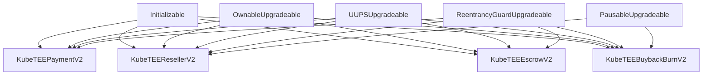

# Contract Migration & Upgrade Plan

## Executive Summary

Migrate 4 payment contracts from `contracts/` to `kubetee/contracts/contracts/` while upgrading them to OpenZeppelin best practices with:
- **UUPS Upgradeability** - Safe proxy pattern for future upgrades
- **Admin/Operator Model** - Separation of concerns for access control
- **OpenZeppelin Upgradeable** - Use battle-tested upgradeable base contracts

---

## Current State Analysis

### Contracts to Migrate

| Contract | Current Pattern | Issues |
|----------|-----------------|--------|
| `KubeTEEPayment.sol` | `Ownable` | Not upgradeable, single owner model |
| `KubeTEEReseller.sol` | `Ownable`, `ReentrancyGuard`, `Pausable` | Not upgradeable, validators tied to owner |
| `KubeTEEEscrow.sol` | `Ownable`, `ReentrancyGuard` | Not upgradeable, validators authorizedValidators mixed |
| `KubeTEEBuybackBurn.sol` | `Ownable`, `ReentrancyGuard`, `Pausable` | Not upgradeable, single owner model |

### Reference Pattern (KubeTEEGitHubRegistry.sol)

```solidity
import "@openzeppelin/contracts-upgradeable/access/OwnableUpgradeable.sol";
import "@openzeppelin/contracts-upgradeable/proxy/utils/Initializable.sol";
import "@openzeppelin/contracts-upgradeable/proxy/utils/UUPSUpgradeable.sol";

contract KubeTEEGitHubRegistry is Initializable, OwnableUpgradeable, UUPSUpgradeable {
    mapping(address => bool) public isOperator;
    
    modifier onlyOperator() { require(isOperator[msg.sender], "Only operators"); _; }
    
    constructor() { _disableInitializers(); }
    
    function initialize() public initializer {
        __Ownable_init(msg.sender);
        __UUPSUpgradeable_init();
    }
    
    function _authorizeUpgrade(address) internal override onlyOwner {}
}
```

---

## Target Architecture

### Access Control Model

```
┌─────────────────────────────────────────────────────────────────────┐
│                        ACCESS CONTROL                                │
├─────────────────────────────────────────────────────────────────────┤
│                                                                      │
│  ┌──────────────┐                    ┌──────────────────────────┐   │
│  │    ADMIN     │                    │       OPERATOR(s)        │   │
│  │   (Owner)    │                    │                          │   │
│  └──────┬───────┘                    └────────────┬─────────────┘   │
│         │                                         │                  │
│         │ • Add/remove operators                  │ • Process        │
│         │ • Upgrade contract                      │   payments       │
│         │ • Pause/unpause                         │ • Report usage   │
│         │ • Set configuration                     │ • Settle epochs  │
│         │ • Emergency withdraw                    │ • Submit         │
│         │                                         │   attestations   │
│         │                                         │                  │
└─────────┴─────────────────────────────────────────┴──────────────────┘
```

### Inheritance Diagram



---

## Contract Specifications

### 1. KubeTEEPaymentV2.sol

**Purpose:** Pull-based payment with affiliate tracking

**Changes from V1:**
- Replace `Ownable` with `OwnableUpgradeable`
- Add UUPS upgradeability
- Add Operator role for payment processing
- Replace `immutable usdc` with storage variable + setter

```solidity
// New imports
import "@openzeppelin/contracts-upgradeable/access/OwnableUpgradeable.sol";
import "@openzeppelin/contracts-upgradeable/proxy/utils/Initializable.sol";
import "@openzeppelin/contracts-upgradeable/proxy/utils/UUPSUpgradeable.sol";
import "@openzeppelin/contracts-upgradeable/utils/ReentrancyGuardUpgradeable.sol";

// New access control
mapping(address => bool) public isOperator;
modifier onlyOperator() { require(isOperator[msg.sender], "Only operators"); _; }

// Changed functions
function registerUser(address user, address affiliate) external onlyOperator { }
function processPayment(address user, uint256 amount) external onlyOperator { }
```

### 2. KubeTEEResellerV2.sol

**Purpose:** Reseller deposit/usage/settlement system

**Changes from V1:**
- Full upgrade to OpenZeppelin Upgradeable
- Rename `validators` to `operators` for consistency
- Replace `kubeteeOwner` with admin (owner) pattern

```solidity
// Renamed
mapping(address => bool) public isOperator;  // was: validators
uint256 public operatorCount;                 // was: validatorCount

// Changed functions
function reportUsage(...) external onlyOperator { }
function settleEpoch() external onlyOperator { }

// Admin functions renamed
function addOperator(address) external onlyOwner { }    // was: addValidator
function removeOperator(address) external onlyOwner { } // was: removeValidator
```

### 3. KubeTEEEscrowV2.sol

**Purpose:** Trustless escrow for reseller/miner payments

**Changes from V1:**
- Full upgrade to OpenZeppelin Upgradeable
- Rename `authorizedValidators` to `isOperator`
- Replace `treasury` management with admin pattern

```solidity
// Renamed
mapping(address => bool) public isOperator;  // was: authorizedValidators

// Changed functions
function submitServiceAttestation(...) external onlyOperator { }

// Admin functions
function registerReseller(address) external onlyOwner { }
function registerMiner(address) external onlyOwner { }
function addOperator(address) external onlyOwner { }
function removeOperator(address) external onlyOwner { }
```

### 4. KubeTEEBuybackBurnV2.sol

**Purpose:** Automated USDC→TAO→Alpha→Burn mechanism

**Changes from V1:**
- Full upgrade to OpenZeppelin Upgradeable
- Add Operator role for manual triggers
- Replace `immutable usdc` with storage variable

```solidity
// New access control
mapping(address => bool) public isOperator;

// Changed functions
function manualBuyback() external onlyOperator { }  // was: onlyOwner
function manualBridge() external onlyOperator { }   // was: onlyOwner

// Admin-only functions
function setWtao(address) external onlyOwner { }
function pause() external onlyOwner { }
function emergencyWithdraw(...) external onlyOwner { }
```

---

## File Structure (After Migration)

```
kubetee-subnet/kubetee/contracts/
├── .gitignore
├── hardhat.config.js
├── package.json
├── package-lock.json
│
├── contracts/
│   ├── KubeTEEGitHubRegistry.sol      # Existing (reference)
│   ├── KubeTEEGitHubRegistryV2.sol    # Existing
│   ├── KubeTEEPaymentV2.sol           # NEW
│   ├── KubeTEEResellerV2.sol          # NEW
│   ├── KubeTEEEscrowV2.sol            # NEW
│   └── KubeTEEBuybackBurnV2.sol       # NEW
│
├── scripts/
│   ├── deploy.js                       # Existing
│   ├── deploy-payment.js               # NEW
│   ├── deploy-reseller.js              # NEW
│   ├── deploy-escrow.js                # NEW
│   ├── deploy-buyback.js               # NEW
│   └── upgrade-*.js                    # NEW (upgrade scripts)
│
└── test/
    ├── KubeTEEGitHubRegistry.test.js   # Existing
    ├── KubeTEEPaymentV2.test.js        # NEW
    ├── KubeTEEResellerV2.test.js       # NEW
    ├── KubeTEEEscrowV2.test.js         # NEW
    └── KubeTEEBuybackBurnV2.test.js    # NEW
```

---

## Test Coverage Requirements

### Per Contract Test Suite

Each contract test file should include:

```javascript
describe("ContractName", function () {
    describe("Deployment & Initialization", () => {
        it("Should deploy as proxy correctly")
        it("Should initialize with correct owner")
        it("Should not allow re-initialization")
    });
    
    describe("Access Control - Admin", () => {
        it("Should allow admin to add operator")
        it("Should allow admin to remove operator")
        it("Should allow admin to upgrade contract")
        it("Should allow admin to pause/unpause")
        it("Should reject non-admin from admin functions")
    });
    
    describe("Access Control - Operator", () => {
        it("Should allow operator to [core function]")
        it("Should reject non-operator from operator functions")
    });
    
    describe("Upgradeability", () => {
        it("Should upgrade to V3 successfully")
        it("Should preserve state after upgrade")
        it("Should reject unauthorized upgrade")
    });
    
    describe("Core Functionality", () => {
        // Contract-specific business logic tests
    });
    
    describe("Edge Cases & Security", () => {
        it("Should handle reentrancy attacks")
        it("Should handle zero amounts")
        it("Should handle invalid addresses")
    });
});
```

### Minimum Test Count Targets

| Contract | Min Tests |
|----------|-----------|
| KubeTEEPaymentV2 | 25 |
| KubeTEEResellerV2 | 30 |
| KubeTEEEscrowV2 | 25 |
| KubeTEEBuybackBurnV2 | 20 |
| **Total** | **100+** |

---

## Implementation Steps

### Phase 1: Setup & Dependencies (Day 1)

```bash
# Update package.json with OpenZeppelin upgradeable contracts
cd kubetee-subnet/kubetee/contracts
npm install @openzeppelin/contracts-upgradeable @openzeppelin/hardhat-upgrades

# Update hardhat.config.js
```

### Phase 2: Contract Migration (Day 1-2)

1. Create `KubeTEEPaymentV2.sol`
2. Create `KubeTEEResellerV2.sol`
3. Create `KubeTEEEscrowV2.sol`
4. Create `KubeTEEBuybackBurnV2.sol`
5. Compile and fix any issues

### Phase 3: Test Development (Day 2-3)

1. Create test files for each contract
2. Achieve 100% function coverage
3. Include upgrade scenarios
4. Include access control tests

### Phase 4: Deployment Scripts (Day 3)

1. Create deployment scripts using OpenZeppelin Upgrades plugin
2. Create upgrade scripts for future versions
3. Test on local network

### Phase 5: Cleanup (Day 4)

1. Remove old `contracts/` folder from root
2. Update documentation
3. Final review and commit

---

## Git Commit Plan

```bash
# Step 1: Setup
git commit -m "chore(contracts): Add OpenZeppelin upgrades dependencies"

# Step 2: Contracts
git commit -m "feat(contracts): Add KubeTEEPaymentV2 with UUPS and operator model"
git commit -m "feat(contracts): Add KubeTEEResellerV2 with UUPS and operator model"
git commit -m "feat(contracts): Add KubeTEEEscrowV2 with UUPS and operator model"
git commit -m "feat(contracts): Add KubeTEEBuybackBurnV2 with UUPS and operator model"

# Step 3: Tests
git commit -m "test(contracts): Add comprehensive tests for payment contracts"

# Step 4: Cleanup
git commit -m "chore: Remove old contracts folder, migration complete"
```

---

## Approval Checklist

Before proceeding with implementation:

- [ ] Architecture approved
- [ ] Access control model approved (Admin/Operator)
- [ ] UUPS upgradeability pattern approved
- [ ] File structure approved
- [ ] Test requirements approved
- [ ] Timeline acceptable

---

## Questions for Review

1. **Immutable vs Storage:** Should USDC/token addresses remain immutable for gas savings, or be upgradeable via storage?
   - *Recommendation:* Use storage for flexibility in upgrades

2. **Operator Multi-sig:** Should operators require multi-sig for critical operations?
   - *Recommendation:* No for now, can add in V3

3. **Emergency Pause:** Should operators be able to pause, or only admin?
   - *Recommendation:* Admin only for pause

4. **Treasury Address:** Should each contract have its own treasury, or share one?
   - *Recommendation:* Configurable per contract, set by admin
