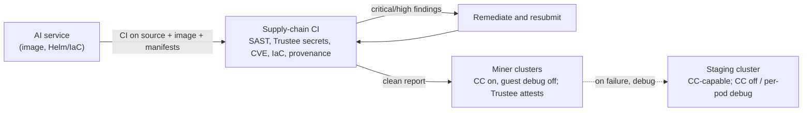

# NeMo Microservices, Bittensor Subnet Integrations & the Stage 0 Security Gate

This document is the detailed reference behind the README [NVIDIA NeMo Microservices](../README.md#nvidia-nemo-microservices--bittensor-subnet-integrations) and [Bittensor Subnet Integrations](../README.md#nvidia-nemo-microservices--bittensor-subnet-integrations) sections. It covers: the NeMo stack on KubeTEE, the attestation-gated TLS protocol between services, the NVIDIA NIM Operator's experimental Kata/Dynamo support and its CoCo limitations, the SOTA Bittensor subnets that could replace or augment each NeMo layer inside a TEE, and the Stage 0 supply-chain security gate.

---

## 1. NVIDIA NeMo Microservices on KubeTEE

[NVIDIA NeMo Microservices](https://docs.nvidia.com/nemo/microservices/latest/about/index.html) are API-first, modular tools for customizing, evaluating, and securing LLMs and embedding models on Kubernetes. A goal of the KubeTEE AI Factory is to run the full NVIDIA AI stack — NeMo Microservices, NIM models, and AI Blueprints — as **SOTA AI services** for enterprises inside Kata + CoCo TEE. Batch jobs are a secondary service: Armada schedules the jobs and pipelines that call those services when an enterprise needs that path.

Each cluster therefore exposes a shared, high-availability NeMo Microservices deployment as **cluster-resident services that scheduled AI jobs call**. This is the distinction between a service and a job: Customizer, Evaluator, Guardrails, Retriever, and the model endpoints are long-lived and shared, while a job is a transient Armada workload that consumes them. A fine-tuning job dispatched to a miner cluster calls the local Customizer, an evaluation job calls the local Evaluator, and a RAG job calls the local Retriever — inside the cluster, without leaving the confidential boundary or crossing the public internet. Sharing one HA deployment per cluster also means the cost of standing up the stack is amortized across every job that lands there, rather than paid again per job.

---

## 2. Attestation-Gated TLS Between Services

Traffic between these services is secured by **attestation-gated TLS, not operator-issued mTLS** — a distinction that matters because the threat model excludes the host operator, so a certificate KubeTEE issued proves nothing about the workload holding it:

- **cert-manager** mints private keys into Kubernetes Secrets, so the keys exist in etcd and on the node. KubeTEE staff could impersonate either end, or sit in the middle. The wire is encrypted and the guarantee is zero.
- **A service mesh** (Linkerd, Istio, Calico's Istio integration) binds certificates to a pod's Kubernetes ServiceAccount, which authenticates *identity*, not *integrity*. Flip `runtimeClassName` from a confidential runtime to plain `nvidia` and the workload presents the same valid certificate over the same green mTLS — the mesh cannot tell a TEE workload from a non-TEE one. Its issuer key also lives in a Secret outside any TEE.
- **Host-level encryption** (Calico or Cilium WireGuard/IPsec) is a host-to-host tunnel with no per-workload identity, so it cannot express "refuse a peer that cannot attest," and it leaves the host-to-pod segments in the clear.

The general rule: any encryption layer whose keys are managed by the host fails here, because the host is the adversary being excluded.

KubeTEE follows the CoCo Confidential AI pattern: **Trustee issues TLS credentials after attestation; apps speak ordinary mTLS.** Guests do not parse quotes. The built-in CoCo Attestation Service verifies Intel-signed TDX DCAP quotes (PCCS collateral on the cluster); KBS policy releases certs only when the EAR is affirming and guest debug is off. TLS is terminated **inside** the guest, so cleartext exists only in encrypted guest memory. Intel Trust Authority is deferred.

That is not classic quote-in-handshake RA-TLS, and it is not in-guest keygen. Trustee is the relying party (trusted zone). A later profile can bind `report_data` to a guest-generated pubkey if keys must never exist in Trustee; that is not the first cut.

SGLang (and most LLM NIMs) cannot require a client certificate, so the terminator is a second container in the **same** Kata sandbox (HAProxy, not Envoy/Traefik), proxying to the model server on guest loopback. LiteLLM 1.96 `ssl_certificate` is ignored by httpx 0.28; outbound mTLS is `sitecustomize.py` loading the Trustee client cert into the default SSL context. Kubernetes **Service** DNS is the TLS hostname: replicas share one cert SAN; they do not need per-pod endpoints.

**Public hop.** Grey-cloud DNS plus Traefik TLS passthrough is ordinary Let’s Encrypt into the LiteLLM guest (`kata-qemu-tdx-runtime-rs`). Client-attested RA-TLS on `llm.kubetee.ai` is later. If an L7 relay returns to the path, OHTTP+SKR is the attested relay design.

**First cut (deployed 2026-08-15 on `na-us-oakland-56`):** LiteLLM → GLM-5.2 and DeepSeek-V4-Flash-0731 over Service `:8443` mTLS. All four replicas `2/2`. SGLang binds `127.0.0.1:8000`; kubelet HTTPS probes use `:8443`. KBS still uses `default.rego` (path×role + cpu0-affirming 401s). Implementation spec: [East-west attested mTLS](./EAST-WEST-ATTESTED-MTLS.md). Miner clusters will run TEE models without LiteLLM; the gateway stays on the infra cluster and uses the same Trustee mTLS over L4 passthrough — [Later: miner-cluster backends](./EAST-WEST-ATTESTED-MTLS.md#later-miner-cluster-backends). Do not start that until KBS resource fetch is attested or TLS-pinned.

---

## 3. NIM Operator — Experimental Kata & Dynamo Support

The [NVIDIA NIM Operator](https://docs.nvidia.com/nim-operator/latest/) now ships **experimental** support for running NIM/NeMo workloads inside Kata sandboxes and for Dynamo-orchestrated inference graphs:

- **[Kata Sandbox Workloads (Experimental)](https://docs.nvidia.com/nim-operator/latest/kata-sandbox.html)** — deploys a `NIMService` with `runtimeClassName: kata-qemu-nvidia-gpu` so the NIM runs inside a Kata VM sandbox with hardware-isolated kernel and OS. NVIDIA notes this is a preview for testing only (not production), and that **Confidential Containers** support is planned for a future release.
- **[Dynamo (Experimental)](https://docs.nvidia.com/nim-operator/latest/dynamo.html)** — deploys Dynamo `DynamoGraphDeployment` CRDs (OpenAI-compatible frontend, multi-backend LLM serving, disaggregated prefill/decode) via the NIM Operator with `dynamo.enabled=true`.

> ⚠️ **KubeTEE does not use either path yet.** NeMo Microservices on KubeTEE run on the **stable** TEE runtime classes instead. **KubeTEE is working directly with the NVIDIA NIM Operator and Kata Containers teams** to harden Kata sandbox + CoCo integration and Dynamo's disaggregated serving graphs for production; graduating them is a Phase 3 item.

---

## 4. Kata / CoCo Limitations (NVIDIA)

The NeMo Microservices docs index does not itself list Kata/CoCo limits — the constraints come from the **NIM Operator** (which deploys NeMo Microservices as CRDs) and the **NVIDIA CoCo Reference Architecture**. They are the reason KubeTEE's current confidential path is the stable CoCo runtime classes rather than the NIM Operator's experimental Kata sandbox:

**NIM Operator Kata Sandbox (experimental)** — [Kata Sandbox docs](https://docs.nvidia.com/nim-operator/latest/kata-sandbox.html)
- **Not confidential computing.** The Kata sandbox runtime class is `kata-qemu-nvidia-gpu` and *"does not enable encryption"* — VM isolation only, no TEE encryption/attestation. The GPU Operator must run in **non-CC mode** (`nvidia.com/cc.mode=off`).
- **CoCo + NIMCache unsupported.** *"Confidential Containers and NIM Cache deployments have not been tested and are not supported in this release."* Only `NIMService` with the Kata sandbox has been tested; CoCo support is planned for a future NIM Operator release.
- **Preview only** — NVIDIA marks it *"experimental, not fully supported, not recommended for production."*

**NVIDIA CoCo Reference Architecture** (the stable `kata-qemu-nvidia-gpu-tdx` path KubeTEE uses) — [Limitations & Restrictions](https://docs.nvidia.com/datacenter/cloud-native/confidential-containers/latest/overview.html)
- **containerd only** — no CRI-O / dockerd for confidential workloads.
- **All GPUs on a host must be in CC mode** — configuring a subset is unsupported; for multi-GPU passthrough, all GPUs must be assigned to a single confidential VM.
- **No nested virtualization** — CoCo must be installed directly on the host, not inside a guest VM.
- **No PCI peer-to-peer (P2P) DMA** — IOMMUFD cannot map PCI BAR regions (QEMU logs warnings; GPU function is unaffected).
- **No host-side NVIDIA driver** — CoCo uses VFIO passthrough; host drivers interfere with VFIO binding (the GPU Operator manages the in-guest driver instead).

**NIM Operator (general)** — [Release Notes](https://docs.nvidia.com/nim-operator/latest/release-notes.html)
- **No multi-node NIM microservice config** — *"The Operator does not support configuring NIM microservices in a multi-node deployment"* (multi-node NIM v2.0 via Ray is a separate, newer path).
- **CC added incrementally** — Kata sandbox is the *"first foundational step"*; full CoCo encryption/attestation through the Operator is future work.

---

## 5. Bittensor Subnet Integrations (SOTA, Confidential-Ready)

Given the limitations above, KubeTEE's thesis is that **the Bittensor ecosystem already contains SOTA, verifiable substitutes** for several NeMo stack layers, and that running them inside Kata + CoCo TEE pods — instead of, or alongside, the NVIDIA stack — could sidestep those limitations while keeping workloads confidential. Each subnet below exposes a **verifiable feed** (public API + on-chain metagraph) and is a **potential partnership** that could replace or augment the corresponding NeMo component. These are candidate integrations and proposals, not shipping integrations:

| Subnet | Name | SOTA role | Could replace / augment (NeMo stack) | Confidential-computing fit |
|--------|------|-----------|--------------------------------------|----------------------------|
| SN56 | [Gradients](https://www.gradients.io/) (G.O.D) | AutoML tournaments — miners submit open-source SFT / DPO / GRPO training scripts; validators execute on standardized GPU infra and open-source the winners | NeMo Customizer (fine-tuning) | Training scripts execute inside KubeTEE TEE pods → confidential fine-tuning tournaments with open-source winning methods |
| SN120 | [Affine](https://www.affine.io/) | Incentivized RL ("reason mining") — miners submit on-chain model revisions; validators host inference and run challenger-vs-champion duels; winner-takes-all; sybil/decoy/copy/overfitting-proof | NeMo Customizer (RL / reasoning) | Validator inference + duels run in TEE; winning models bridge to Chutes (SN64) for confidential serving |
| SN97 | [Albedo](https://github.com/unarbos/distil) / [albedo](https://github.com/unarbos/albedo) (Distil) | Competitive **model distillation** (trajectory / knowledge distillation — not coding agents): miners commit ≤33B students distilled from a large teacher; validators score king-of-the-hill duels on a multi-axis composite; open HF checkpoints + public duel traces; upstream already serves the king at [chat.arbos.life](https://chat.arbos.life). **KubeTEE SN90 PoC parked 2026-08-13** after a successful 100-sample run (2026-08-09). Revisit when Armada + CoCo Trustee can deploy **unmodified** SN97 (no KubeTEE fork / split topology). Details: [SN97-ALBEDO-POC.md](./SN97-ALBEDO-POC.md) · [PLAN.md](https://github.com/KubeTEE-AI-Blueprints/albedo/blob/kubetee-poc/kubetee/PLAN.md) · [unarbos/albedo#4](https://github.com/unarbos/albedo/pull/4). | NeMo Customizer (distillation) + Evaluator (duel / composite scoring) + model endpoints (serve the reigning king) | Distillation + duels in TEE; reigning king served as confidential (or staging) inference; open distilled checkpoints reusable as job templates |
| SN27 | [Orion](https://github.com/SILX-LABS/Orion) | Decentralized data subnet — campaign-driven discovery / generation / curation of model-ready training data with on-chain quality validation | NeMo Data Designer / data pipeline | Data provenance is on-chain; generation miners run in TEE for confidential data pipelines |
| SN22 | [Desearch](https://desearch.ai/) | Decentralized real-time web + X/Twitter search for AI agents; cited, context-rich results via API | Live search / grounding (not RAG) | Search runs as a confidential web/X lookup inside the TEE before generation |
| SN31 | [Rec4ll](https://taostats.io/subnets/31) | Decentralized RAG — miners serve embedding models, vector search, and LLM inference; validators independently score retrieval accuracy and answer quality; the subnet routes queries to the top RAG pipeline | NeMo Retriever / RAG | RAG pipeline (embed → retrieve → generate) runs inside the TEE; citations and retrieved chunks stay in the enclave |
| SN44 | [Score](https://github.com/score-technologies/turbovision) (TurboVision) | Decentralized computer vision — miners run CV models (object detection, keypoint detection, tracking) on live video/imagery and return structured, decision-ready annotations; validators benchmark on live data via lightweight hybrid validation (frame filtering, keypoint + homography checks, CLIP-based semantic verification). First deployment: Game State Recognition for football at 10–100× lower cost than manual annotation; generalizes to any camera feed | NVIDIA Video Search and Summarization blueprint (video analytics / structured video understanding) | CV inference + validation run inside KubeTEE TEE pods → confidential video analytics with attested structured outputs; sensitive footage stays in the enclave |
| SN28 | [sayGM](https://saygm.com/) | Idle-capacity inference marketplace; KubeTEE miner SKUs forward to `llm.kubetee.ai`. Connected as a LiteLLM **inference provider** (same `model` names on the gateway) | Inference (provider + demand channel) | Inbound path is live (TDX + NVIDIA CC). LiteLLM HA fallbacks go to other TEE networks (Chutes, Phala, Near AI) — not back through sayGM |
| SN64 | [Chutes](https://chutes.ai/) — Parallax (Jon Durbin) | Decentralized serverless inference + **Parallax** decentralized MoE training (surrogate experts, no all-to-all; ternary weights; Gated DeltaNet) across heterogeneous, non-colocated GPUs — within 0.6% of centralized baseline | Inference + distributed training; **LiteLLM TEE fallback** | Chutes already runs a **fully TEE-only infrastructure stack**; Parallax trains frontier models on distributed confidential compute — a native fit for KubeTEE's decentralized TEE clusters and a fallback when in-cluster TEE is down |
| SN75 | [Hippius](https://hippius.com/) | Decentralized cloud storage — S3-compatible + IPFS pinning; Arion engine (Reed-Solomon k=10/m=20, CRUSH placement, self-healing) | Persistent storage (solves CoCo's **ephemeral-data-only** limitation) | **Already ships Confidential Compute** (AMD SEV-SNP encrypted VMs); drop-in S3 endpoint replacing/augmenting encrypted Longhorn + object store |
| SN118 | [Ditto](https://heyditto.ai/) | Open-source persistent memory / context layer for AI agents (Claude / Cursor / MCP); miners train the memory-retrieval "harness" | Agent memory / context management | Memory graph backed by confidential storage (e.g. Hippius) so agent context persists across confidential sessions |

KubeTEE treats this as an **open set**: any Bittensor subnet with a SOTA, verifiable solution for a NeMo stack layer — data, training, retrieval, inference, storage, agent memory, or evaluation — is a potential partnership and candidate integration, with the workload adapted to run inside `kata-qemu-nvidia-gpu-tdx` / `kata-qemu-tdx` and its outputs attested and persisted on confidential storage. This is the Bittensor-native path to a confidential AI Factory that is **not locked to a single vendor's experimental stack**, and it is the concrete way KubeTEE could "work with the ecosystem" rather than waiting on the NIM Operator's CoCo roadmap.

---

## 6. Stage 0 — Supply-Chain Security Gate

> **Status: designed, not yet automated.** Gate rules below are supply-chain CI, not a staging promotion workflow. See [Deploying in a TEE](./TEE-DEPLOYMENT-AND-CICD.md#supply-chain-ci). Automation is a Phase 0/1 item.

Stage 0 scans the workload's **code, container image, and deploying IaC** — not the confidential data the workload will process in production — so the production TEE boundary stays intact.

**Gate rules:**
- **Scope** — job templates, model-serving / subnet-integration glue, the container image that will run under Kata, and the IaC/Helm/Fleet values that deploy it.
- **Checks** — SAST (CodeQL, Semgrep); **secrets in CoCo Trustee / KBS** (attestation-gated release into the guest — not Kubernetes Secrets, not Git); SCA + image CVE (Trivy, Grype); IaC/Helm/Fleet policy (Checkov, kube-linter, Kyverno); image provenance (cosign / digest pins — Fleet already digest-pins). Stage 0 fails if credentials appear in Git, Helm values, or image layers.
- **Pass condition** — no unresolved critical or high-severity findings. Findings are remediated and resubmitted, or accepted as documented risk with owner sign-off. Production has no sign-off bypass for critical/high.
- **Re-run on change** — a new image tag, job template, guest image, or driver version re-triggers Stage 0.
- **Confidentiality** — the gate never sees production TEE contents or Trustee-held secrets. Scanners run in CI against source and image artifacts; the guest fetches secrets from Trustee only after it attests.

**Why a gate, not a scanner inside the cluster:** production SN90 clusters run confidential workloads under Kata + CoCo with attested, encrypted memory. A security agent *inside* the TEE would either see confidential data (breaking the trust boundary) or see nothing useful.

---

## References

- [NVIDIA NeMo Microservices](https://docs.nvidia.com/nemo/microservices/latest/about/index.html)
- [NVIDIA NIM Operator](https://docs.nvidia.com/nim-operator/latest/) — [Kata Sandbox (Experimental)](https://docs.nvidia.com/nim-operator/latest/kata-sandbox.html) | [Dynamo (Experimental)](https://docs.nvidia.com/nim-operator/latest/dynamo.html) | [Release Notes](https://docs.nvidia.com/nim-operator/latest/release-notes.html)
- [NVIDIA Confidential Containers Reference Architecture](https://docs.nvidia.com/datacenter/cloud-native/confidential-containers/latest/overview.html)
- [Intel Trust Authority](https://www.intel.com/content/www/us/en/security/trust-authority.html)
- Bittensor subnets: [Gradients SN56](https://www.gradients.io/) · [Affine SN120](https://www.affine.io/) · [Albedo SN97](https://github.com/unarbos/distil) · [Orion SN27](https://github.com/SILX-LABS/Orion) · [Desearch SN22](https://desearch.ai/) · [Rec4ll SN31](https://taostats.io/subnets/31) · [Score SN44](https://github.com/score-technologies/turbovision) · [sayGM SN28](https://saygm.com/) · [Chutes SN64](https://chutes.ai/) · [Hippius SN75](https://hippius.com/) · [Ditto SN118](https://heyditto.ai/)
- TEE inference fallbacks (LiteLLM HA, not Bittensor netuids): [Phala](https://phala.network/) · [Near AI](https://near.ai/)
