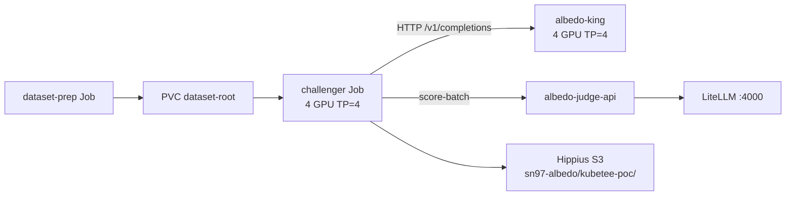

# Albedo (SN97) King-of-the-Hill Eval — KubeTEE SN90 PoC

KubeTEE **SN90** runs [Albedo / Denrite (SN97)](https://github.com/unarbos/albedo) king-of-the-hill GPU evaluations on the subnet-owner staging cluster (`na-us-oakland-56`). This is an **active PoC**: a successful 100-sample end-to-end run landed 2026-08-09. Upstream PR: [unarbos/albedo#4](https://github.com/unarbos/albedo/pull/4). Full architecture and ops notes live in the Albedo fork: [`kubetee/PLAN.md`](https://github.com/KubeTEE-AI-Blueprints/albedo/blob/kubetee-poc/kubetee/PLAN.md).

Albedo remains **Bittensor SN97**; KubeTEE is **SN90**. The PoC is SN90 infrastructure hosting SN97-style evals.

**What Albedo is (and is not):** SN97 is competitive **model distillation** — miners compress a large teacher into smaller open students (≤33B), validators score **king-of-the-hill** duels on a multi-axis composite, and the reigning king is published for reuse ([distil.arbos.life](https://distil.arbos.life), [chat.arbos.life](https://chat.arbos.life)). It is **not** a coding-agent subnet. NeMo-layer fit: Customizer (distillation) + Evaluator (duels) + **Inference** (serve the king).

---

## Integration opportunities (KubeTEE)

| Integration | Why it fits | Status |
|-------------|-------------|--------|
| **King-of-the-hill GPU evals** | Challenger Jobs + shared judge on staging GPUs | **Live** (this PoC) |
| **Public king inference (SN90 offer to Albedo / Distil)** | `albedo-king` already proxies OpenAI `/v1/*` to local vLLM (`king_serve.py`). Register in LiteLLM (`openai/<name>` → `http://albedo-king.albedo-poc.svc.cluster.local:8000/v1`) and publish for **public** use via SN90 capacity — including the **SN28 (SayGM) integration** (not exclusive; KubeTEE may also serve the public directly) — complementary to upstream [chat.arbos.life](https://chat.arbos.life). Offered in [unarbos/albedo#4](https://github.com/unarbos/albedo/pull/4) / `PLAN.md`. | **Offered — not registered yet** — Phase 0 follow-up |
| **Public duel / checkpoint artifacts** | Hippius `sn97-albedo` public-read objects; open HF student checkpoints | **Live** for PoC runs |
| **Armada-backed Denrite submit** | Denrite dispatcher → Armada `JobSubmitRequest` | Follow-up |
| **Confidential king + eval** | Move king/challenger onto `kata-*` + `kata-direct` | Follow-up |

**LiteLLM caveats when serving the king:**
- During king reload, `/ready` and `/v1/*` return **503** with `fault_code=king_changing` — gateway clients must retry / fail soft (same as eval Jobs).
- King GPUs are shared with challenger capacity planning (king holds 4× H200 on `am-h200-25`); heavy chat traffic competes with duel load.
- Today the king is non-CC staging; TEE serve is a later step on the same OpenAI surface.

---

## Status

| Item | State |
|------|--------|
| Split topology (dataset + always-on king + challenger Job) | **Live** on `na-us-oakland-56` |
| Shared judge → in-cluster LiteLLM (`z-ai/glm-5.2`, …) | **Live** |
| Submission path | Direct `kubectl apply` of a `batch/v1` Job (**not Armada yet**) |
| Staging eval image | `vllm/vllm-openai` + git clone / `pip install` at Job start |
| Production eval image | Final Albedo Docker image (baked code + deps) — planned |
| Confidential eval (`kata-*` + `kata-direct`) | Follow-up (CC path already validated by other GLM/Qwen serves) |
| Armada `JobSubmitRequest` for Denrite dispatcher | Follow-up |

---

## Architecture (split topology)

Namespace: `albedo-poc` on context `na-us-oakland-56-direct`.

| Piece | Manifest (Albedo fork) | Role |
|-------|------------------------|------|
| Dataset corpus | `kubetee/deploy/dataset-prep.yaml` | One-shot Job fills `albedo-poc-dataset-root` + verifies `manifest.json`. Re-run only on corpus/version change. |
| Always-on king | `kubetee/deploy/king.yaml` | 4× H200 / TP=4 on `am-h200-25` (`kubetee.ai/albedo-king=true`). OpenAI HTTP via `king_serve.py` + local vLLM (`albedo-king:8000`). |
| Challenger Job | `kubetee/deploy/eval.yaml` | 4× H200 / TP=4. Mounts corpus; local vLLM challenger; HTTP previous-king gens; scores via shared judge; uploads artifacts. |
| Shared judge | `kubetee/deploy/judge-api.yaml` | `albedo-judge-api:8091` → LiteLLM `http://litellm.litellm.svc.cluster.local:4000`. |

**King change protocol:** king state `changing` → in-flight Jobs get HTTP 503 `king_changing` → `fault_code=king_changed` (no registering verdict).

**Dataset pin (apple-to-apple):** subsequent evals load the exact 100 `sample_ids` from Denrite reference [`request.json`](https://github.com/KubeTEE-AI-Blueprints/albedo/blob/kubetee-poc/kubetee/compare/reference-ca530856-ffa8-4e66-9175-7400e829e8c0/request.json) (`manifest_hash` `e3cff617…`, same corpus as `albedo-poc-dataset-config`). The first PoC run (`7e09f071-…`) used seed `kubetee-poc` only and had **0** sample overlap with that reference — scores are not directly comparable until a re-run with the pin.

**Why not Armada (yet):** PoC submits with `kubectl apply -f kubetee/deploy/eval.yaml`. `deploy/armada-job-template.yaml` is kept as the future Denrite submit shape. No Denrite docker-compose, Postgres queue, or chain resolution inside KubeTEE — only king/challenger model refs + eval/submission IDs.

---

## Latest successful run (2026-08-09)

| Field | Value |
|-------|--------|
| `eval_run_id` | `7e09f071-4514-4ae0-9b92-6cf02019544f` |
| `submission_id` | `4ca920b9-7a6b-4d0c-8f16-bcbad63b5a26` |
| Verdict | `succeeded` (`challenger_won=false`) |
| Scores | challenger **0.635906** / king **0.636356** (binary, `judge_count=1`, win margin 0.03) |
| Samples | 100 scored / 100 valid turns |
| King | `hf://tojointhecommunity/albedo-qwen3.6-35b-top@438aec1140de06268cc36b79dc9567129678888c` |
| Challenger | `hf://bkn1890/albedo-qwen3.6-35b-hk971@1ba87c52697f154a8f75a33ddf5714c1d314bcc7` |
| Wall clock | **2333 s** (~38.9 min) — `worker.execute` only |
| Judge spend | **$6.90** (3926 requests) |
| GPU spend (challenger Job) | **$6.48** (4× H200 @ $2.50/gpu/h) |
| Total | **$13.39** |

Public artifacts (Hippius `public-read`):

- [verdict.json](https://s3.hippius.com/sn97-albedo/kubetee-poc/7e09f071-4514-4ae0-9b92-6cf02019544f/verdict.json)
- [eval-summary.json](https://s3.hippius.com/sn97-albedo/kubetee-poc/7e09f071-4514-4ae0-9b92-6cf02019544f/eval-summary.json)
- [request.json](https://s3.hippius.com/sn97-albedo/kubetee-poc/7e09f071-4514-4ae0-9b92-6cf02019544f/request.json)
- [progress.jsonl](https://s3.hippius.com/sn97-albedo/kubetee-poc/7e09f071-4514-4ae0-9b92-6cf02019544f/progress.jsonl)
- [generated-samples.jsonl](https://s3.hippius.com/sn97-albedo/kubetee-poc/7e09f071-4514-4ae0-9b92-6cf02019544f/generated-samples.jsonl)
- [scoring-results.jsonl](https://s3.hippius.com/sn97-albedo/kubetee-poc/7e09f071-4514-4ae0-9b92-6cf02019544f/scoring-results.jsonl)
- [remote-logs.txt](https://s3.hippius.com/sn97-albedo/kubetee-poc/7e09f071-4514-4ae0-9b92-6cf02019544f/remote-logs.txt)

Reference Denrite shape (not this run): [detail UI](https://pub-e2a73e9642e74a2ea78d2910c7a86025.r2.dev/detail.html?eval_run_id=ca530856-ffa8-4e66-9175-7400e829e8c0) · mirrored under `kubetee/compare/reference-ca530856-…` in the Albedo fork.

---

## Observed idle-GPU window

After multi-turn generation, the challenger Job closes local vLLM (`VllmProcessGenerator.close()` → EngineCore SIGTERM) and then runs HTTP scoring + S3 upload **while still holding `nvidia.com/gpu: 4`**. Scoring itself needs no eval-pod GPUs (judge-api / LiteLLM only).

**Planned improvement:** checkpoint durable gen outputs (+ `request` / `category_prep_id`) → exit the GPU Job → CPU-only score Job. Requires a score-from-artifacts entrypoint (today `generated-samples` is uploaded only after scoring). Tracked as follow-up #6 in [`PLAN.md`](https://github.com/KubeTEE-AI-Blueprints/albedo/blob/kubetee-poc/kubetee/PLAN.md#follow-ups-after-poc-success).

---

## How to re-run (ops sketch)

Manifests and secrets live in the Albedo `kubetee-poc` branch — not in this subnet repo. From the monorepo (or a checkout of [KubeTEE-AI-Blueprints/albedo](https://github.com/KubeTEE-AI-Blueprints/albedo) `@kubetee-poc`):

1. Apply out-of-band Secret (`deploy/secret-template.yaml` shape — never commit secrets).
2. `kubectl apply -f kubetee/deploy/dataset-prep.yaml` (once / on hash bump).
3. `kubectl apply -f kubetee/deploy/judge-api.yaml -f kubetee/deploy/king.yaml`.
4. Set model refs + `EVAL_RUN_ID` / `SUBMISSION_ID` in `eval.yaml`, then `kubectl apply -f kubetee/deploy/eval.yaml`.
5. Tail Job logs; confirm public artifacts under `s3://sn97-albedo/kubetee-poc/<eval_run_id>/`.

Context: `na-us-oakland-56-direct`. Details: [`PLAN.md` → Run the PoC](https://github.com/KubeTEE-AI-Blueprints/albedo/blob/kubetee-poc/kubetee/PLAN.md#run-the-poc).

---

## Follow-ups (summary)

1. Armada submit API for Denrite’s dispatcher  
2. King warm-cache on the model-cache PVC  
3. Keep LiteLLM backends aligned with Albedo’s hardcoded `JUDGE_MODELS`  
4. Confidential eval (`kata-qemu-nvidia-gpu-tdx-runtime-rs` + `kata-direct`)  
5. Denrite real dispatcher integration  
6. Split generation vs scoring Jobs (free challenger GPUs sooner)

---

## Links

| Resource | URL |
|----------|-----|
| Albedo PLAN (authoritative) | https://github.com/KubeTEE-AI-Blueprints/albedo/blob/kubetee-poc/kubetee/PLAN.md |
| Upstream PR | https://github.com/unarbos/albedo/pull/4 |
| Albedo / Distil | https://github.com/unarbos/distil · https://github.com/unarbos/albedo |
| NeMo / subnet integration table | [NEMO-MICROSERVICES-AND-SUBNET-INTEGRATIONS.md](./NEMO-MICROSERVICES-AND-SUBNET-INTEGRATIONS.md#5-bittensor-subnet-integrations-sota-confidential-ready) |
