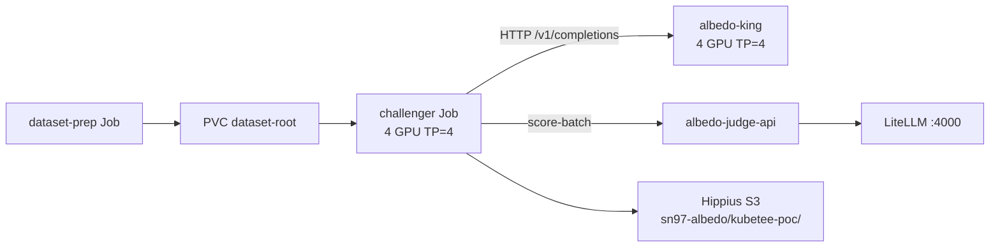

# Albedo (SN97) King-of-the-Hill Eval — KubeTEE SN90 PoC

**Parked (2026-08-13).** Revisit when the **complete KubeTEE job flow** is live — [Armada](https://armadaproject.io/) submit/execute across miner clusters **and** [CoCo Trustee](https://github.com/confidential-containers/trustee) (KBS) attestation-gated secrets — so [Albedo / Denrite (SN97)](https://github.com/unarbos/albedo) can be deployed **without modifications or architecture changes**.

A successful 100-sample end-to-end run landed **2026-08-09** on `na-us-oakland-56`. That run proved SN90 can host SN97-style king-of-the-hill GPU evals. It used a **KubeTEE-specific** split topology (`kubectl apply` Jobs, always-on king, shared judge-api). That path is **not** the target. The target is upstream Albedo as-is on the finished platform.

Albedo remains **Bittensor SN97**; KubeTEE is **SN90**. Upstream PR from the PoC: [unarbos/albedo#4](https://github.com/unarbos/albedo/pull/4). PoC-era architecture notes: [`kubetee/PLAN.md`](https://github.com/KubeTEE-AI-Blueprints/albedo/blob/kubetee-poc/kubetee/PLAN.md).

**What Albedo is (and is not):** SN97 is competitive **model distillation** — miners compress a large teacher into smaller open students (≤33B), validators score **king-of-the-hill** duels on a multi-axis composite, and the reigning king is published for reuse ([distil.arbos.life](https://distil.arbos.life), [chat.arbos.life](https://chat.arbos.life)). It is **not** a coding-agent subnet. NeMo-layer fit: Customizer (distillation) + Evaluator (duels) + **Inference** (serve the king).

---

## Integration opportunities (KubeTEE)

| Integration | Why it fits | Status |
|-------------|-------------|--------|
| **King-of-the-hill GPU evals** | Challenger Jobs + shared judge on staging GPUs | **Parked** — 2026-08-09 PoC succeeded; do not extend the KubeTEE fork |
| **Public king inference (SN90 offer to Albedo / Distil)** | PoC `albedo-king` proxied OpenAI `/v1/*` to local vLLM (`king_serve.py`). Registering that Service in LiteLLM is **not** the revisit path. Serve the king the way upstream Albedo already does, on Armada + Trustee. Offered in [unarbos/albedo#4](https://github.com/unarbos/albedo/pull/4) / `PLAN.md`. | **Parked** |
| **Public duel / checkpoint artifacts** | Hippius `sn97-albedo` public-read objects; open HF student checkpoints | **Recorded** (PoC run artifacts below) |
| **Armada-backed Denrite submit** | Denrite dispatcher → Armada `JobSubmitRequest` with **unmodified** SN97 code | **Revisit gate** (with Trustee) |
| **Confidential king + eval** | `kata-qemu-nvidia-gpu-tdx-runtime-rs` + `kata-direct` + Trustee-released secrets | **Revisit gate** (with Armada) |

**PoC-era LiteLLM notes (king Service — not the revisit path):**
- During king reload, `/ready` and `/v1/*` returned **503** with `fault_code=king_changing` — clients had to retry / fail soft.
- King GPUs were shared with challenger capacity (king held 4× H200 on `am-h200-25`).
- The PoC king was non-CC staging. Confidential serve is in the revisit gate (Trustee + `kata-*`), via unmodified Albedo — not by registering this Service in LiteLLM.

---

## Revisit gate

Do **not** continue the KubeTEE-forked PoC (custom `king_serve.py`, `albedo-judge-api`, `batch/v1` `kubectl apply`, split king/challenger topology) as the production path. Those were scaffolding to prove GPU evals on SN90.

**Resume SN97 on KubeTEE when all of the following are true:**

1. **Armada** control plane + executor can submit and run confidential GPU jobs on staging (Denrite’s dispatcher targets Armada; no KubeTEE-only eval architecture).
2. **CoCo Trustee (KBS)** releases secrets only to attested Kata guests (`kata-qemu-nvidia-gpu-tdx-runtime-rs`, `kata-direct` as needed). Staging Kata guest debug is **off**; Trustee attests those guests. Debug can be enabled per pod for diagnostics.
3. An **upstream Albedo / Denrite** image and job spec can be submitted through that flow **unchanged** — no SN97 code fork, no KubeTEE-only split topology.

Until then, this document is the record of the 2026-08-09 proof and the public artifacts.

## Status

| Item | State |
|------|--------|
| PoC (KubeTEE-specific split topology) | **Parked** 2026-08-13 |
| 100-sample end-to-end duel | **Succeeded** 2026-08-09 (artifacts below) |
| Submission path used in PoC | Direct `kubectl apply` of a `batch/v1` Job — **not** the revisit path |
| Staging eval image used in PoC | `vllm/vllm-openai` + git clone / `pip install` at Job start |
| Target at revisit | Unmodified Albedo Docker image + Denrite submit via Armada + Trustee |
| Confidential eval (`kata-*` + `kata-direct` + Trustee) | **Blocked** on complete KubeTEE flow |
| Armada `JobSubmitRequest` for Denrite dispatcher | **Blocked** on complete KubeTEE flow |

---

## Architecture used in the PoC (historical — not the revisit target)

The topology below is what ran on 2026-08-09. Keep it as evidence. Do **not** evolve it into the production SN97 integration; revisit deploys upstream Albedo without this split.

Namespace: `albedo-poc` on context `na-us-oakland-56-direct`.

| Piece | Manifest (Albedo fork) | Role |
|-------|------------------------|------|
| Dataset corpus | `kubetee/deploy/dataset-prep.yaml` | One-shot Job fills `albedo-poc-dataset-root` + verifies `manifest.json`. Re-run only on corpus/version change. |
| Always-on king | `kubetee/deploy/king.yaml` | 4× H200 / TP=4 on `am-h200-25` (`kubetee.ai/albedo-king=true`). OpenAI HTTP via `king_serve.py` + local vLLM (`albedo-king:8000`). |
| Challenger Job | `kubetee/deploy/eval.yaml` | 4× H200 / TP=4. Mounts corpus; local vLLM challenger; HTTP previous-king gens; scores via shared judge; uploads artifacts. |
| Shared judge | `kubetee/deploy/judge-api.yaml` | `albedo-judge-api:8091` → LiteLLM `http://litellm.litellm.svc.cluster.local:4000`. |

**King change protocol:** king state `changing` → in-flight Jobs get HTTP 503 `king_changing` → `fault_code=king_changed` (no registering verdict).

**Dataset pin (apple-to-apple):** subsequent evals load the exact 100 `sample_ids` from Denrite reference [`request.json`](https://github.com/KubeTEE-AI-Blueprints/albedo/blob/kubetee-poc/kubetee/compare/reference-ca530856-ffa8-4e66-9175-7400e829e8c0/request.json) (`manifest_hash` `e3cff617…`, same corpus as `albedo-poc-dataset-config`). The first PoC run (`7e09f071-…`) used seed `kubetee-poc` only and had **0** sample overlap with that reference — scores are not directly comparable until a re-run with the pin.

**Why the PoC skipped Armada:** the 2026-08-09 run submitted with `kubectl apply -f kubetee/deploy/eval.yaml` because Armada + Trustee were not yet the complete job flow. `deploy/armada-job-template.yaml` in the fork was a sketch only. At revisit, Denrite submits through Armada with **unmodified** SN97 — no KubeTEE-side king/challenger split required.

---

## Latest successful run (2026-08-09)

| Field | Value |
|-------|--------|
| `eval_run_id` | `7e09f071-4514-4ae0-9b92-6cf02019544f` |
| `submission_id` | `4ca920b9-7a6b-4d0c-8f16-bcbad63b5a26` |
| Verdict | `succeeded` (`challenger_won=false`) |
| Scores | challenger **0.635906** / king **0.636356** (binary, `judge_count=1`, win margin 0.03) |
| Samples | 100 scored / 100 valid turns |
| King | `hf://tojointhecommunity/albedo-qwen3.6-35b-top@438aec1140de06268cc36b79dc9567129678888c` |
| Challenger | `hf://bkn1890/albedo-qwen3.6-35b-hk971@1ba87c52697f154a8f75a33ddf5714c1d314bcc7` |
| Wall clock | **2333 s** (~38.9 min) — `worker.execute` only |
| Judge spend | **$6.90** (3926 requests) |
| GPU spend (challenger Job) | **$6.48** (4× H200 @ $2.50/gpu/h) |
| Total | **$13.39** |

Public artifacts (Hippius `public-read`):

- [verdict.json](https://s3.hippius.com/sn97-albedo/kubetee-poc/7e09f071-4514-4ae0-9b92-6cf02019544f/verdict.json)
- [eval-summary.json](https://s3.hippius.com/sn97-albedo/kubetee-poc/7e09f071-4514-4ae0-9b92-6cf02019544f/eval-summary.json)
- [request.json](https://s3.hippius.com/sn97-albedo/kubetee-poc/7e09f071-4514-4ae0-9b92-6cf02019544f/request.json)
- [progress.jsonl](https://s3.hippius.com/sn97-albedo/kubetee-poc/7e09f071-4514-4ae0-9b92-6cf02019544f/progress.jsonl)
- [generated-samples.jsonl](https://s3.hippius.com/sn97-albedo/kubetee-poc/7e09f071-4514-4ae0-9b92-6cf02019544f/generated-samples.jsonl)
- [scoring-results.jsonl](https://s3.hippius.com/sn97-albedo/kubetee-poc/7e09f071-4514-4ae0-9b92-6cf02019544f/scoring-results.jsonl)
- [remote-logs.txt](https://s3.hippius.com/sn97-albedo/kubetee-poc/7e09f071-4514-4ae0-9b92-6cf02019544f/remote-logs.txt)

Reference Denrite shape (not this run): [detail UI](https://pub-e2a73e9642e74a2ea78d2910c7a86025.r2.dev/detail.html?eval_run_id=ca530856-ffa8-4e66-9175-7400e829e8c0) · mirrored under `kubetee/compare/reference-ca530856-…` in the Albedo fork.

---

## Observed idle-GPU window

After multi-turn generation, the challenger Job closes local vLLM (`VllmProcessGenerator.close()` → EngineCore SIGTERM) and then runs HTTP scoring + S3 upload **while still holding `nvidia.com/gpu: 4`**. Scoring itself needs no eval-pod GPUs (judge-api / LiteLLM only).

**PoC observation only:** a split gen-then-score Job would free GPUs sooner, but do **not** invent that in the KubeTEE fork. At revisit, use whatever upstream Albedo already ships. Noted in [`PLAN.md`](https://github.com/KubeTEE-AI-Blueprints/albedo/blob/kubetee-poc/kubetee/PLAN.md#follow-ups-after-poc-success) follow-up #6.

---

## How the PoC was run (historical — do not extend)

Manifests and secrets live in the Albedo `kubetee-poc` branch — not in this subnet repo. The steps below reproduce the **parked** fork, not the revisit target. From a checkout of [KubeTEE-AI-Blueprints/albedo](https://github.com/KubeTEE-AI-Blueprints/albedo) `@kubetee-poc`:

1. Apply out-of-band Secret (`deploy/secret-template.yaml` shape — never commit secrets).
2. `kubectl apply -f kubetee/deploy/dataset-prep.yaml` (once / on hash bump).
3. `kubectl apply -f kubetee/deploy/judge-api.yaml -f kubetee/deploy/king.yaml`.
4. Set model refs + `EVAL_RUN_ID` / `SUBMISSION_ID` in `eval.yaml`, then `kubectl apply -f kubetee/deploy/eval.yaml`.
5. Tail Job logs; confirm public artifacts under `s3://sn97-albedo/kubetee-poc/<eval_run_id>/`.

Context: `na-us-oakland-56-direct`. Details: [`PLAN.md` → Run the PoC](https://github.com/KubeTEE-AI-Blueprints/albedo/blob/kubetee-poc/kubetee/PLAN.md#run-the-poc).

---

## Follow-ups (superseded by the revisit gate)

The items below were the PoC’s next steps. They are **not** the current workstream. At revisit, deploy unmodified SN97 on Armada + Trustee instead of finishing this list on the KubeTEE fork:

1. Armada submit API for Denrite’s dispatcher — **now part of the revisit gate**
2. King warm-cache on the model-cache PVC
3. Keep LiteLLM backends aligned with Albedo’s hardcoded `JUDGE_MODELS`
4. Confidential eval (`kata-qemu-nvidia-gpu-tdx-runtime-rs` + `kata-direct`) — **now part of the revisit gate** (with Trustee)
5. Denrite real dispatcher integration — **now part of the revisit gate**
6. Split generation vs scoring Jobs (free challenger GPUs sooner) — only if upstream Albedo already works that way; do not invent it in a KubeTEE fork

---

## Links

| Resource | URL |
|----------|-----|
| Albedo PLAN (PoC-era fork notes) | https://github.com/KubeTEE-AI-Blueprints/albedo/blob/kubetee-poc/kubetee/PLAN.md |
| Upstream PR | https://github.com/unarbos/albedo/pull/4 |
| Albedo / Distil | https://github.com/unarbos/distil · https://github.com/unarbos/albedo |
| NeMo / subnet integration table | [NEMO-MICROSERVICES-AND-SUBNET-INTEGRATIONS.md](./NEMO-MICROSERVICES-AND-SUBNET-INTEGRATIONS.md#5-bittensor-subnet-integrations-sota-confidential-ready) |
