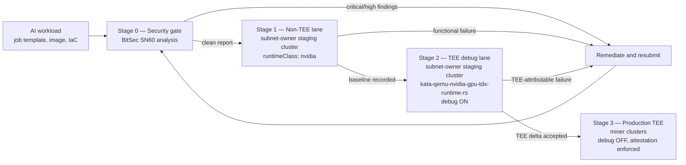

# Deploying in a TEE — The Engineering Challenge and the CI/CD Promotion Pipeline

> **Scope.** This document explains why running an AI tech stack inside a Trusted Execution
> Environment is materially harder than running the same stack on a normal container runtime,
> why KubeTEE's Early Access staging cluster is deliberately **hybrid** (non-TEE nodes alongside
> TEE nodes, with Kata Containers in **debug mode**), and the **CI/CD promotion pipeline** a
> workload must pass before it is allowed onto a production miner cluster.
>
> **Status.** The hybrid staging cluster and the debug-mode staging runtime exist today. The
> promotion pipeline is described here as the Early Access operating model; its automation
> (gate enforcement, per-revision re-runs, published gate results) is a Phase 0/1 roadmap item
> and is **not** wired into validator weights. See [Roadmap](../README.md#roadmap).

---

## Table of Contents

- [1. Why deploying in a TEE is hard](#1-why-deploying-in-a-tee-is-hard)
  - [1.1 The workload is a VM, not a container](#11-the-workload-is-a-vm-not-a-container)
  - [1.2 GPU passthrough and multi-GPU topology](#12-gpu-passthrough-and-multi-gpu-topology)
  - [1.3 Guest resources are not pod resources](#13-guest-resources-are-not-pod-resources)
  - [1.4 Cold start breaks normal probe assumptions](#14-cold-start-breaks-normal-probe-assumptions)
  - [1.5 Storage semantics change](#15-storage-semantics-change)
  - [1.6 Secrets and images](#16-secrets-and-images)
  - [1.7 Observability collapses by design](#17-observability-collapses-by-design)
  - [1.8 Failures are destructive](#18-failures-are-destructive)
  - [1.9 The stack is version-coupled](#19-the-stack-is-version-coupled)
- [2. The hybrid staging cluster](#2-the-hybrid-staging-cluster)
- [3. Kata debug mode in staging](#3-kata-debug-mode-in-staging)
- [4. The CI/CD promotion pipeline](#4-the-cicd-promotion-pipeline)
- [5. What this means for miners](#5-what-this-means-for-miners)
- [References](#references)

---

## 1. Why deploying in a TEE is hard

The short version: **a confidential pod is a virtual machine with an encrypted, attested memory
boundary, not a namespaced process on the host.** Every assumption a Kubernetes workload makes
about devices, storage, networking, resources, startup time, and debuggability is renegotiated
at that boundary. A container image that runs correctly under the `nvidia` runtime class can
fail — or, worse, run correctly but ten times slower — under
`kata-qemu-nvidia-gpu-tdx-runtime-rs`, for reasons that have nothing to do with the model or the
application code.

The failure classes below are not hypothetical. Each one has been hit while bringing up the
KubeTEE stack, and most have an upstream issue attached.

### 1.1 The workload is a VM, not a container

Everything that the host kernel normally provides directly must be re-established inside the
guest: the device tree, the GPU driver, the filesystem, the network path. The host cannot see
into the guest, and the guest cannot see the host's devices unless they are explicitly passed
through. This is the root cause of nearly every item that follows.

The NVIDIA Confidential Containers reference architecture also constrains the host itself:
**containerd only** (no CRI-O or dockerd for confidential workloads), **all GPUs on a host must
be in CC mode** (a subset is unsupported, and multi-GPU passthrough requires all GPUs assigned
to a single confidential VM), **no nested virtualization**, **no PCI peer-to-peer DMA**, and
**no host-side NVIDIA driver** (CoCo uses VFIO passthrough; a host driver interferes with VFIO
binding). A cluster design that violates any of these cannot run confidential GPU workloads at
all, regardless of the workload.

### 1.2 GPU passthrough and multi-GPU topology

Getting one GPU into a confidential guest is a solved problem. Getting **eight GPUs plus their
NVSwitch fabric** into one — which is what an HGX node is for — is not.

On KubeTEE this required five independent fixes stacked on top of each other before an in-guest
`nvidia-smi topo -m` reported `NV18` (full NVLink) instead of `PHB` (GPUs talking over the PCIe
host bridge — functional, but catastrophically slower for collective operations):

1. **Host binding.** `vfio-manage bind --all` binds GPUs but *not* NVSwitches by default;
   NVSwitch binding is opt-in via `BIND_NVSWITCHES`.
2. **Device-plugin ordering.** The Kata sandbox device plugin enumerates VFIO devices **at
   startup**. If it started before the NVSwitches were bound it advertises zero of them, and
   pods requesting `nvidia.com/nvswitch` stay `Pending` forever. This is an ordering
   dependency, not a bug, and it is invisible unless you know to look for it.
3. **Runtime device filtering.** The runtime-rs bridge filter treated the NVSwitch PCI class
   (`0x0680`) as a subset of the ignored bridge class (`0x0600`) and silently stripped the
   NVSwitches out of the guest device list — [kata-containers#13430][k13430].
4. **In-guest fabric manager.** `nv_fabricmanager` looked for its NVLink topology files at a
   path that did not exist in the composable base-plus-extension guest image layout, and
   panicked — [NVIDIA/nvrc#203][nvrc203], [kata-containers#13432][k13432].
5. **CDI mapping.** An attempt to fix this by adding NVSwitches to the guest CDI device table
   made the agent block on a CDI spec that is never generated in-guest, producing
   `unresolvable CDI devices`. It was reverted; the container does not need NVSwitch CDI,
   because the driver and fabric manager reach them through VFIO.

Note what layers 3 through 5 have in common: the pod is scheduled, the sandbox boots, and the
container starts. Nothing reports an error. The workload simply runs on a degraded interconnect
or dies inside the guest where the host cannot see why.

### 1.3 Guest resources are not pod resources

`resources.limits` describes the *container*. The guest VM is sized by hypervisor configuration
and pod annotations, and the two do not automatically agree.

Upstream runtime-rs boots confidential guests with `default_vcpus = 1` and **ignores** the
`io.katacontainers.config.hypervisor.default_vcpus` annotation
([kata-containers#13439][k13439]); setting `limits.cpu` instead routes through a vCPU hotplug
path that is not stable ([kata-containers#13440][k13440]). A single-vCPU guest is fatal for
exactly the CPU-bound work AI jobs do at startup — loading and de-quantizing weights, JIT
compilation, CUDA-graph capture — and it presents as "the job is mysteriously slow" or as a
sandbox-creation timeout, not as a resource error.

KubeTEE runs a patched shim that honours the annotation, so confidential inference pods set
`default_vcpus: "16"` and the hypervisor boots `-smp 16` directly. The general lesson stands:
**guest sizing is a separate, explicit step**, and getting it wrong is silent.

### 1.4 Cold start breaks normal probe assumptions

A confidential pod's startup path includes work a normal pod never does: sandbox creation,
firmware and guest-kernel boot, dm-verity verification of the guest image, remote attestation
round trips to the KBS, image pull and decryption *inside* the guest, and model-weight loading
across a virtualized storage path. Minutes, not seconds.

Default liveness and readiness probes, `progressDeadlineSeconds`, and the CRI
`runtime-request-timeout` are all calibrated for container startup and will kill a
confidential pod mid-boot. Worse, a premature kill during sandbox creation is one of the
destructive failure modes described in [1.8](#18-failures-are-destructive). Every job template
needs its timeouts re-derived for the TEE lane; a template validated only on the non-TEE lane
carries container-era timeouts and will fail on promotion.

### 1.5 Storage semantics change

A `Filesystem`-mode PVC can reach a Kata guest in only two ways, and the choice is not a
StorageClass setting:

- **virtio-fs** — works with any CSI driver. The host mounts the filesystem and shares it into
  the guest. Per Kata's own design documentation this is *the only way* to surface a
  Filesystem-mode PV inside a guest with a generic CSI driver. The host mediates every I/O,
  which is the wrong shape for loading hundreds of gigabytes of weights.
- **Direct block assignment** — near-native, but it requires the **CSI driver itself to be
  Kata-aware**: it must call `kata-runtime direct-volume add` at publish time so the runtime
  can rewrite the container mount spec. Most CSI drivers, including Longhorn's, do not
  implement this, so they land on the virtio-fs path by default.

Beyond performance, CoCo today is effectively **ephemeral-data-only** for confidential volumes,
and data written through either path lands as **plaintext on host-visible media**. The guest is
attested and its memory is encrypted, while the model weights and application data it writes are
not. Closing that gap needs guest-side dm-crypt with an attestation-gated key from a KBS, which
in turn needs a KBS deployed — see [1.6](#16-secrets-and-images).

Direct assignment also has sharper edges. KubeTEE carries a local backport of
[kata-containers#13187][k13187] because the stock CSI direct-volume driver deleted a volume's
backing file on **every pod detach**, not on PVC release — so any pod recreation silently
destroyed the volume's data while the PVC stayed `Bound` and the workload came back up healthy
on a blank filesystem, with no error anywhere.

### 1.6 Secrets and images

If the host is outside the trust boundary, a plain Kubernetes `Secret` is not a secret — the
host can read it. The confidential answer is to release secrets and image-decryption keys only
to a guest that has produced acceptable attestation evidence, which is what a **KBS / Trustee**
deployment provides, and which is also the prerequisite for encrypting data at rest
([1.5](#15-storage-semantics-change)).

This makes attestation a hard runtime dependency rather than a reporting feature: no KBS, or
attestation evidence the KBS rejects, means the workload does not start at all. That is the
correct fail-closed behaviour, and it is another axis on which a job that works on the non-TEE
lane can fail on the TEE lane.

### 1.7 Observability collapses by design

This is the one that reframes the whole problem. A TEE is built to stop the host from inspecting
the workload — so the moment the workload misbehaves, the operator has lost the tools they would
normally reach for. No meaningful `kubectl exec` view, no host-side memory inspection, no
attaching a debugger from outside, and guest-kernel output that does not reach the host journal
unless it was explicitly configured to.

**The security property and the debuggability problem are the same property.** You cannot fix
this by being more careful; you can only decide, per environment, how much of the boundary to
deliberately open. That decision is what [section 3](#3-kata-debug-mode-in-staging) is about,
and it is the reason a debug-enabled staging lane is a structural necessity rather than a
convenience.

### 1.8 Failures are destructive

Force-deleting a confidential GPU pod (`--force --grace-period=0`) during sandbox creation or
teardown can leave VFIO/iommufd in a stuck state that requires a **node reboot** to recover the
GPUs ([kata-containers#13179][k13179]). Kata sandbox teardown legitimately takes minutes, so the
natural operator reflex — the pod looks hung, force-delete it — is precisely the action that
takes an eight-GPU node out of service.

The safe operations are a graceful delete with a real grace period, or deleting the owning
custom resource and waiting. On a decentralized network this matters beyond one node: a
destructive recovery reflex on a miner cluster costs that miner availability, and therefore
score.

### 1.9 The stack is version-coupled

The GPU driver version, the guest GPU-extension image, its dm-verity root hash, the runtime
configuration referencing that hash, and the shim binary form one coupled set. Bumping the
driver invalidates the verity hash; a re-installed or upgraded `kata-deploy` re-extracts stock
guest images and silently reverts host-side patches; a node reboot can restore a stock image and
resurrect a bug that was fixed weeks earlier.

KubeTEE handles this with overlay DaemonSets that re-apply patched artifacts idempotently and
survive reboots. The general point for job authors: **"it worked last month on this node" is not
evidence it works now**, which is why the promotion pipeline re-runs per revision rather than
once.

---

## 2. The hybrid staging cluster

KubeTEE operates one deliberately **hybrid** staging cluster as the subnet-owner staging miner — non-TEE GPU
nodes and TEE GPU nodes in the same cluster, under the same Rancher and Fleet management, with
the same storage, networking, and monitoring:

| Lane | Node class | Runtime class | Purpose |
|------|-----------|---------------|---------|
| Non-TEE | H100 GPU node, `cc.mode=off` | `nvidia` | Functional and performance baseline |
| TEE | H200 (HGX Hopper) and B200 (HGX Blackwell), Intel TDX | `kata-qemu-nvidia-gpu-tdx-runtime-rs` | Confidential execution under debug |

**Why both lanes must be in the same cluster.** Section 1 is a list of ways a workload can fail
for TEE-specific reasons while looking like an application bug. Without a reference lane, an
operator staring at a failing confidential job cannot distinguish "the model, image, or job
template is broken" from "the TEE path is broken" — and those have completely different owners
and fixes. Running the *identical* job spec on the `nvidia` runtime class first establishes that
the workload itself is correct and produces a performance number; running it again on the
confidential runtime class attributes any remaining delta to the TEE path. That is a controlled
experiment, and it only works if the two lanes differ in the runtime class and nothing else —
same cluster, same storage classes, same images, same Fleet-managed configuration.

The performance baseline matters as much as the pass/fail result. Confidential execution has a
real cost (encrypted memory, virtualized I/O, guest driver initialization), and the only way to
state that cost honestly — and to notice when a regression makes it much worse — is to measure
both lanes on the same hardware generation with the same job.

**This hybrid is specific to KubeTEE's staging cluster.** It is not a template for miners. See
[section 5](#5-what-this-means-for-miners).

---

## 3. Kata debug mode in staging

The TEE lane of the staging cluster runs Kata Containers with **debug mode enabled**, which is
the direct answer to the observability collapse in
[1.7](#17-observability-collapses-by-design). In Kata terms this means `enable_debug = true` in
the `[runtime]`, `[hypervisor.*]`, and `[agent.kata]` configuration sections — which promotes
component log filters to `debug`, adds guest-kernel and agent debug parameters, and surfaces
guest boot output and the hypervisor command line in the host journal — and, when a live guest
shell is needed, `debug_console_enabled = true` in `[agent.kata]`, which starts a shell in the
guest reachable over VSOCK via `kata-runtime exec`.

Concretely, this is what turns "the pod is in `StartError` and I cannot see why" into a readable
guest boot log — which is how the fabric-manager panic and the CDI resolution failure in
[1.2](#12-gpu-passthrough-and-multi-gpu-topology) were actually diagnosed.

### Why this cannot go to production

Debug mode is not merely "a bit less secure." It is incompatible with the attestation model:

- **It changes the attestation evidence.** Upstream CoCo documentation is explicit that enabling
  debug options in the Kata configuration *can change the attestation evidence of a confidential
  guest*, and that enabling the debug console *changes the launch measurement*. A debug-enabled
  guest therefore does not measure the same as the production guest it is supposed to be
  standing in for — so it cannot serve as an attestation reference, and a policy pinned to
  production measurements will reject it.
- **It opens a channel into the guest.** The debug console is a shell inside the confidential
  VM, reachable from the host. That is the exact access the TEE exists to prevent.
- **It leaks guest state to the host.** Debug-level guest and agent logs land in the host
  journal, where the host operator can read them.

So debug mode buys diagnosis at the cost of the confidentiality guarantee, which is an excellent
trade in staging and an unacceptable one in production. **"Debug disabled, attestation verified
against production measurements" is therefore itself a promotion gate**, not a deployment
detail — and it is the reason a workload's final validation must happen on a non-debug TEE
configuration before it is trusted with real data.

---

## 4. The CI/CD promotion pipeline

The pipeline follows from sections 1 through 3. Each stage exists to answer a question the
previous stage could not, and the ordering is not arbitrary — every stage runs in an environment
strictly closer to production than the one before it.

### Stage 0 — Security gate

BitSec SN60 analysis of the workload's code, container image, and deploying IaC/Helm values. A
workload proceeds only with no unresolved critical or high-severity findings. This stage is a
**design concept** — see
[BitSec SN60 — Security Gate](../README.md#bitsec-sn60--security-gate-for-ai-workload-promotion)
for the proposed rules, which are provisional.

### Stage 1 — Non-TEE lane (staging, `nvidia`)

Runs on the staging cluster's non-TEE node. Exit criteria:

- The job completes correctly and produces expected output.
- A **performance baseline** is recorded (throughput, latency, time-to-first-token, total job
  duration as applicable to the job class).
- Resource footprint is measured — this is the input to guest sizing in Stage 2.

A failure here is an application, image, or job-template problem. It is deliberately **not**
diagnosed against the TEE.

### Stage 2 — TEE debug lane (staging, confidential runtime, debug on)

The identical job spec, changed only in runtime class and the TEE-specific configuration it
requires. This is where every failure class in section 1 is expected to surface, and where debug
mode makes them diagnosable. Exit criteria:

- The sandbox boots and the container starts under the confidential runtime class.
- **GPU topology is correct in-guest** — for multi-GPU jobs, NVLink is present rather than a
  silent fallback to PCIe host-bridge routing.
- **Guest resources are correct** — the guest actually booted with the intended vCPU count and
  memory, verified inside the guest rather than assumed from the pod spec.
- **Storage and secrets paths work** under the confidential runtime, over the storage class the
  job will use in production.
- **Startup completes within the configured timeouts**, with probes and
  `runtime-request-timeout` re-derived for the TEE lane rather than inherited from Stage 1.
- The **TEE-versus-baseline performance delta** is measured against Stage 1 and explicitly
  accepted. An unexplained large regression is a failure, not a footnote.

### Stage 3 — Production TEE (miner clusters)

The final configuration change is the one that cannot be validated anywhere else: **debug off**.
Exit criteria:

- Debug and the debug console are **disabled**.
- Attestation succeeds against **production measurements** — necessarily re-verified here,
  because Stage 2's debug configuration changes the measurement
  ([section 3](#3-kata-debug-mode-in-staging)).
- The job runs to completion on a production miner cluster under the non-debug confidential
  runtime.

Only after Stage 3 may a workload be published as an Armada job template available to the
subnet.

### Re-run on change

Promotion is **per-revision, not once-and-done**. A new image tag, a changed job template, a
changed GPU driver or guest image, or a new subnet integration re-triggers the pipeline from
Stage 0. Section [1.9](#19-the-stack-is-version-coupled) is the reason: the stack underneath a
workload can change without the workload changing at all.

---

## 5. What this means for miners

**Every miner cluster must provide TEE-capable confidential-computing nodes.** The requirement
is unchanged: Intel TDX (AMD SEV-SNP in Phase 3) with NVIDIA H100/H200/B200/B300, TDX enabled in
BIOS and kernel, with the confidential runtime classes available. See
[GPU Node Requirements](./GPU-NODE-REQUIREMENTS.md).

Specifically, miners should note:

- **Miners do not run a non-TEE lane.** The hybrid arrangement in
  [section 2](#2-the-hybrid-staging-cluster) is KubeTEE's own staging cluster and
  exists so that *workloads* can be qualified before they reach miner infrastructure. A miner
  adding non-TEE nodes gains nothing — non-TEE capacity is not confidential capacity and is not
  what the subnet scores.
- **Miners do not run debug mode.** Production clusters run the non-debug confidential runtime,
  for the attestation reasons in [section 3](#3-kata-debug-mode-in-staging).
- **The promotion burden is on the workload, not the miner.** Stages 0 through 2 qualify a job
  template. Miners provide attested confidential capacity and execute jobs that have already
  passed those gates.
- **Avoid the destructive recovery reflex.** Never force-delete a confidential GPU pod
  ([1.8](#18-failures-are-destructive)); it can cost a node reboot and therefore availability
  score.

---

## References

**KubeTEE documentation**

- [GPU Node Requirements](./GPU-NODE-REQUIREMENTS.md) — TEE hardware, BIOS, and kernel requirements
- [Node Registration](./NODE-REGISTRATION.md) — miner cluster and node registration
- [Confidential Containers Certification](./certification-confidential-containers.md) — CC standards and Kata runtime mapping
- [FIPS-140-3 Target](./FIPS-140-3.md) — RKE2 + Kata + CoCo FIPS stack

**Upstream issues referenced**

| Issue | Subject |
|-------|---------|
| [kata-containers#13430][k13430] | runtime-rs strips NVSwitch devices via the bridge-class filter |
| [kata-containers#13432][k13432] | Kata-side tracking for the fabric-manager topology path |
| [NVIDIA/nvrc#203][nvrc203] | `nv_fabricmanager` topology file path in composable guest images |
| [kata-containers#13439][k13439] | runtime-rs ignores the `default_vcpus` hypervisor annotation |
| [kata-containers#13440][k13440] | vCPU hotplug path via `limits.cpu` is unstable |
| [kata-containers#13187][k13187] | CSI direct-volume driver deletes backing storage on detach |
| [kata-containers#13179][k13179] | VFIO/iommufd stuck state after force-deleting a CC pod |

**External**

- [Kata Containers Developer Guide — enabling debug](https://github.com/kata-containers/kata-containers/blob/main/docs/Developer-Guide.md)
- [Confidential Containers troubleshooting guide](https://github.com/confidential-containers/confidential-containers/blob/main/guides/troubleshooting.md)
- [Kata direct block device assignment design](https://github.com/kata-containers/kata-containers/blob/main/docs/design/direct-blk-device-assignment.md)
- [NVIDIA Confidential Containers reference architecture](https://docs.nvidia.com/datacenter/cloud-native/confidential-containers/latest/overview.html)

[k13430]: https://github.com/kata-containers/kata-containers/issues/13430
[k13432]: https://github.com/kata-containers/kata-containers/issues/13432
[k13439]: https://github.com/kata-containers/kata-containers/issues/13439
[k13440]: https://github.com/kata-containers/kata-containers/issues/13440
[k13187]: https://github.com/kata-containers/kata-containers/pull/13187
[k13179]: https://github.com/kata-containers/kata-containers/issues/13179
[nvrc203]: https://github.com/NVIDIA/nvrc/issues/203
