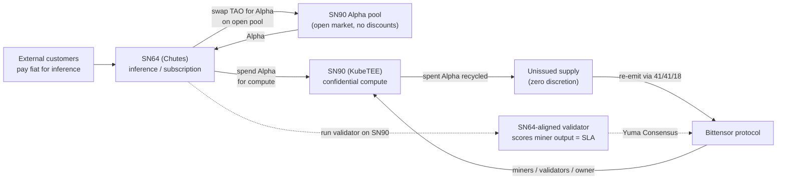
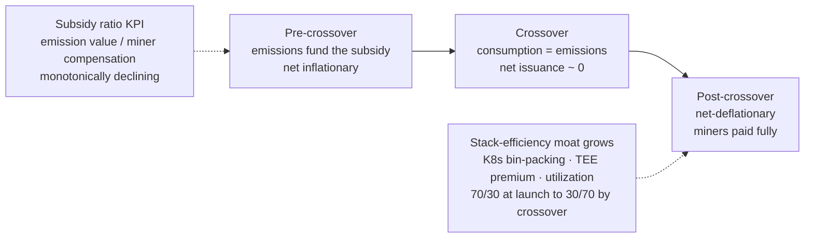

# Tokenomics — Utility Token & DePIN Model

This document is the full analysis behind the README [Tokenomics — Utility Token & DePIN Model](../README.md#tokenomics--utility-token--depin-model) section. It covers the economic design of SN90 (KubeTEE) Alpha: recycle vs burn, securities posture, the cross-subnet consumption loop, the vertically-split corporate structure, and the DePIN subsidy trajectory.

> **Not legal advice.** The securities analysis below is engineering design rationale, not legal advice. Run the royalty-base carve-out and related-party structure past Cyprus counsel before the first sale.

---

## Overview

SN90 (KubeTEE) Alpha is a **utility token consumed to access confidential compute**, not a security. The design follows a DePIN subsidy model:

- External inference demand buys Alpha on the **open market** and spends it to consume compute.
- Spent Alpha is **recycled** to unissued supply and re-emitted through the protocol's fixed emission split — a self-sustaining security budget for the compute network (the Bitcoin-fee model applied to Alpha).
- No entity sells tokens against promises, holds customer balances, or accumulates a treasury — all unused emissions are recycled. Value reaches each entity only through protocol safe-harbor channels (owner emissions, scored miner emissions).

The goal is a token whose value narrative is **compute access**, verifiable on-chain by anyone — the cleanest fact pattern for a utility-token / DePIN classification.

---

## Recycle vs Burn

### Mechanics

In Bittensor, burned tokens are removed from circulation **irreversibly**, while recycled tokens are removed from circulation but **can be issued again** — they return to unissued supply and flow back out through future emissions. Two operational consequences:

- **Burning does not reduce `SubnetAlphaOut`**, unlike recycling.
- **Recycling shifts halving timing** — halvings trigger on supply thresholds, and the date moves based on the amount recycled each day.

### Where "recycle instead of burn" does not buy anything

Under the current emission model, the miner-withholding penalty is **source-based, not method-based**: subnets are penalized for withholding miner emission regardless of whether that emission is recycled or burned. Routing emission through an owner-controlled hotkey and recycling it to dodge the `MinerBurned` penalty **does not work**. Switching methods is not an emission-share optimization.

### Where it does matter

- **Halving runway.** Halvings trigger on supply thresholds; the date shifts with how much TAO is recycled daily. Recycling pushes the threshold out and preserves the future emission stream. Burning does not. If the revenue model is emission-denominated over a multi-year horizon, recycle is strictly better for the operator and worse for near-term holders.
- **Price support.** Burn is irreversible and removes float permanently. Recycled supply comes back as future emission — the sell pressure is **deferred, not eliminated**. Burn is the stronger commitment signal precisely because it is costly and unrecoverable.

The choice is a **duration trade**: recycle optimizes the operator's long-run emission entitlement; burn optimizes current-holder scarcity.

### Why recycle for a compute subnet

For a compute subnet whose product is **ongoing work** (inference, training), recycle is the right economics: consumption funds future miner emissions — a self-sustaining security budget. The honest framing of the tradeoff: burn optimizes holder value and legal defensibility; recycle optimizes network sustainability and the operator's own future emission entitlement. A subnet can legitimately choose recycle and defend it as the more "commodity-like" behavior — reinvesting fees into the programmatic production of the commodity itself.

---

## Securities Posture — No Treasury

SN90 has **no treasury**. All unused emissions are **recycled** to unissued supply with zero discretion anywhere — nobody holds them, nobody times their disposal, no customer-balance liability exists. This removes the entire treasury category: no accumulation, no discretion, nothing to mischaracterize.

The SEC/CFTC interpretive release (Release No. 33-11412, March 17, 2026) applies the Howey test to **transactions** rather than assets themselves, and addresses how a non-security crypto asset may become subject to, and cease to be subject to, an investment contract. The question is not "is Alpha a security" but "do any of our practices create a scheme where purchasers reasonably expect profits from our managerial efforts." Eliminating the treasury eliminates the most attackable set of those practices up front.

### Fact patterns the no-treasury design avoids

1. **Receiving emissions (safe).** The release includes explicit safe harbors for protocol mining, staking, and airdrops — tokens received programmatically per protocol rules are not the problem. The subnet owner's 18% arrives the same way a miner's 41% does. Passive accrual to a wallet is hard to attack.
2. **Accumulating and holding a discretionary position (avoided).** A large discretionary insider position is a Howey factor (common enterprise, reliance on a promoter). A dormant treasury sits as ammunition for the argument that value depends on what you will do with it. With no treasury, there is no such position to characterize.
3. **Selling treasury to fund operations (avoided).** Emissions → sell → servers and salaries is functionally a continuous primary distribution funding the enterprise; if buyers reasonably expect the funded development to drive token value, those sales transactions start to look like investment contracts — even while secondary trading of the same token stays commodity-like. The token can be a digital commodity and treasury sales can still be securities transactions. With no treasury, there is nothing to sell this way.
4. **Deploying treasury for holder benefit (avoided entirely).** Buybacks, price support, liquidity backstops, yield programs, "treasury works for the community" messaging — anything that positions discretionary decisions as the value driver walks directly into the "expectation of profits from the essential managerial efforts of others" prong. With no treasury, there is no discretionary deployment to make.

### Why recycle fulfills the burn-adjacent posture

Durbin's programmatic purchase-and-burn model is extreme precisely because it removes the entire category: no accumulation, no discretion, nothing to mischaracterize. Burn makes consumption **terminal**: no beneficiary, no residual claim anywhere.

Recycling all unused emissions reaches the same posture by a different route: there is still no accumulation, no discretion, and no residual claim — spent Alpha returns to unissued supply and is re-emitted only through the protocol's fixed 41/41/18 split. Nobody chooses who receives it; the protocol does. The load-bearing property is **no discretion anywhere in the loop**, not the choice of burn over recycle. For a compute subnet whose product is ongoing work, recycle preserves the emission runway that funds future miner compensation while keeping the same "nothing to mischaracterize" posture.

### Mitigants

- Token is already functional (used per its programmatic utility on a functional system).
- No fundraising framing, no roadmap promises tied to sales.
- Arm's-length OTC disposal of any emission the owner entity does liquidate.
- Disclosure — especially important for a related-party structure.
- No staking of accumulated balances for yield (would add a passive-income feature on top).

---

## Cross-Subnet Consumption Loop

### The protocol-native (no-invoice) model

The cleanest structure is the **protocol-native model**: SN90's Alpha is the access ticket to the compute; another subnet (e.g. SN64 / Chutes) acquires it on the open market and spends it to consume. No bilateral paper anywhere.

**Securities-wise this is the strongest possible fact pattern for SN90.** The absence of a contract is not a gap — it is the feature. There is no bilateral scheme to characterize as an investment contract, just spot acquisition of a token followed by its consumptive use, which lands squarely in the release's carve-out that securities laws generally do not apply to items purchased for use or consumption.

Better still, it upgrades SN90's own token classification: an Alpha that **must be spent to obtain compute** is a token with genuine programmatic utility on a functional system — precisely the digital-commodity definition — rather than a token whose only story is speculation. SN64's demand gives organic, verifiable consumption.

### The flywheel



The acquisition leg is where the value transfer happens: SN64 swaps TAO into SN90's pool to get Alpha — that swap is the real payment. Every purchase is TAO inflow into SN90's reserve and upward pressure on the Alpha price. Under the current emission model, each subnet's share of block emissions is proportional to its EMA token price normalized across all subnets, so sustained SN64 buying directly raises SN90's emission share. The flywheel: external inference revenue → SN64 buys SN90 Alpha → price and emissions rise → miner incentive grows → more compute capacity → more inference served. Because SN64's demand is funded by outside customers, this is genuinely **external demand one hop removed** — not the circular emissions-recycling pattern that gets subnets dismissed as hot-potato economics.

### The spend leg (design decision)

When SN64 spends Alpha for compute, SN90's mechanism decides what happens to it:

- **Burn** — permanent supply reduction, does not touch `SubnetAlphaOut`, maximum scarcity signal.
- **Recycle** (chosen) — returns to unissued supply, reduces `SubnetAlphaOut`, extends the Alpha emission runway and pushes halving thresholds out; effectively refills the budget that pays miners.
- **Route to miners** as supplemental incentive on top of emissions — directly couples miner pay to real usage (tightest incentive alignment) but reintroduces sell pressure since miners liquidate.

Recycle is the mechanically interesting choice for a compute subnet: recycling consumption back into future miner emissions is a self-sustaining security budget, the Bitcoin-fee model applied to Alpha.

### Reflexivity risks (the flywheel spins both ways)

- **Concentration**: if SN64 becomes the dominant source of TAO inflow, SN90's emission share is a derivative of one customer's purchasing schedule. The day they pause, your price EMA decays, emission share follows, miner revenue drops, and capacity exits. Single-customer alpha demand is how a subnet deregisters fast.
- **Predictability**: if SN64 buys on a fixed cadence sized to revenue, that flow is visible on-chain and will be front-run. Use continuous small swaps (TWAP-style) rather than monthly lumps — this also smooths the EMA rather than spiking it.
- **Inventory exposure**: SN64 holds SN90 Alpha between purchase and spend, carrying the token's volatility as working-capital risk. The deeper the pool, the smaller that risk; pool depth is partly the subnet owner's problem to solve.

### Quality enforcement without contracts

No SLA means SN90's validators **are** the SLA: scoring must measure exactly what SN64 consumes — latency, throughput, uptime, correctness of the compute delivered — or miners will optimize for the metric while SN64 experiences something worse. An elegant protocol-native option: SN64 (or an entity aligned with them) runs a validator on SN90, so the customer's own quality observations feed Yuma Consensus directly. The customer scores the vendor's workers, and the chain settles it.

### Keep the loop at the market layer

If the subnet starts withholding miner emission to owner-controlled hotkeys to juice the economics, the penalty applies regardless of whether that emission is recycled or burned — the mechanism is source-aware, not method-aware. The clean version is entirely arm's-length at the protocol level: SN64 swaps on the open pool like anyone else, spends like anyone else, and SN90's edge is just being the subnet whose token has a real consumer. That is also the version where the flywheel narrative — usage-backed Alpha demand — is verifiable by anyone reading the chain.

---

## Corporate Structure (vertically split)

```mermaid
flowchart LR
    Proto["Bittensor protocol<br/>41 / 41 / 18 emission split"]
    Proto -->|18% owner stream| Kube["KubeTEE LTD<br/>subnet owner<br/>mechanism + IP"]
    Proto -->|41% miner stream| Hori["1-HORIZON LTD<br/>miner operator<br/>GPU/TEE capex"]
    Proto -->|41% miner stream| Ext["External miners<br/>(permissionless)"]
    Hori -.->|separate coldkeys<br/>(MinerBurned tripwire)| Proto
    Kube -.->|related-party license<br/>(off-chain, disclosed)| Hori
```

- **KubeTEE LTD — subnet owner**: owns the subnet layer (mechanism, the €198k registration, the 18% owner stream). Receives value only through the owner-emission safe-harbor path.
- **1-HORIZON LTD — miner operator**: a miner competing inside SN90 for a slice of the 41%. Funds GPU, TEE hardware, and rack commitments. Registers, competes, and is deregistered under identical rules as every other miner — same registration cost, same immunity period, no reserved UIDs.

### What the split gets right

Separating the subnet-owner entity from the miner entity means each receives value **exclusively through protocol safe-harbor channels**: KubeTEE's 18% arrives as owner emissions; 1-HORIZON's share arrives as scored miner emissions. Neither entity needs to sell tokens against promises, hold customer balances, or accumulate a treasury — all unused emissions are recycled. Capex lands in the right place — GPUs, TEE hardware, rack commitments sit in 1-HORIZON, insulated from the subnet-layer entity, which owns only the mechanism and IP.

### The on-chain tripwire

The `MinerBurned` penalty targets miner emission flowing to hotkeys owned by the subnet owner. Two separate Cyprus companies with genuinely separate coldkeys likely do not trigger the mechanical penalty — but the keys must **actually be separate**, not the same coldkey wearing two corporate hats. If 1-HORIZON's miner hotkeys trace to KubeTEE-controlled coldkeys, the subnet is withholding miner emission in the protocol's eyes, and the penalty applies regardless of what is done with it afterward.

### Concentration risk (classification risk is concentration, not existence)

A related-party miner on the subnet is unremarkable — most owner teams bootstrap capacity this way. What degrades both the DePIN story and the digital-commodity posture is **1-HORIZON becoming the dominant miner**: at that point the network is not meaningfully permissionless, the compute SN64 pays for is mostly produced by the owner's sister company, and token value starts depending on one director's operational decisions across both entities — the managerial-efforts prong creeping back in. This is the "own a DC, fully self-mine, limit access" anti-pattern.

### Load-bearing mitigations (in order)

1. The incentive mechanism must be **objective and published**, scoring measurable compute properties so no validator judgment call can favor 1-HORIZON.
2. The validator set should include parties KubeTEE does not control (an SN64-aligned validator doubles as both quality signal and independence proof).
3. 1-HORIZON registers, competes, and is deregistered under identical rules as every other miner — same registration cost, same immunity period, no reserved UIDs.
4. **Want external miners to out-compete 1-HORIZON over time** — a declining related-party share is the on-chain evidence the network is real. Target state: a taostats chart where the related-party (purple) share shrinks as external (gray) miners grow.

---

## DePIN Subsidy Trajectory



### The DePIN subsidy thesis

SN64 gets compute at below-market price because SN90 emissions subsidize the cost of compute. This is the goal of SN90: help subsidize the cost of compute, with a more efficient tech stack that monetizes compute better than a VM.

### Mechanics of who is paying

A miner's all-in compensation is **emissions plus consumption spend**. When emissions cover most of the cost base, miners can price delivered compute below their cash cost, and SN64 pockets the gap. That gap is not free — it is paid by **Alpha dilution**, i.e., by stakers and holders absorbing issuance. The honest description: token holders are collectively funding customer acquisition for the compute network. That is legitimate DePIN bootstrapping (the Helium/Filecoin/io.net playbook), and stated that way it is also classification-safe — the discount is protocol-programmatic, available to anyone who buys Alpha on the open pool, not a managerial pricing decision.

### Net issuance and the crossover

Net Alpha issuance = emissions out − consumption recycled back.

- **Pre-crossover (amber)**: low utilization; inflation-funding the subsidy.
- **Crossover**: as SN64's spend grows, recycling offsets more of the emission; when consumption spend equals emissions, net issuance is roughly zero, and the "subsidy" has become a closed loop where consumers fund the miner budget through the pool.
- **Post-crossover**: net-deflationary while still paying miners fully.

This gives a single on-chain KPI worth publishing from day one — the **subsidy ratio** (emission value ÷ total miner compensation) — and its required trajectory is **monotonically down**. That number declining is simultaneously the economic health metric, the DePIN credibility proof, and the answer to anyone claiming the token only exists to farm emissions.

### Defenses against the reflexive spiral

Failure mode: Alpha price falls → subsidy value shrinks → below-market pricing evaporates → SN64 routes compute elsewhere → consumption falls → price falls further.

1. **Subsidy tapers by policy expectation, not by surprise.** If SN64 builds unit economics assuming permanent 40%-below-market compute, the first halving breaks their margin model and the demand simultaneously. Consumers should price in a published glide path.
2. **Stack efficiency is the moat.** If the KubeTEE stack genuinely extracts more revenue per GPU-hour than VM rental — Kubernetes bin-packing multiple workloads per card instead of dedicated-VM idle time, TEE attestation commanding a confidential-compute premium, higher effective utilization — then part of the discount is structural and survives emission decay. Emissions buy time; stack efficiency is the moat. A subnet whose price advantage is 70% subsidy / 30% efficiency at launch needs to be 30/70 by crossover.

### Wash consumption (attack surface specific to subsidized-compute subnets)

If the incentive mechanism scores miners on utilization, a miner can spend Alpha consuming its own compute — the spend recycles, but the score farms emissions worth more than the spend. Defenses:

- Score **verifiable properties** instead: delivered capacity, attested TEE execution, latency/correctness on validator-issued challenges.
- Treat real consumption as a demand signal rather than the direct emission driver, **or** make self-consumption economically neutral (spend ≥ emission value gained).

Given 1-HORIZON mines on the subnet its sister company owns, this must be closed before anyone asks — a related-party miner on a utilization-scored subnet is exactly where an observer would go looking first.

---

## Boundary Conditions (what breaks the model)

1. **Owner-hotkey withholding** of miner emission — penalized regardless of recycle/burn, and re-centralizes the flow.
2. **Discretionary accumulation** inserted between spend and recycle (no treasury — any accumulation is the poison; all unused emissions must be recycled).
3. **Public messaging** that frames Alpha appreciation — rather than compute access — as the reason to hold.
4. **Preferential Alpha placement**, side-letters, or volume discounts to large consumers — contaminates the loop into a primary distribution with investment characteristics.

The mechanism is defensible only as long as the story told about it matches the arrows.

---

## References

- [Bittensor dTAO Whitepaper](https://bittensor.com/dtao-whitepaper)
- [Emission in Dynamic TAO](https://docs.bittensor.com/dynamic-tao/emission)
- [Recycling — Learn Bittensor](https://learnbittensor.org/concepts/tokenomics/recycling)
- [Recycling — TaoStats](https://docs.taostats.io/docs/recycling)
- [Tao Emission — TaoStats](https://docs.taostats.io/docs/tao-emission)

