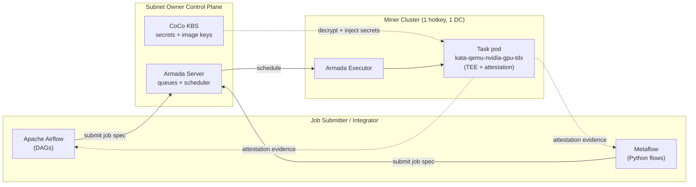

# Workflow Orchestration — Apache Airflow & Metaflow Integration

KubeTEE AI Factory executes AI workloads as **Armada batch jobs** inside **Kata + CoCo TEE pods** on miner clusters. A single job is submitted to an Armada queue (see the README [Submitting a Confidential Job](../README.md#submitting-a-confidential-job) section). For **multi-step AI pipelines** — e.g. ETL → fine-tune → evaluate → register → deploy — KubeTEE integrates with two open-source orchestrators so that **every pipeline step runs as a confidential Armada batch job**:

- **[Apache Airflow](https://airflow.apache.org/)** — DAG-based pipeline orchestration.
- **[Metaflow](https://metaflow.org/)** — a Python framework for data-science / ML workflows.

The orchestrator schedules the *pipeline*; Armada schedules each *task pod* across miner clusters. Task pods execute under a confidential `runtimeClassName` (`kata-qemu-nvidia-gpu-tdx` for GPU, `kata-qemu-tdx` for CPU) with CoCo remote attestation, so the entire pipeline — code, data, and artifacts — stays inside the confidential computing boundary.

---

## Where It Fits



- The **orchestrator** (Airflow scheduler / Metaflow runner) can live on the subnet-owner control plane or on an integrator's own environment. It only submits Armada job specs — it does **not** touch GPU data.
- **Task pods** land on miner-cluster nodes inside Kata + CoCo TEE pods. Data and models are decrypted inside the TEE via the KBS; they never appear in plaintext on the host or in the orchestrator.
- A pipeline can require a step's **attestation evidence** before passing artifacts downstream, giving confidential-by-construction pipelines.

---

## Apache Airflow Integration

Airflow authors pipelines as **DAGs** of tasks. On KubeTEE, each task that needs confidential compute is submitted to an Armada queue via a KubeTEE **Armada operator** (a custom Airflow operator that wraps the Armada `submit` API). Airflow owns the *control flow* (dependencies, retries, scheduling); Armada owns the *batch placement* across miner clusters.

**Responsibilities**:
- Airflow scheduler + metadata DB run on the control plane (or externally). Only the task pods are confidential.
- Each task builds an Armada job spec with a confidential `runtimeClassName` and an NVIDIA AI stack image (NeMo / NIM / Blueprint), then submits it to an Armada queue.
- DAG code holds **no plaintext secrets** — secrets are referenced by KBS key and injected into the TEE pod at runtime.
- Airflow Connections / Variables are backed by Vault (VSO); the Armada endpoint and queue names are configured as Airflow connections.

**Illustrative DAG** (connector is on the roadmap — API is illustrative):

```python
from airflow import DAG
from airflow.utils.dates import days_ago
from kubetee_airflow import ArmadaConfidentialJobOperator

with DAG("nemo_finetune_pipeline", start_date=days_ago(1), schedule_interval=None) as dag:
    etl = ArmadaConfidentialJobOperator(
        task_id="etl",
        armada_connection="kubetee_armada",      # Airflow Connection: Armada server URL + queue
        queue="confidential-ml",
        runtime_class="kata-qemu-tdx",            # CPU TEE for ETL
        image="ghcr.io/kubetee/nemo-etl:latest",
        kbs_secret_keys=["s3-creds"],             # injected into the TEE, never in DAG code
    )

    train = ArmadaConfidentialJobOperator(
        task_id="train",
        armada_connection="kubetee_armada",
        queue="confidential-ml",
        runtime_class="kata-qemu-nvidia-gpu-tdx", # GPU TEE for training
        image="ghcr.io/kubetee/nemo-train:latest",
        gpus=8,
        kbs_secret_keys=["s3-creds", "hf-token"],
        require_attestation=True,                  # fail the task if attestation cannot be verified
    )

    etl >> train
```

---

## Metaflow Integration

Metaflow authors pipelines as **Python flows** using `@step` decorators. On KubeTEE, a custom **Metaflow producer** maps each `@batch`-style step to an Armada job submission: the step's code and image run as a confidential pod on a miner cluster, while the local Metaflow runner orchestrates the flow and tracks artifacts.

**Responsibilities**:
- Iterate locally (small data) on the submitter machine; production steps execute in TEE on miner clusters.
- The Metaflow artifact store lives on encrypted Longhorn or an encrypted S3-compatible object store; artifacts are encrypted at rest and in transit.
- Secrets are injected via the KBS — never embedded in flow code.
- Each step can require CoCo attestation evidence before producing/consuming artifacts.

**Illustrative flow** (connector is on the roadmap — API is illustrative):

```python
from metaflow import FlowSpec, step, kubetee_batch

class NemoFinetuneFlow(FlowSpec):
    @step
    def start(self):
        self.data_uri = "s3://kubetee-confidential/dataset.parquet"
        self.next(self.train)

    @kubetee_batch(queue="confidential-ml",
                   runtime_class="kata-qemu-nvidia-gpu-tdx",
                   image="ghcr.io/kubetee/nemo-train:latest",
                   gpus=8,
                   kbs_secret_keys=["s3-creds", "hf-token"],
                   require_attestation=True)
    @step
    def train(self):
        # Runs inside a Kata + CoCo TEE pod on a miner cluster.
        # Secrets are injected by the KBS; data is decrypted inside the TEE.
        import nemo
        self.model_uri = run_nemo_train(self.data_uri)
        self.next(self.end)

    @step
    def end(self):
        print("trained model:", self.model_uri)

if __name__ == "__main__":
    NemoFinetuneFlow()
```

---

## Confidentiality & Attestation

- **Per-task TEE**: every step runs under `kata-qemu-nvidia-gpu-tdx` (GPU) or `kata-qemu-tdx` (CPU). The host and hypervisor cannot read task memory.
- **CoCo remote attestation**: each task pod attests its image and runtime; pipelines can gate downstream steps on verified attestation evidence.
- **No plaintext secrets in the orchestrator**: DAG / flow code references KBS keys only; the KBS releases secrets into the TEE after attestation.
- **Confidential artifacts**: intermediate artifacts move through encrypted Longhorn volumes or an encrypted object store; they are decrypted only inside downstream TEE pods.

---

## Status

This integration is on the **roadmap** (see the README [Roadmap](../README.md#roadmap)):

- **Phase 1 — Expansion**: `kubetee-airflow` Armada operator + `kubetee_batch` Metaflow decorator; example DAGs and flows; KBS secret injection.
- **Phase 3 — Job-Type Growth**: attestation-gated step transitions, artifact lineage, and additional orchestrator connectors.

Until the connectors ship, pipelines can submit Armada jobs directly with `armadactl` (see [Submitting a Confidential Job](../README.md#submitting-a-confidential-job)).

---

## References

- [Apache Airflow](https://airflow.apache.org/) | [Airflow docs](https://airflow.apache.org/docs/)
- [Metaflow](https://metaflow.org/) | [Metaflow docs](https://docs.metaflow.org/)
- [Armada](https://armadaproject.io/) | [Armada GitHub](https://github.com/armadaproject/armada)
- [Kata Containers](https://katacontainers.io/) | [Confidential Containers](https://github.com/confidential-containers/confidential-containers)
