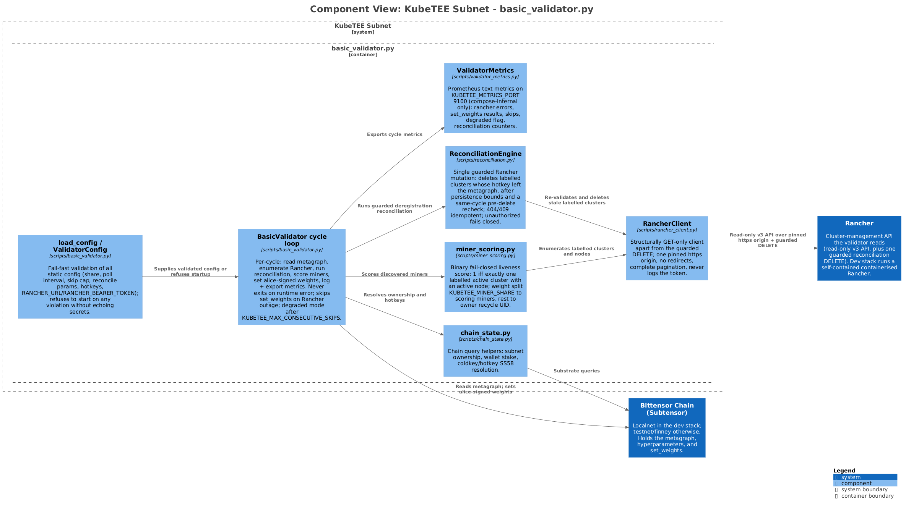
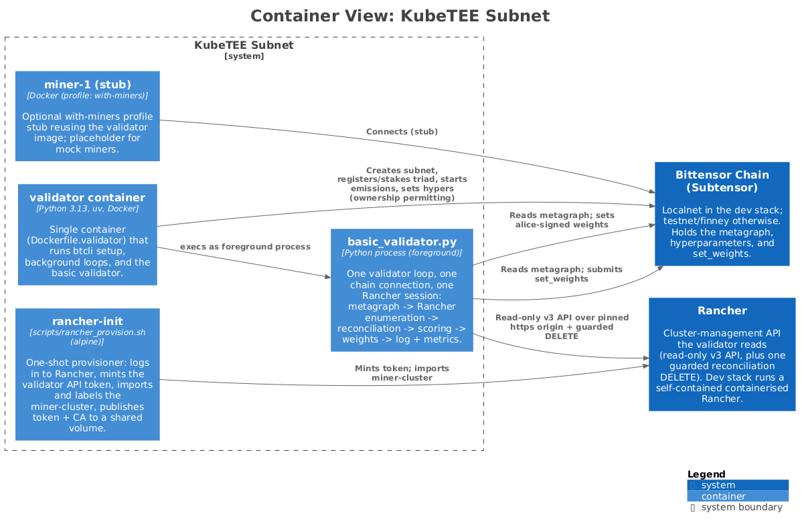
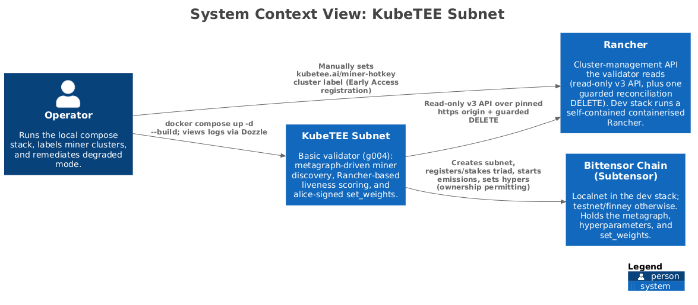
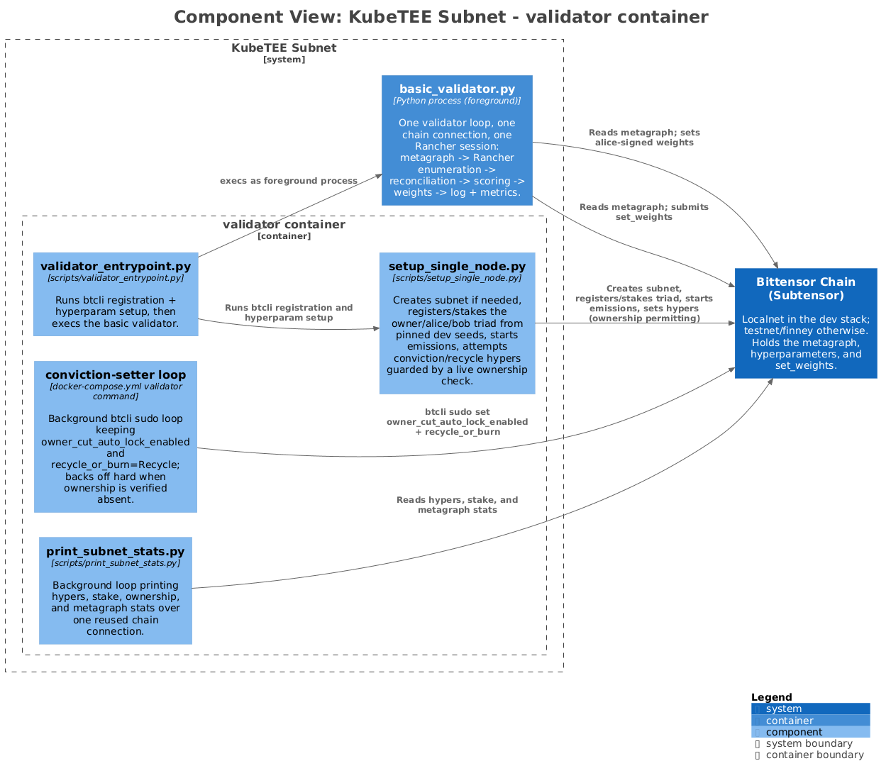

# kubetee-subnet Architecture

> Enterprise-Grade Confidential Computing AI Factory on Decentralized Kubernetes Infrastructure, scheduled by Armada across Bittensor miner clusters

> Depth lives in authored docs under `context/`, `containers/`, `components/`, and `acceptance/`. This file is a regenerable index.

## Context

- [overview](context/overview.md) — purpose, bounded context, external systems

- [data flow](context/data-flow.md) — end-to-end pipeline

- [dependencies](context/dependencies.md) — contracts with other KubeTEE components

## Containers

- [miner-cluster](containers/miner-cluster.md) — Disposable downstream k3s/RKE2 cluster labelled kubetee.ai/miner-hotkey with a miner hotkey; plays the role of a miner's cluster.

- [validator container](containers/validator-container.md) — Single container (Dockerfile.validator) that runs btcli setup, background loops, and the basic validator.

- [basic_validator.py](containers/basic_validator.py.md) — One validator loop, one chain connection, one Rancher session: metagraph -> Rancher enumeration -> reconciliation -> scoring -> weights -> log + metrics.

- [rancher-init](containers/rancher-init.md) — One-shot provisioner: logs in to Rancher, mints the validator API token, imports and labels the miner-cluster, publishes token + CA to a shared volume.

- [miner-1 (stub)](containers/miner-1-stub.md) — Optional with-miners profile stub reusing the validator image; placeholder for mock miners.

## Components

One doc per `cmd/` worker under `components/`. Generator-owned header, human-owned body (Reads/Writes/Flow/Invariants/Run/Verify).

| Worker | Component doc |
|---|---|

## C4 Diagrams

### structurizr-kubetee-subnet-basic-validator-components

[vector SVG](diagrams/rendered/global/structurizr-kubetee-subnet-basic-validator-components.svg) · [PNG](diagrams/rendered/global/structurizr-kubetee-subnet-basic-validator-components.png)

See [context/overview.md](context/overview.md) for context.

### structurizr-kubetee-subnet-containers

[vector SVG](diagrams/rendered/global/structurizr-kubetee-subnet-containers.svg) · [PNG](diagrams/rendered/global/structurizr-kubetee-subnet-containers.png)

See [context/overview.md](context/overview.md) for context.

### structurizr-kubetee-subnet-context

[vector SVG](diagrams/rendered/global/structurizr-kubetee-subnet-context.svg) · [PNG](diagrams/rendered/global/structurizr-kubetee-subnet-context.png)

See [context/overview.md](context/overview.md) for context.

### structurizr-kubetee-subnet-validator-container-components

[vector SVG](diagrams/rendered/global/structurizr-kubetee-subnet-validator-container-components.svg) · [PNG](diagrams/rendered/global/structurizr-kubetee-subnet-validator-container-components.png)

See [containers/validator-container.md](containers/validator-container.md) for context.

## Verification

- `No standard local verification command detected; inspect README.md and workflows.`
