# KubeTEE AI Subnet Integrations Diagram

## Mermaid Diagram

```mermaid
%%{init: {'theme': 'base', 'themeVariables': { 'primaryColor': '#76B900', 'primaryTextColor': '#fff', 'primaryBorderColor': '#5a8f00', 'lineColor': '#333', 'secondaryColor': '#006100', 'tertiaryColor': '#fff'}}}%%
flowchart TB
    subgraph KUBETEE["🏢 KubeTEE AI Deep Research Agent"]
        direction TB
        CORE["🧠 REASONING CORE<br/>Fine-tuned LLM"]
        GROUND["📚 GROUNDING LAYER<br/>RAG + CyborgDB"]
        VERIFY["🛡️ VERIFICATION<br/>Safety Layer"]
        STORAGE["💾 STORAGE LAYER<br/>Decentralized"]
        FINANCE["💰 FINANCIAL INTEL<br/>Domain Research"]
        TEE["🔒 TEE INFRASTRUCTURE<br/>Intel TDX / NVIDIA CC"]
    end

    subgraph REASONING["🎯 Reasoning & Training"]
        SN01["SN01 Apex<br/>Agentic Traces"]
        SN03["SN03 Templar<br/>Pre-Training"]
        SN09["SN09 IOTA<br/>Distributed Pre-Training"]
        SN56["SN56 Gradients<br/>Fine-Tuning"]
        SN120["SN120 Affine<br/>RL Models"]
    end

    subgraph DATA["📊 Data & Grounding"]
        SN52["SN52 Dojo<br/>Human-Validated"]
        SN54["SN54 MIID<br/>Synthetic IDs"]
    end

    subgraph SAFETY["🔐 Verification & Safety"]
        SN37["SN37 Aurelius<br/>AI Alignment"]
        SN60["SN60 Bitsec<br/>Security Scan"]
    end

    subgraph TOOLS["🔧 Tools & MCP"]
        SN13["SN13 Data Universe<br/>55B+ Social Posts / MCP"]
        SN22["SN22 Desearch<br/>Web Search / MCP"]
        SN62["SN62 Ridges<br/>Coding Assistant"]
    end

    subgraph INFRA["☁️ Infrastructure"]
        SN75["SN75 Hippius<br/>Cloud Storage"]
        SN64["SN64 Chutes<br/>Serverless Compute"]
    end

    subgraph FINANCIAL["📈 Financial Intelligence"]
        SN06["SN06 Numinous<br/>Forecasting Oracle"]
        SN15["SN15 BitQuant<br/>DeFi Analytics"]
        SN79["SN79 τaos<br/>Market Simulation"]
    end

    subgraph MARKETING["📣 Marketing & Growth"]
        SN16["SN16 BitAds<br/>Affiliate Marketing"]
        SN71["SN71 LeadPoet<br/>B2B Leads"]
        SN93["SN93 Bitcast<br/>Creator Marketing"]
    end

    %% Reasoning connections
    SN01 --> CORE
    SN03 --> CORE
    SN09 --> CORE
    SN56 --> CORE
    SN120 --> CORE

    %% Data connections
    SN52 --> GROUND
    SN54 --> GROUND

    %% Safety connections
    SN37 --> VERIFY
    SN60 --> VERIFY

    %% Tools connections
    SN13 --> GROUND
    SN13 --> CORE
    SN22 --> GROUND
    SN22 --> CORE
    SN62 --> CORE

    %% Storage connections
    SN75 --> STORAGE
    SN64 --> CORE

    %% Financial connections
    SN06 --> FINANCE
    SN15 --> FINANCE
    SN79 --> FINANCE

    %% Internal flow
    CORE --> GROUND
    GROUND --> VERIFY
    VERIFY --> STORAGE
    STORAGE --> FINANCE
    FINANCE --> TEE

    %% Marketing (external)
    SN16 -.-> KUBETEE
    SN71 -.-> KUBETEE
    SN93 -.-> KUBETEE

    %% Cross-subnet integrations
    SN22 -.-> SN06
    SN64 -.-> SN06

    classDef kubetee fill:#76B900,stroke:#5a8f00,color:#fff
    classDef reasoning fill:#2196F3,stroke:#1976D2,color:#fff
    classDef data fill:#9C27B0,stroke:#7B1FA2,color:#fff
    classDef safety fill:#F44336,stroke:#D32F2F,color:#fff
    classDef tools fill:#00BCD4,stroke:#0097A7,color:#fff
    classDef infra fill:#FF9800,stroke:#F57C00,color:#fff
    classDef financial fill:#4CAF50,stroke:#388E3C,color:#fff
    classDef marketing fill:#E91E63,stroke:#C2185B,color:#fff

    class CORE,GROUND,VERIFY,STORAGE,FINANCE,TEE kubetee
    class SN01,SN03,SN09,SN56,SN120 reasoning
    class SN52,SN54 data
    class SN37,SN60 safety
    class SN13,SN22,SN62 tools
    class SN75,SN64 infra
    class SN06,SN15,SN79 financial
    class SN16,SN71,SN93 marketing
```



## ASCII Diagram (for README)

```
┌──────────────────────────────────────────────────────────────────────────────────────────────────────────────────┐
│                                       KUBETEE AI SUBNET INTEGRATIONS                                             │
├──────────────────────────────────────────────────────────────────────────────────────────────────────────────────┤
│                                                                                                                  │
│  ┌──────────────────────────────────┐  ┌──────────────────────────────────┐  ┌────────────────────────────────┐  │
│  │     🎯 REASONING & TRAINING      │  │       📊 DATA & GROUNDING        │  │       📣 MARKETING             │  │
│  ├──────────────────────────────────┤  ├──────────────────────────────────┤  ├────────────────────────────────┤  │
│  │  SN01   Apex (Agentic Traces)    │  │  SN52  Dojo (Human-Validated)    │  │  SN16  BitAds (Affiliate)      │  │
│  │  SN03   Templar (Pre-Training)   │  │  SN54  MIID (Synthetic IDs)      │  │  SN71  LeadPoet (B2B Leads)    │  │
│  │  SN09   IOTA (Distributed)       │  └─────────────────┬────────────────┘  │  SN93  Bitcast (Creators)      │  │
│  │  SN56   Gradients (Fine-Tuning)  │                    │                   └───────────────┬────────────────┘  │
│  │  SN120  Affine (RL Models)       │                    │                                   │                   │
│  └────────────────┬─────────────────┘                    │                                   │                   │
│                   │                                      │                                   │                   │
│                   ▼                                      ▼                                   │                   │
│  ┌───────────────────────────────────────────────────────────────────────────────────────────┴────────────────┐  │
│  │                                                                                                            │  │
│  │                              ┌────────────────────────────────────────────┐                                │  │
│  │                              │       🏢 KUBETEE AI DEEP RESEARCH          │                                │  │
│  │                              │              AGENT (TEE)                   │                                │  │
│  │                              ├────────────────────────────────────────────┤                                │  │
│  │                              │                                            │                                │  │
│  │                              │  ┌────────────┐   ┌──────────────────────┐ │                                │  │
│  │                              │  │ REASONING  │──▶│   GROUNDING LAYER    │ │                                │  │
│  │                              │  │   CORE     │   │   (RAG + CyborgDB)   │ │                                │  │
│  │                              │  └────────────┘   └──────────┬───────────┘ │                                │  │
│  │                              │                              │             │                                │  │
│  │                              │  ┌──────────────────────────┐│             │                                │  │
│  │                              │  │   VERIFICATION LAYER     │◀────────────┘                                │  │
│  │                              │  │   (Safety + Security)    │                                               │  │
│  │                              │  └──────────┬───────────────┘                                               │  │
│  │                              │             │                                                               │  │
│  │                              │  ┌──────────▼───────────────┐                                               │  │
│  │                              │  │    FINANCIAL INTEL       │                                               │  │
│  │                              │  │   (Domain Research)      │                                               │  │
│  │                              │  └──────────┬───────────────┘                                               │  │
│  │                              │             │                                                               │  │
│  │                              │  ┌──────────▼───────────────┐                                               │  │
│  │                              │  │  🔒 TEE INFRASTRUCTURE   │                                               │  │
│  │                              │  │  Intel TDX / NVIDIA CC   │                                               │  │
│  │                              │  └──────────────────────────┘                                               │  │
│  │                              │                                            │                                │  │
│  │                              └────────────────────────────────────────────┘                                │  │
│  │                                                                                                            │  │
│  └────────────────────────────────────────────────────────────────────────────────────────────────────────────┘  │
│                   ▲                                      ▲                                   ▲                   │
│                   │                                      │                                   │                   │
│  ┌────────────────┴─────────────────┐  ┌─────────────────┴────────────────┐  ┌───────────────┴────────────────┐  │
│  │    🔐 VERIFICATION & SAFETY      │  │     📈 FINANCIAL INTELLIGENCE    │  │      🔧 TOOLS & MCP            │  │
│  ├──────────────────────────────────┤  ├──────────────────────────────────┤  ├────────────────────────────────┤  │
│  │  SN37  Aurelius (AI Alignment)   │  │  SN06  Numinous (Forecasting)    │  │  SN13  Data Universe (MCP)     │  │
│  │  SN60  Bitsec (Security Scan)    │  │  SN15  BitQuant (DeFi Analytics) │  │  SN22  Desearch (Search/MCP)   │  │
│  └──────────────────────────────────┘  │  SN79  τaos (Market Simulation)  │  │  SN62  Ridges (Coding/MCP)     │  │
│                                        └──────────────────────────────────┘  └────────────────────────────────┘  │
│                   ▲                                                                                              │
│                   │                                                                                              │
│  ┌────────────────┴─────────────────┐                                                                            │
│  │       ☁️ INFRASTRUCTURE           │                                                                            │
│  ├──────────────────────────────────┤                                                                            │
│  │  SN64  Chutes (Serverless)       │                                                                            │
│  │  SN75  Hippius (Cloud Storage)   │                                                                            │
│  └──────────────────────────────────┘                                                                            │
│                                                                                                                  │
└──────────────────────────────────────────────────────────────────────────────────────────────────────────────────┘

                                            SUBNET INTERACTION LEGEND
┌──────────────────────────────────────────────────────────────────────────────────────────────────────────────────┐
│                                                                                                                  │
│  🎯 REASONING       │  Model training, fine-tuning, distributed pre-training, and RL enhancement                │
│  📊 DATA            │  Real-time data, web search, human-validated samples                                       │
│  🔐 SAFETY          │  AI alignment, security scanning, vulnerability detection                                  │
│  🔧 TOOLS & MCP     │  Data APIs, coding assistants, MCP servers, development tools                              │
│  ☁️ INFRASTRUCTURE  │  Storage, serverless compute                                                               │
│  📈 FINANCIAL       │  Market analysis, forecasting, trading signals                                             │
│  📣 MARKETING       │  Affiliate marketing, lead generation, creator content                                     │
│                                                                                                                  │
│  ─────────────────────────────────────────────────────────────────────────────────────────────────────────────── │
│                                                                                                                  │
│  TOTAL: 18 SUBNET INTEGRATIONS                                                                                   │
│                                                                                                                  │
│  ┌─────────────────┐  ┌─────────────────┐  ┌─────────────────┐  ┌─────────────────┐  ┌─────────────────┐         │
│  │ 🎯 REASONING    │  │ 📊 DATA         │  │ 🔐 SAFETY       │  │ 🔧 TOOLS & MCP  │  │ ☁️ INFRA        │         │
│  ├─────────────────┤  ├─────────────────┤  ├─────────────────┤  ├─────────────────┤  ├─────────────────┤         │
│  │ SN01  Apex      │  │ SN52  Dojo      │  │ SN37  Aurelius  │  │ SN13  DataUniv  │  │ SN64  Chutes    │         │
│  │ SN03  Templar   │  │ SN54  MIID      │  │ SN60  Bitsec    │  │ SN22  Desearch  │  │ SN75  Hippius   │         │
│  │ SN09  IOTA      │  └─────────────────┘  └─────────────────┘  │ SN62  Ridges    │  └─────────────────┘         │
│  │ SN56  Gradients │                                            └─────────────────┘                              │
│  │ SN120 Affine    │                       ┌─────────────────┐  ┌─────────────────┐                              │
│  └─────────────────┘                       │ 📈 FINANCIAL    │  │ 📣 MARKETING    │                              │
│                                            ├─────────────────┤  ├─────────────────┤                              │
│                                            │ SN06  Numinous  │  │ SN16  BitAds    │                              │
│                                            │ SN15  BitQuant  │  │ SN71  LeadPoet  │                              │
│                                            │ SN79  τaos      │  │ SN93  Bitcast   │                              │
│                                            └─────────────────┘  └─────────────────┘                              │
│                                                                                                                  │
└──────────────────────────────────────────────────────────────────────────────────────────────────────────────────┘
```

## Subnet Summary Table

| Category | Subnet | Name | Purpose |
|----------|--------|------|---------|
| **🎯 Reasoning** | SN01 | Apex | Agentic reasoning traces (millions tokens/day) |
| | SN03 | Templar | Model pre-training from scratch |
| | SN09 | IOTA | Distributed pre-training orchestration |
| | SN56 | Gradients | Decentralized fine-tuning |
| | SN120 | Affine | RL-trained open source models |
| **📊 Data** | SN52 | Dojo | Human-validated data samples |
| | SN54 | MIID | Synthetic identity generation |
| **🔐 Safety** | SN37 | Aurelius | AI alignment & red-teaming |
| | SN60 | Bitsec | Security scanning & vulnerabilities |
| **🔧 Tools & MCP** | SN13 | Data Universe | 55B+ social posts / MCP server |
| | SN22 | Desearch | Decentralized web search / MCP server |
| | SN62 | Ridges | AI coding assistant / MCP server |
| **☁️ Infrastructure** | SN64 | Chutes | Serverless AI compute |
| | SN75 | Hippius | Decentralized cloud storage |
| **📈 Financial** | SN06 | Numinous | Superhuman forecasting oracle |
| | SN15 | BitQuant | DeFi analytics & market data |
| | SN79 | τaos | Financial market simulation |
| **📣 Marketing** | SN16 | BitAds | Affiliate & performance marketing |
| | SN71 | LeadPoet | B2B lead intelligence |
| | SN93 | Bitcast | Creator marketing & awareness |

## Technology Stack

| Layer | Technology | Description |
|-------|------------|-------------|
| **Vector Database** | [CyborgDB](https://www.cyborg.co/) | End-to-end encrypted confidential vector database |
| **TEE Infrastructure** | Intel TDX / NVIDIA CC | Hardware-secured trusted execution environments |
| **Kubernetes** | RKE2 FIPS-140-2 | U.S. Federal Government Grade Security |
| **LLM Inference** | NVIDIA NIM | Optimized model deployment |
| **RAG Pipeline** | NVIDIA AIQ Blueprint | Deep Research Agent architecture |

## Data Flow

```
┌──────────────┐    ┌──────────────┐    ┌──────────────┐    ┌──────────────┐    ┌──────────────┐
│   TRAINING   │───▶│   GROUNDING  │───▶│ VERIFICATION │───▶│  FINANCIAL   │───▶│     TEE      │
│   SUBNETS    │    │   SUBNETS    │    │   SUBNETS    │    │   SUBNETS    │    │  DEPLOYMENT  │
├──────────────┤    ├──────────────┤    ├──────────────┤    ├──────────────┤    ├──────────────┤
│ SN01  Apex   │    │ SN52  Dojo   │    │ SN37 Aurelius│    │ SN06 Numinous│    │ Intel TDX    │
│ SN03  Templar│    │ SN54  MIID   │    │ SN60 Bitsec  │    │ SN15 BitQuant│    │ NVIDIA CC    │
│ SN09  IOTA   │    └──────────────┘    └──────────────┘    │ SN79 τaos    │    │ CyborgDB     │
│ SN56  Grads  │                                            └──────────────┘    └──────────────┘
│ SN120 Affine │
└──────────────┘
         │
         │         ┌──────────────┐    ┌──────────────┐
         └────────▶│ 🔧 TOOLS/MCP │    │ ☁️ INFRA     │
                   ├──────────────┤    ├──────────────┤
                   │ SN13 DataUniv│    │ SN64 Chutes  │
                   │ SN22 Desearch│    │ SN75 Hippius │
                   │ SN62 Ridges  │    └──────────────┘
                   └──────────────┘
```

## Enterprise RAG Architecture

```
┌─────────────────────────────────────────────────────────────────────────────┐
│                    KUBETEE ENTERPRISE RAG WITH CYBORGDB                     │
├─────────────────────────────────────────────────────────────────────────────┤
│                                                                             │
│   ENTERPRISE DATA                          TEE SECURE ENCLAVE               │
│   ───────────────                          ─────────────────                │
│                                                                             │
│   ┌─────────────────┐                     ┌─────────────────────────────┐   │
│   │ 📄 Documents    │                     │  🔐 CONFIDENTIAL COMPUTING  │   │
│   │ 📊 Databases    │ ──► Encrypted ─────▶│                             │   │
│   │ 📧 Emails       │     Transfer        │  ┌─────────────────────┐    │   │
│   │ 💼 Contracts    │                     │  │ NeMo Ingestor       │    │   │
│   │ 🏥 Patient Data │                     │  │ (Multi-format)      │    │   │
│   │ 💰 Financials   │                     │  └──────────┬──────────┘    │   │
│   └─────────────────┘                     │             │               │   │
│                                           │             ▼               │   │
│                                           │  ┌─────────────────────┐    │   │
│                                           │  │ CyborgDB Encrypted  │    │   │
│   PRIVACY GUARANTEES:                     │  │ Vector Database     │    │   │
│   • End-to-end encryption                 │  │ (Your namespace)    │    │   │
│   • Encrypted at rest, transit, in-use    │  └──────────┬──────────┘    │   │
│   • Zero-knowledge architecture           │             │               │   │
│   • HIPAA/SOC2/GDPR compliant             │             ▼               │   │
│                                           │  ┌─────────────────────┐    │   │
│                                           │  │ Deep Research Agent │    │   │
│                                           │  │ (NVIDIA NIM + AIQ)  │    │   │
│                                           │  └──────────┬──────────┘    │   │
│                                           │             │               │   │
│                                           └─────────────┼───────────────┘   │
│                                                         │                   │
│   ┌─────────────────────────────────────────────────────▼───────────────┐   │
│   │                         YOUR INSIGHTS                               │   │
│   │  • Research reports grounded in your private data                   │   │
│   │  • Answers with source attribution                                  │   │
│   │  • Analysis without data exposure                                   │   │
│   └─────────────────────────────────────────────────────────────────────┘   │
│                                                                             │
└─────────────────────────────────────────────────────────────────────────────┘
```

---

*Generated for KubeTEE AI Deep Research Agent Subnet*
